이 사업의 기능 우선순위는 “눈에 띄는 기능”이 아니라,

**거래 완료율을 높이고, 배송 실패를 줄이고, 재구매와 확장을 가능하게 하는 기능 순서**로 정해야 한다.

### 1. 기능 우선순위 표

| 기능 ID | 기능명 | 연결 Job / Value | 핵심 목적 | 중요도(1~5) | 구현난이도(1~5) | 우선순위 | MVP 포함 여부 | 리스크 대응전략 |
| --- | --- | --- | --- | --- | --- | --- | --- | --- |
| F1 | 예상 총액 확정 보기 | 총비용 예측, 첫 구매 불안 해소 | 상품가+배송비+예상세금/수수료를 결제 전에 명확히 제시 | 5 | 3 | High | ✔ | 국가별 계산 로직을 단순화해 1차는 대표국부터 적용 |
| F2 | 국가별 통관 가능 여부 사전 확인 | 통관 가능성 확신 | 상품/국가 조합별 구매 가능·주의·제한 상태 제공 | 5 | 4 | High | ✔ | 고위험 카테고리부터 룰베이스로 시작하고 예외국은 수동 운영 병행 |
| F3 | 주소/연락처 실시간 검증 | 배송 성공률, 주소 정확성 | 국가별 주소 형식·전화번호·필수값 검증 | 5 | 4 | High | ✔ | 우선 출고량 상위 국가부터 적용, 실패 로그로 검증 룰 고도화 |
| F4 | 배송 ETA 및 예외 상황 가이드 | 배송 가시성, 고객 행동 명확화 | 지연/보류/추가서류 상황에서 고객 액션 안내 | 5 | 3 | High | ✔ | 물류사 이벤트를 전부 연결하지 못해도 상태 설명 사전 정의로 시작 |
| F5 | 공식성/정품 신뢰 신호 | 정품 신뢰, 공식채널 인식 | 공식 채널, 정품 보증, 정책/FAQ 신뢰 요소 노출 | 5 | 2 | High | ✔ | UI 신호부터 빠르게 적용하고, 운영정책 문서와 함께 증빙 일치화 |
| F6 | 건기식 설명 카드 | 가족 건강관리 안심구매 | 성분/복용법/주의사항/통관 주의 요약 제공 | 4 | 3 | Mid | ✔ | 모든 SKU 동시 구축 대신 베스트셀러/고위험 SKU 우선 적용 |
| F7 | 빠른 재주문 / 이전 주문 복제 | 반복구매 단축 | 재주문 클릭 수와 탐색 비용 절감 | 4 | 2 | Mid | ✔ | 주문이력 구조를 단순화해 핵심 SKU 중심으로 먼저 제공 |
| F8 | 저위험 첫 구매 패키지 | 비사용자 전환 | 첫 구매용 샘플/번들/안심 구성 제공 | 4 | 2 | Mid | ✖ | SKU 수를 제한하고 국가별 통관 안전 조합 중심으로 운영 |
| F9 | 재입고 알림 / 희소 SKU 추적 | SKU 확보 불안 해소 | 원하는 SKU의 재고 회복 시점 안내 | 3 | 2 | Mid | ✖ | 핵심 SKU만 대상으로 시작해 운영 복잡성 통제 |
| F10 | 안전 번들 추천 | 총비용 최적화, 가족구매 보조 | 국가/카테고리 기준으로 안전한 장바구니 조합 제안 | 3 | 3 | Mid | ✖ | 추천 엔진보다 규칙기반 번들부터 시작 |
| F11 | 공동구매 링크 생성 | 공동구매 운영 부담 감소 | 운영자가 주문 취합 없이 링크로 수요 연결 | 4 | 3 | Mid | ✖ | 리더 프로그램을 소수 테스트로 운영하며 오남용 방지 |
| F12 | 리더용 주문/배송 대시보드 | B2B2C 확장, 운영자 보호 | 참여자 상태를 운영자가 한눈에 확인 | 4 | 4 | Low-Mid | ✖ | 1차는 수동 리포트/간이 페이지로 검증 후 정식 개발 |
| F13 | FAQ 자동응대 / 상태공유 링크 | 문의 집중 완화 | 배송·통관 질문을 운영자 대신 플랫폼이 처리 | 4 | 3 | Mid | ✖ | 자주 묻는 질문 템플릿부터 적용하고 자동화는 후속 개발 |
| F14 | 개인화 추천 / 구독 | 장기 LTV 확대 | 반복구매, 락인, 객단가 증대 | 3 | 4 | Low | ✖ | 거래 안정성 확보 전에는 보류, 재구매 데이터 축적 후 도입 |

### 2. 우선순위 해석

### Tier 1. Day 1 MVP 핵심 기능

- F1 예상 총액 확정 보기
- F2 국가별 통관 가능 여부 사전 확인
- F3 주소/연락처 실시간 검증
- F4 배송 ETA 및 예외 상황 가이드
- F5 공식성/정품 신뢰 신호

이 5개는 **고객의 결제 직전 이탈을 막고 배송 실패를 줄이는 기능**이다.

즉, 매출을 만드는 기능이면서 동시에 CS 비용과 운영 리스크를 줄이는 기능이다.

### Tier 2. 초기 성장 기능

- F6 건기식 설명 카드
- F7 빠른 재주문
- F8 저위험 첫 구매 패키지
- F9 재입고 알림
- F10 안전 번들 추천

이 구간은 **한 번 산 고객을 다시 사게 만들고, 아직 안 산 고객을 부담 없이 들어오게 하는 기능**이다.

### Tier 3. 확장 기능

- F11 공동구매 링크 생성
- F12 리더용 대시보드
- F13 FAQ 자동응대 / 상태공유 링크
- F14 개인화 추천 / 구독

이 구간은 **B2B2C 확장과 장기 락인**을 위한 기능이다.

사업이 안정화되기 전에는 욕심내기 쉽지만, 너무 일찍 붙이면 MVP가 무거워질 수 있다.

### 3. Job(Value)-MVP Feature Map Mermaid

아래 Mermaid 차트는 실제 문서/노션/마크다운 환경에 붙여 넣어 사용할 수 있는 버전이다.

```mermaid
flowchart TD
    A[핵심 Value Proposition\n해외 고객이 한국 제품을\n가장 문제 없이 사게 해주는 신뢰형 CBT 플랫폼]

    A --> J1[Job/Value 1\n결제 전 총비용 예측]
    A --> J2[Job/Value 2\n국가별 통관 가능성 확신]
    A --> J3[Job/Value 3\n주소 정확성 및 배송 성공률 확보]
    A --> J4[Job/Value 4\n배송 중 예외 상황 행동 명확화]
    A --> J5[Job/Value 5\n공식성·정품 신뢰 확보]
    A --> J6[Job/Value 6\n반복구매와 첫 구매 진입장벽 완화]
    A --> J7[Job/Value 7\n공동구매/B2B2C 확장]

    J1 --> F1[F1 예상 총액 확정 보기\n중요도 5 / 난이도 3 / High / MVP✔]
    J2 --> F2[F2 통관 가능 여부 사전 확인\n중요도 5 / 난이도 4 / High / MVP✔]
    J3 --> F3[F3 주소·연락처 실시간 검증\n중요도 5 / 난이도 4 / High / MVP✔]
    J4 --> F4[F4 배송 ETA·예외 가이드\n중요도 5 / 난이도 3 / High / MVP✔]
    J5 --> F5[F5 공식성·정품 신뢰 신호\n중요도 5 / 난이도 2 / High / MVP✔]

    J6 --> F6[F6 건기식 설명 카드\n중요도 4 / 난이도 3 / Mid / MVP✔]
    J6 --> F7[F7 빠른 재주문\n중요도 4 / 난이도 2 / Mid / MVP✔]
    J6 --> F8[F8 저위험 첫 구매 패키지\n중요도 4 / 난이도 2 / Mid / MVP✖]
    J6 --> F9[F9 재입고 알림\n중요도 3 / 난이도 2 / Mid / MVP✖]
    J6 --> F10[F10 안전 번들 추천\n중요도 3 / 난이도 3 / Mid / MVP✖]

    J7 --> F11[F11 공동구매 링크 생성\n중요도 4 / 난이도 3 / Mid / MVP✖]
    J7 --> F12[F12 리더용 주문·배송 대시보드\n중요도 4 / 난이도 4 / Low-Mid / MVP✖]
    J7 --> F13[F13 FAQ 자동응대·상태공유 링크\n중요도 4 / 난이도 3 / Mid / MVP✖]
    J7 --> F14[F14 개인화 추천·구독\n중요도 3 / 난이도 4 / Low / MVP✖]

    classDef core fill:#ffe7cc,stroke:#d97a00,stroke-width:1.5px,color:#222;
    classDef mvp fill:#e7f4e4,stroke:#2e8b57,stroke-width:1.5px,color:#222;
    classDef growth fill:#e8f0ff,stroke:#4a67ff,stroke-width:1.5px,color:#222;
    classDef expand fill:#f3e8ff,stroke:#8a3ffc,stroke-width:1.5px,color:#222;

    class A core;
    class F1,F2,F3,F4,F5,F6,F7 mvp;
    class F8,F9,F10 growth;
    class F11,F12,F13,F14 expand;
```

### 4. 구현 로드맵 관점의 해석

### 1) 먼저 만들 기능 = 매출과 실패율에 동시에 영향 주는 기능

- F1, F2, F3, F4, F5
- 이유: 전환율, 배송 성공률, CS 감소 효과가 동시에 큼

### 2) 그다음 만들 기능 = 재구매와 객단가를 키우는 기능

- F6, F7, F8, F9, F10
- 이유: 첫 구매 성공 고객을 유지하고 확장하는 데 필요

### 3) 나중에 키울 기능 = 확산과 락인을 만드는 기능

- F11, F12, F13, F14
- 이유: 제품-시장 적합성이 어느 정도 검증된 뒤 확장 효과가 커짐

### 5. 창업자용 한 줄 정리

**이 사업의 기능 우선순위는 “멋져 보이는 기능” 순서가 아니라, “고객의 불안을 줄여 실제 거래를 성사시키는 기능” 순서로 정해야 한다.**
