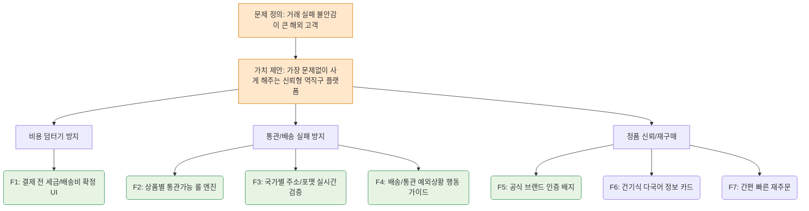

# Value Proposition Sheet — 통합 기준 문서 (V1_gem)
## 한국발 CBT 기반 K-Beauty·건강기능식품 글로벌 역직구 플랫폼

- **문서 버전:** V1 (gem)
- **작성일:** 2026-04-18
- **문서 성격:** 4개의 파편화된 기획 문서(가치 제안, 기능 우선순위, MVP 구현 계획, 가격 정책)를 하나의 흐름으로 묶은 통합 문서
- **기획 방향성:** 무엇을 만들 것인가(기능/구현)에 앞서, **누구의 문제를 어떤 비즈니스 모델로 풀 것인가(가치 제안/가격 정책)**를 먼저 정의하고, 이를 바탕으로 MVP와 기능을 나중에 도출하는 구조로 전면 재배치하였습니다.

> **이 문서가 답하는 핵심 질문 순서**
> 1. 우리는 누구의 어떤 불확실성을 제거해 줄 것인가? (가치 제안)
> 2. 그 가치를 통해 우리는 어떻게 돈을 벌 것인가? (가격 정책/수익 구조)
> 3. 이를 위해 어떤 기능들을 우선적으로 만들어야 하는가? (Job-Feature Map)
> 4. 그 기능들은 기술적으로 어떻게 구현할 것인가? (MVP 구현 상세)

---

# Part 1. Value Proposition (가치 제안) — 누구의 어떤 문제를 푸는가

## 1-1. 사업의 출발점

이 플랫폼의 출발점은 **"한국 제품을 많이 파는 글로벌몰"**이 아닙니다.  
핵심 문제는 **"해외 고객이 한국 건강기능식품/뷰티 제품을 살 때, 상품 자체의 스펙보다 '거래가 탈 없이 완료될 것인가'를 먼저 걱정한다"**는 점에 있습니다.

고객이 결제 전에 묻는 5가지 불안과 우리의 대응:
1. **Trust:** 이 채널은 정말 공식적이고 믿을 만한가?
2. **Clarity:** 결제하면 추가 비용이나 덤터기 없이 받을 수 있는가?
3. **Compliance:** 내 국가에서 통관에 걸리지 않는가?
4. **Accuracy:** 내 주소로 무사히 배송이 가능한가?
5. **Guidance:** 문제가 생기면 나는 어떻게 대처해야 하는가?

---

## 1-2. Value Proposition Sheet

| 항목 | 내용 |
| --- | --- |
| **페르소나 및 핵심 문제 (Pain / Needs)** | **1. 배송불안 소비자 (주소/통관 실패 반복형)** - **Pain:** 직구 시 숨겨진 세금, 주소·통관 문제로 인한 실패 경험 - **Needs:** 예상되는 최종 비용 안내와 나의 국가로 정상 배송이 가능한지 명확한 확신  **2. 가족 건강관리자 (정품·규제 민감형)** - **Pain:** 건기식 구매 시 가족이 먹을 제품의 성분과 유통기한 진위 판단 불가 - **Needs:** 확실한 공식 정품 보증과 내수 규제(수입 가능 여부) 사전 점검  **3. 교민 리더 (공동구매 운영형)** - **Pain:** 엑셀로 취합하는 주문 누락, 파손·분실 시 혼자 짊어지는 CS 책임 - **Needs:** 추천만 하면 배송과 CS는 플랫폼이 안아서 해결해 주는 B2B2C 툴 |
| **고객의 Job (목표)** | - **Clarity:** *"결제 전, 숨겨진 관세 없이 총 예상 비용을 미리 알아서 멈칫거림 없이 구매하고 싶다."* - **Certainty:** *"가족용 건기식을 살 때, 내 국가에서 통관 반려 없는 제품만 골라 사고 싶다."* - **Efficiency:** *"커뮤니티 사람들에게 제품을 추천할 때, 개별 주문 트래킹 스트레스에서 벗어나고 싶다."* |
| **핵심 가치 제안 (VP)** | *"해외 고객이 K-Beauty 및 건강기능식품을 구매할 때 느끼는 '불안과 불확실성(깜깜이 세금, 통관 실패, 가품 의심)'을 결제 전에 100% 제거해 주는, 예측 가능한 안심 역직구 플랫폼"* |
| **고객이 원하는 Outcome** | 1. 장바구니에서 관부가세·배송비가 포함된 **'최종 결제 금액' 확정** 2. 상품 페이지에서 **'내 국가 통관 가능 여부' 사전 확인** 3. 검증된 **'공식 정품 배지'**로 가품 불안 0% 달성 4. 오류 시 즉각적인 **배송 예외(Exception) 가이드** 제공 |
| **차별적 우위 (KSF)** | 기존 대안(iHerb, 스타일코리안 등)이 '상품 구색'에 목맬 때, 우리는 고관여 카테고리의 특성을 노려 **'거래 불확실성 0%(안심 비용, 안심 통관)'**를 무기로 삼는다. |

---

# Part 2. 가격 정책 및 수익 구조 — 어떻게 지속가능한 수익을 만들 것인가

이 플랫폼은 '최저가'가 아닌 '안심 거래'를 팝니다. 따라서 가격 역시 싸게 보이려는 꼼수보다 **철저히 예측 가능하게 설계**하여 수익을 다각화합니다.

## 2-1. 3층 수익 모델 (Monetization Framework)

1. **상품 판매 마진 (Layer 1)**
   - 공급가 기반의 기본 리테일 수익
   - '뷰티(저마진 진입) + 건기식(고마진)' 전략적 객단가 배합
2. **거래 신뢰 서비스 마진 (Layer 2) — 차별적 수익원**
   - Premium Express 배송 옵션 수익
   - 안심 패키지(검증 강화, 통관 보증 등) 추가 수수료
   - 선물/단독 포장 옵션
3. **파트너 플랫폼 수수료 (Layer 3) — 장기 수익원**
   - 커뮤니티 리더용 '공동구매 SaaS 도구' 구독료 및 커미션 배분
   - 마이크로 셀러 및 현지 파트너 도매 B2B 수수료

## 2-2. 고객군별 가격 접근법

- **신규 B2C 고객 (MVP 단계):**
  - 무리한 마진보다 '최종 결제액 100% 투명화'에 집중. 숨은 추가 요금을 없앰.
- **반복 구매 고객 (초기 성장 단계):**
  - 묶음 배송으로 물류 효율을 높이는 'Repeat Saver Bundle'과 배송 혜택 위주의 가벼운 멤버십 적용.
- **B2B2C 교민 리더 (확장 단계):**
  - 초기엔 수요만 가져오면 인센티브를 주어 유인, 트래픽 락인 후 'Pro Dashboard' 기능 제한적 유료화 실시.

---

# Part 3. Job-MVP Feature Map — 수익과 신뢰를 위한 기능 우선순위 매핑

앞서 정의한 **[가치 제안]**과 **[수익 모델]**을 달성하기 위해, 고객의 불안을 잠재울 '거래 완료율' 상승 관점에서의 MVP 기능을 도출합니다. 

## 3-1. MVP 포함 O/X 기능 분류

| 기능 ID | 기능명 | 연결 Job (핵심 목표) | 중요도 | 우선순위 | MVP | 대응 전략 / 제약 사항 |
| --- | --- | --- | --- | --- | --- | --- |
| **F1** | 예상 총액 확정 보기 | 총비용 예측 (Clarity) | 5 | High | **✔** | 초기엔 상위 3~5개 주요 타깃 국가 로직부터 적용 |
| **F2** | 국가별 통관 가능 여부 체크 | 불확실성 해소 (Certainty) | 5 | High | **✔** | 건기식 등 위험 카테고리 룰 엔진 하드코딩 시작 |
| **F3** | 주소/연락처 실시간 검증 | 배송 성공률 극대화 | 5 | High | **✔** | 타깃 국가 주소 정규식 유효성 검사 필수 탑재 |
| **F4** | ETA 및 배송 예외 사전 가이드 | 예외 피로도 최소화 | 5 | High | **✔** | 물류사 트래킹 API 기본 연동 및 상태값 매핑 |
| **F5** | 공식 인증·정품 배지 | 브랜드 신뢰 확보 | 5 | High | **✔** | 정품 정책 페이지와 직공급 인증 UI 적극 노출 |
| **F6** | 건기식 다국어 설명 카드 | 성분/성능/규제 안전성 입증 | 4 | Mid | **✔** | 상위 베스트셀러 SKU 우선 데이터 구축 |
| **F7** | 원클릭 재주문 시스템 | 반복 구매(수익성) 강화 | 4 | Mid | **✔** | 이전 장바구니 덤프 및 간편 주문 처리 |
| **F8~F10** | 첫 구매 안전 번들 / 재입고 알림 | 유입 및 체류 유도 | 3~4 | Mid | ✖ | MVP 이후 (Phase 2), 상품 소싱 안정화 후 적용 |
| **F11~F13** | 인플루언서 / 리더용 B2B2C 도구 | 트래픽 스케일업 및 관리 | 4 | Low | ✖ | MVP 이후 (Phase 3), 기본기 확보 후 확장 |

## 3-2. 기능 연관 관계 (Mermaid View)

---

# Part 4. MVP 구현 상세 계획 — 기술적으로 어떻게 만들 것인가

## 4-1. 아키텍처 및 시스템 레이어 (Draft)

총비용, 주소 검증, 통관 규제 등 국가별 변동성이 큰 로직이 핵심이므로, **모듈형 설계**와 **룰 엔진(Rule Engine)** 기반으로 뒷단을 구성해야 합니다.

1. **Pricing & Cost Engine (비용 엔진):** 
   - SKU 가격 + 물류사 배송비 + 국가별 HS코드 기반 예상 관부가세 합산 로직
2. **Compliance Rule Engine (통관 룰 엔진):** 
   - 국가 코드, SKU의 성분, 중량 등을 Input 받아 (✅ 허용, ⚠️ 주의, ❌ 금지) 리턴
3. **Address Verification (주소 검증 서비스):** 
   - 정규표현식(Regex) 기반 타깃 국가 우편번호 및 전화번호 포맷 실시간 검증 

## 4-2. MVP 기술 스택 (후보 및 제언)
- **Frontend:** Next.js (SSR 및 다국어 i18n 최적화)
- **Backend:** Node.js (NestJS) 또는 Python (빠른 룰 엔진 구축 용이)
- **DB & Cache:** PostgreSQL (JSON 규제/룰 데이터 관리) + Redis (환율 및 통관 룰 캐싱)
- **결제 PG:** Stripe (MVP 초기 1차 론칭용, 다통화 기본 처리)

## 4-3. 마일스톤 및 로드맵
- **Phase 0 (1~4주차):** DB 스키마, 결제/환율/물류 외부 API PoC 연동
- **Phase 1 (5~12주차):** [MVP 핵심] F1 비용 예측, F2 통관 로직, F3 주소 검증, F5 정품 배지 구축 집중
- **Phase 2 (13~20주차):** 안전 번들 추천, 쿠폰/할인 로직, 반복 구매 유도 플로우 연동
- **Phase 3 (21주차~):** B2B2C 파트너 SaaS 기능(대시보드, 공동구매 링크) 오픈

## 4-4. MVP 초기 성과 지표 (Primary KPI)
멋진 UI보다 **"거래 불확실성 로직이 작동하여 실패율이 통제되었는가"**가 먼저입니다.
1. **장바구니 전환율:** 총비용 100% 확정(F1) 제공 시 이탈률이 개선되었는가
2. **주소 오류율 (Target < 5%):** F3 유효성 검사를 통해 반송 건수가 통제 가능한가 
3. **통관 실패율 (Target < 3%):** F2 시스템을 통한 예외 발생 억제력
4. **결제 전 이탈률 (Target < 60%):** 신뢰 시그널 노출을 통한 첫 구매 장벽 해소

---

# Part 5. PRD / 기술 설계 전환 전 필수 합의 사항 (Checklist)

이 문서를 토대로 실제 기술 개발(PRD 작성)에 들어가기 앞서 예비창업자 및 의사결정자가 반드시 확정해야 하는 사항입니다.

### 🔴 Critical (MVP 착수 전)
- [ ] **1차 출시 타깃 국가 확정:** 룰 엔진 하드코딩과 주소 검증을 특정할 초기 3~5개국
- [ ] **DDP vs DDU 결정:** 관부가세 대납 포워딩 여부 (이 결정에 따라 결제 엔진 로직이 완전히 바뀜)
- [ ] **물류 파트너(3PL/포워더) POOL 지정:** 배송비 API 및 트래킹 시스템 연동 가능 여부 사전 타진
- [ ] **상품 카테고리 범위:** 뷰티만 할 것인가, 건기식을 포함해 복잡한 룰 엔진을 처음부터 짤 것인가.

### 🟡 Important (MVP 개발 중 단계적 합의)
- [ ] 반품/환불 글로벌 정책 (책임 소재 및 예외 처리 프로세스)
- [ ] 번역 퀄리티 및 다국어(i18n) 지원 1차 범위 

---

> **최종 요약**  
> 이 플랫폼은 기능이 많은 쇼핑몰이 아닙니다. 해외 고객의 핵심 페인포인트(배송·통관·가품 불안)를 기술과 정책으로 해소해 주는 **Uncertainty Reduction Engine(불확실성 제거 엔진)**입니다. 이 엔진(MVP)이 정상 작동하는지를 증명하게 되면 수익성과 확장성(B2B2C)은 자연스럽게 따라오게 됩니다.
