# Value Proposition Sheet — 통합 기준 문서 (V1)
## 한국발 CBT 기반 K-Beauty·건강기능식품 글로벌 역직구 플랫폼

- **문서 버전:** V1
- **작성일:** 2026-04-18
- **문서 성격:** 비즈니스 분석 결과를 바탕으로, **가치 제안 → 기능 우선순위 → MVP 구현 계획 → 가격/수익 구조**까지 하나의 흐름으로 정리한 통합 기준 문서
- **대상 독자:** 본격 신규 사업을 기획하는 예비창업자, 기획자, 초기 개발팀

> **이 문서 하나로 아래 질문에 답할 수 있어야 합니다.**
> 1. 우리는 누구의 어떤 문제를 푸는가?
> 2. 어떤 기능을 어떤 순서로 만드는가?
> 3. 그것을 기술적으로 어떻게 구현하는가?
> 4. 어떻게 수익을 만드는가?

---

# Part 1. 가치 제안 — 누구의 어떤 문제를 푸는가

---

## 1-1. 사업의 출발점

이 사업의 출발점은 **"한국 제품을 많이 파는 글로벌몰"**이 아닙니다.

핵심 문제는 다음과 같습니다:

> **해외 고객이 한국 K-Beauty·건강기능식품을 구매하려 할 때, "상품이 좋은가"보다 "이 거래가 정말 완료될 수 있는가"를 먼저 걱정한다.**

고객이 결제 전에 먼저 묻는 것:

| # | 고객 질문 | 대응 가치 |
|---|---|---|
| 1 | 이 채널은 **정말 공식적이고 믿을 만한가?** | Trust |
| 2 | 결제하면 **추가비용 없이 받을 수 있는가?** | Clarity |
| 3 | 내 국가에서 **통관 문제가 없는가?** | Compliance |
| 4 | 내 주소로 **실제로 배송이 가능한가?** | Accuracy |
| 5 | 문제가 생기면 **내가 무엇을 해야 하는가?** | Guidance |

따라서 이 MVP는 **"더 많은 상품 진열"이 아니라, "거래 불확실성 제거"를 위해 존재합니다.**

---

## 1-2. Value Proposition Sheet (가치 제안서)

| 항목 | 내용 |
| --- | --- |
| **페르소나 및 CJM 방식의 고객별 핵심 문제 서술 (Pain, Needs)** | **1. 주소/통관 실패 반복형 (배송불안 소비자)**<br>- **Pain:** 직구 시 숨겨진 추가비용, 주소오류/통관보류 등 배송 실패로 인한 극심한 스트레스<br>- **Needs:** 주문 시점부터 내 나라에 무사히 배송이 가능한 건지, 총 비용이 얼만지 분명하게 알고 싶음.<br><br>**2. 가족 건강관리자 (정품 및 규제 민감형)**<br>- **Pain:** 건기식 등에 대해 성분, 유통기한, 내수 규제 등 가족이 먹기 안전한지 확인이 어려움<br>- **Needs:** 공식적인 정품 보증과 상세한 성분/복용법 가이드, 수입 통관 가능 여부 확신이 필요함.<br><br>**3. 공동구매 운영형 교민 리더 (유통 확장형)**<br>- **Pain:** 수기 엑셀 주문 단톡방 취합의 피로, 배송 분실 및 파손시 발생하는 CS 책임을 독박 쓸 것이라는 두려움<br>- **Needs:** 추천 및 수요만 모으고, 배송/결제/CS 관리는 플랫폼이 위임받아 내 책임을 덜어주는 B2B2C 도구 |
| **JTBD 관점 고객 상황에 따른 목표 서술 (Goal, Job)** | - **투명한 총비용 (Clarity Job):** *"나는 해외 직구로 결제할 때 숨겨진 텍스나 배송비 덤터기 없이 총비용이 정확히 얼마인지 결제 전에 알아서 멈칫하지 않고 구매하고 싶다."*<br>- **통관/배송 확신 (Certainty Job):** *"가족을 위한 건기식을 고를 때, 내 국가에서 통관 문제가 없는 확실한 품목만 골라 안전하게 수령하고 싶다."*<br>- **운영 피로 제거 (Efficiency Job):** *"커뮤니티 사람들에게 제품을 추천하고 수요를 모을 때, 개별 결제와 배송 트래킹을 자동화하여 내 운영 스트레스와 책임을 덜고 싶다."* |
| **고객이 원하는 Outcome (기대효과)** | 1. 장바구니/결제 전 화면에서 수입 세금 및 배송비를 포함한 **'최종 결제 금액(Total Landed Cost)' 100% 확정 및 체감**<br>2. 상품 상세페이지(PDP)에서 **'통관 가능 여부(Green/Red Light)' 사전 확인 가능**<br>3. 공식 채널 직배송으로 **가품(Fake)에 대한 일말의 의심 원천 제거**<br>4. 배송 오류(예: 주소 포맷 오류) 발생 시 **주문 단계에서 즉각 사전 필터링 및 행동 가이드** 획득 |
| **우리 솔루션의 핵심 제안 (Value Proposition)** | *"해외 고객이 K-Beauty 및 건강기능식품을 구매할 때 두려워하는 모든 '불안과 불확실성(가품, 통관 실패, 깜깜이 세금)'을 결제 전 단계에서 선제적으로 제거해 주는, 100% 예측 가능한 안심 CBT 역직구 플랫폼"* |
| **기존 대안 (Competitor / Substitute)** | - **종합 이커머스:** Amazon, iHerb 등 글로벌 채널<br>- **K-제품 버티컬:** Olive Young Global, StyleKorean(Silicon2), Craver(UMMA) 등<br>- **우회 채널:** 현지 한인 마트, 오픈마켓 개별 셀러, 교민 카톡방 대리 구매 |
| **우리가 제공하는 차별적 가치** | 기존 대안은 '상품의 구색'과 '가격경쟁'에 집중합니다. 그러나 우리는 고관여 카테고리(뷰티/건기식) 특성을 파악하여, 최저가가 아닌 **'거래 불확실성 0% 달성'을 차별화 우위(KSF)로 삼습니다.**<br>1. **사전 안심 UX:** 결제 단에서 HS코드 및 세관 데이터를 기반으로 한 총비용/통관 룰 엔진 반영<br>2. **B2B2C 파트너 역직구(Scale-up):** 공동구매 리더에게 CS/물류 부담을 덜어주는 '마이크로 셀러/C2C 커머스 링크' 제공으로 오가닉 유저 풀 확장 |
| **Proof (근거 / 검증 데이터)** | - **5 Forces 분석:** 범용 뷰티 제품의 경쟁 강도는 극상이나, '통관 민감형 건기식 + 제품 신뢰' 시장은 아직 명확한 리더 부족<br>- **TAM/SAM/SOM 및 페르소나 분석:** 초전략 시장(US$65.2bn)에서의 1차 Beachhead 타깃은 상품을 못 구해 안달난 고객이 아니라 '해외직구 배송/통관 불안 고객'으로 측정됨. 통관 가능 여부와 주소 검증만으로 1차 이탈률이 급감할 것이라는 시장 가설 도출됨. |

---

## 1-3. Day 1 핵심 고객과 그들의 Job

### 고객 1: Sarah Kim — 한국 본사 직배송 신뢰형 회원
> **"현지 판매처에서 정품의 진위와 유통기한을 확신할 수 없을 때, 불안 없이 반복 구매하기 위해 한국 본사 기준의 공식 채널에서 신뢰 가능한 상품을 사고 싶다."**

- **핵심 Pain:** 정품 여부, 유통기한, 총비용, 배송 안정성 불안
- **핵심 Needs:** 공식 채널 신뢰, 빠른 재주문, 배송 가시성

### 고객 2: Maria형 가족 건강관리자 — 안심구매형 가족 건강관리자
> **"가족용 건강기능식품을 대신 고르고 주문해야 할 때, 실수 없는 구매를 위해 성분·복용법·통관 가능 여부가 명확한 채널에서 한 번에 안심하고 주문하고 싶다."**

- **핵심 Pain:** 건기식 설명 부족, 통관 가능성 불확실, 가족 구매 책임 부담
- **핵심 Needs:** 성분/복용법 설명, 국가별 통관 안내, 안심 구매 구조

### 고객 3: Ahmed Rahman — 주소·통관 실패 반복 사용자
> **"과거에 주소·연락처·통관 문제로 배송 실패를 겪었을 때, 같은 스트레스를 겪지 않기 위해 한 번에 정확하게 수령 가능한 구매 경험을 원한다."**

- **핵심 Pain:** 주소·연락처·통관 실패 경험 반복
- **핵심 Needs:** 주소 검증, 사전 경고, 예외 시 행동 가이드

### Day 2 확장 고객
- **Linda Park** — 공동구매 운영형 교민 커뮤니티 리더
- **Carlos Mendez** — 해외직구 불신·회피형 잠재고객

---

## 1-4. 경쟁 대안 대비 차별적 가치

| 차별화 축 | 기존 대안 | 우리 플랫폼 |
|---|---|---|
| **거래 안정성** | 상품 발견에 집중, 거래 실패는 사후 처리 | **결제 전 불확실성 제거** |
| **비용 투명성** | 숨은 비용, 통관 후 추가 청구 빈번 | **총비용 사전 확정 표시** |
| **배송 신뢰도** | 주소 오류·통관 실패 시 고객 책임 | **국가별 검증 + 예외 가이드** |
| **확장 구조** | B2C에만 집중 | **B2C → B2B2C 구조 설계** |

---

# Part 2. Job–MVP Feature Map — 어떤 기능을 어떤 순서로 만드는가

---

## 2-1. 기능 우선순위 표

이 사업의 기능 우선순위는 "눈에 띄는 기능"이 아니라,
**거래 완료율을 높이고, 배송 실패를 줄이고, 재구매와 확장을 가능하게 하는 기능 순서**로 정해야 합니다.

| 기능 ID | 기능명 | 연결 Job / Value | 핵심 목적 | 중요도(1~5) | 구현난이도(1~5) | 우선순위 | MVP 포함 여부 | 리스크 대응전략 |
| --- | --- | --- | --- | --- | --- | --- | --- | --- |
| F1 | 예상 총액 확정 보기 | 총비용 예측, 첫 구매 불안 해소 | 상품가+배송비+예상세금/수수료를 결제 전에 명확히 제시 | 5 | 3 | High | ✔ | 국가별 계산 로직을 단순화해 1차는 대표국부터 적용 |
| F2 | 국가별 통관 가능 여부 사전 확인 | 통관 가능성 확신 | 상품/국가 조합별 구매 가능·주의·제한 상태 제공 | 5 | 4 | High | ✔ | 고위험 카테고리부터 룰베이스로 시작하고 예외국은 수동 운영 병행 |
| F3 | 주소/연락처 실시간 검증 | 배송 성공률, 주소 정확성 | 국가별 주소 형식·전화번호·필수값 검증 | 5 | 4 | High | ✔ | 우선 출고량 상위 국가부터 적용, 실패 로그로 검증 룰 고도화 |
| F4 | 배송 ETA 및 예외 상황 가이드 | 배송 가시성, 고객 행동 명확화 | 지연/보류/추가서류 상황에서 고객 액션 안내 | 5 | 3 | High | ✔ | 물류사 이벤트를 전부 연결하지 못해도 상태 설명 사전 정의로 시작 |
| F5 | 공식성/정품 신뢰 신호 | 정품 신뢰, 공식채널 인식 | 공식 채널, 정품 보증, 정책/FAQ 신뢰 요소 노출 | 5 | 2 | High | ✔ | UI 신호부터 빠르게 적용하고, 운영정책 문서와 함께 증빙 일치화 |
| F6 | 건기식 설명 카드 | 가족 건강관리 안심구매 | 성분/복용법/주의사항/통관 주의 요약 제공 | 4 | 3 | Mid | ✔ | 모든 SKU 동시 구축 대신 베스트셀러/고위험 SKU 우선 적용 |
| F7 | 빠른 재주문 / 이전 주문 복제 | 반복구매 단축 | 재주문 클릭 수와 탐색 비용 절감 | 4 | 2 | Mid | ✔ | 주문이력 구조를 단순화해 핵심 SKU 중심으로 먼저 제공 |
| F8 | 저위험 첫 구매 패키지 | 비사용자 전환 | 첫 구매용 샘플/번들/안심 구성 제공 | 4 | 2 | Mid | ✖ | SKU 수를 제한하고 국가별 통관 안전 조합 중심으로 운영 |
| F9 | 재입고 알림 / 희소 SKU 추적 | SKU 확보 불안 해소 | 원하는 SKU의 재고 회복 시점 안내 | 3 | 2 | Mid | ✖ | 핵심 SKU만 대상으로 시작해 운영 복잡성 통제 |
| F10 | 안전 번들 추천 | 총비용 최적화, 가족구매 보조 | 국가/카테고리 기준으로 안전한 장바구니 조합 제안 | 3 | 3 | Mid | ✖ | 추천 엔진보다 규칙기반 번들부터 시작 |
| F11 | 공동구매 링크 생성 | 공동구매 운영 부담 감소 | 운영자가 주문 취합 없이 링크로 수요 연결 | 4 | 3 | Mid | ✖ | 리더 프로그램을 소수 테스트로 운영하며 오남용 방지 |
| F12 | 리더용 주문/배송 대시보드 | B2B2C 확장, 운영자 보호 | 참여자 상태를 운영자가 한눈에 확인 | 4 | 4 | Low-Mid | ✖ | 1차는 수동 리포트/간이 페이지로 검증 후 정식 개발 |
| F13 | FAQ 자동응대 / 상태공유 링크 | 문의 집중 완화 | 배송·통관 질문을 운영자 대신 플랫폼이 처리 | 4 | 3 | Mid | ✖ | 자주 묻는 질문 템플릿부터 적용하고 자동화는 후속 개발 |
| F14 | 개인화 추천 / 구독 | 장기 LTV 확대 | 반복구매, 락인, 객단가 증대 | 3 | 4 | Low | ✖ | 거래 안정성 확보 전에는 보류, 재구매 데이터 축적 후 도입 |

---

## 2-2. Tier별 우선순위 해석

### Tier 1. Day 1 MVP 핵심 기능
- F1 예상 총액 확정 보기
- F2 국가별 통관 가능 여부 사전 확인
- F3 주소/연락처 실시간 검증
- F4 배송 ETA 및 예외 상황 가이드
- F5 공식성/정품 신뢰 신호

이 5개는 **고객의 결제 직전 이탈을 막고 배송 실패를 줄이는 기능**이다.
즉, 매출을 만드는 기능이면서 동시에 CS 비용과 운영 리스크를 줄이는 기능이다.

### Tier 2. 초기 성장 기능
- F6 건기식 설명 카드
- F7 빠른 재주문
- F8 저위험 첫 구매 패키지
- F9 재입고 알림
- F10 안전 번들 추천

이 구간은 **한 번 산 고객을 다시 사게 만들고, 아직 안 산 고객을 부담 없이 들어오게 하는 기능**이다.

### Tier 3. 확장 기능
- F11 공동구매 링크 생성
- F12 리더용 대시보드
- F13 FAQ 자동응대 / 상태공유 링크
- F14 개인화 추천 / 구독

이 구간은 **B2B2C 확장과 장기 락인**을 위한 기능이다.
사업이 안정화되기 전에는 욕심내기 쉽지만, 너무 일찍 붙이면 MVP가 무거워질 수 있다.

---

## 2-3. Job(Value)–MVP Feature Map (시각화)

```mermaid
flowchart TD
    A[핵심 Value Proposition\n해외 고객이 한국 제품을\n가장 문제 없이 사게 해주는 신뢰형 CBT 플랫폼]

    A --> J1[Job/Value 1\n결제 전 총비용 예측]
    A --> J2[Job/Value 2\n국가별 통관 가능성 확신]
    A --> J3[Job/Value 3\n주소 정확성 및 배송 성공률 확보]
    A --> J4[Job/Value 4\n배송 중 예외 상황 행동 명확화]
    A --> J5[Job/Value 5\n공식성·정품 신뢰 확보]
    A --> J6[Job/Value 6\n반복구매와 첫 구매 진입장벽 완화]
    A --> J7[Job/Value 7\n공동구매/B2B2C 확장]

    J1 --> F1[F1 예상 총액 확정 보기\n중요도 5 / 난이도 3 / High / MVP✔]
    J2 --> F2[F2 통관 가능 여부 사전 확인\n중요도 5 / 난이도 4 / High / MVP✔]
    J3 --> F3[F3 주소·연락처 실시간 검증\n중요도 5 / 난이도 4 / High / MVP✔]
    J4 --> F4[F4 배송 ETA·예외 가이드\n중요도 5 / 난이도 3 / High / MVP✔]
    J5 --> F5[F5 공식성·정품 신뢰 신호\n중요도 5 / 난이도 2 / High / MVP✔]

    J6 --> F6[F6 건기식 설명 카드\n중요도 4 / 난이도 3 / Mid / MVP✔]
    J6 --> F7[F7 빠른 재주문\n중요도 4 / 난이도 2 / Mid / MVP✔]
    J6 --> F8[F8 저위험 첫 구매 패키지\n중요도 4 / 난이도 2 / Mid / MVP✖]
    J6 --> F9[F9 재입고 알림\n중요도 3 / 난이도 2 / Mid / MVP✖]
    J6 --> F10[F10 안전 번들 추천\n중요도 3 / 난이도 3 / Mid / MVP✖]

    J7 --> F11[F11 공동구매 링크 생성\n중요도 4 / 난이도 3 / Mid / MVP✖]
    J7 --> F12[F12 리더용 주문·배송 대시보드\n중요도 4 / 난이도 4 / Low-Mid / MVP✖]
    J7 --> F13[F13 FAQ 자동응대·상태공유 링크\n중요도 4 / 난이도 3 / Mid / MVP✖]
    J7 --> F14[F14 개인화 추천·구독\n중요도 3 / 난이도 4 / Low / MVP✖]

    classDef core fill:#ffe7cc,stroke:#d97a00,stroke-width:1.5px,color:#222;
    classDef mvp fill:#e7f4e4,stroke:#2e8b57,stroke-width:1.5px,color:#222;
    classDef growth fill:#e8f0ff,stroke:#4a67ff,stroke-width:1.5px,color:#222;
    classDef expand fill:#f3e8ff,stroke:#8a3ffc,stroke-width:1.5px,color:#222;

    class A core;
    class F1,F2,F3,F4,F5,F6,F7 mvp;
    class F8,F9,F10 growth;
    class F11,F12,F13,F14 expand;
```



---

## 2-4. MVP 단계별 NOT-DO 리스트

MVP를 가볍게 유지하기 위해 **명시적으로 배제**해야 할 것:

| 배제 항목 | 이유 |
|---|---|
| 모든 국가에 같은 UX 적용 | 국가별 규제·주소·통관이 달라 범용 UX는 실패 유발 |
| 모든 SKU 한 번에 확대 | 통관 검증 없는 SKU 확대는 실패율만 높임 |
| 커뮤니티 기능 조기 도입 | 거래 안정성 없이 커뮤니티는 의미 없음 |
| 개인화 추천 | 거래 데이터 축적 전에는 추천 품질이 낮음 |
| 복잡한 멤버십 체계 | 첫 구매 전환에 장벽이 됨 |

---

# Part 3. MVP 구현 상세 계획 — 기술적으로 어떻게 만드는가

---

## 3-1. MVP 기능 스펙 및 기술 요구사항

### Tier 1: Day 1 MVP 핵심 기능 (5개)

| ID | 기능명 | 기술 요구사항 | 구현 난이도 | 리스크 대응 전략 |
|---|---|---|---|---|
| **F1** | 예상 총액 확정 보기 | 국가별 세금·관세 계산 로직, 배송비 API, 환율 API 연동 | ★★★☆☆ | 1차는 대표국(미국·일본·동남아 3~5개국)부터 적용, 나머지는 수동 운영 |
| **F2** | 국가별 통관 가능 여부 사전 확인 | 상품/국가 조합별 룰 엔진, HS Code 매핑, 규제 DB | ★★★★☆ | 고위험 카테고리(건기식)부터 룰베이스로 시작, 예외국은 수동 운영 병행 |
| **F3** | 주소/연락처 실시간 검증 | 국가별 주소 포맷 검증, 전화번호 포맷 검증, 필수값 체크 | ★★★★☆ | 출고량 상위 국가부터 적용, 실패 로그 기반으로 검증 룰 점진 고도화 |
| **F4** | 배송 ETA 및 예외 상황 가이드 | 물류사 Tracking API 연동, 상태 매핑, 예외 시나리오 정의 | ★★★☆☆ | 물류사 이벤트를 전부 연결 못해도 상태 설명 사전 정의로 시작 |
| **F5** | 공식성/정품 신뢰 신호 | 브랜드 인증 배지 UI, 정품 보증 정책 페이지, FAQ 구조 | ★★☆☆☆ | UI 신호부터 빠르게 적용, 운영 정책 문서와 증빙 일치화 |

### Tier 2: 초기 성장 기능 (MVP에 포함되되 간소화)

| ID | 기능명 | 기술 요구사항 | 구현 난이도 | MVP 포함 전략 |
|---|---|---|---|---|
| **F6** | 건기식 설명 카드 | 성분/복용법/주의사항 구조화 데이터, 국가별 통관 주의 연동 | ★★★☆☆ | 베스트셀러/고위험 SKU 우선 적용 |
| **F7** | 빠른 재주문 / 이전 주문 복제 | 주문 이력 저장, 장바구니 복제 로직 | ★★☆☆☆ | 핵심 SKU 중심 단순 구조로 제공 |

---

## 3-2. 시스템 아키텍처 초안

### 전체 아키텍처 개념도

```
┌─────────────────────────────────────────────────────────────────────┐
│                        CLIENT LAYER                                │
│  ┌─────────────┐  ┌──────────────┐  ┌───────────────────────────┐  │
│  │ Web App     │  │ Mobile Web   │  │ Admin Dashboard           │  │
│  │ (Next.js)   │  │ (Responsive) │  │ (Internal Ops)            │  │
│  └──────┬──────┘  └──────┬───────┘  └────────────┬──────────────┘  │
└─────────┼───────────────┼────────────────────────┼──────────────────┘
          │               │                        │
          ▼               ▼                        ▼
┌─────────────────────────────────────────────────────────────────────┐
│                        API GATEWAY                                 │
│                  (Rate Limiting, Auth, i18n)                       │
└──────────┬──────────────┬──────────────┬──────────────┬─────────────┘
           │              │              │              │
           ▼              ▼              ▼              ▼
┌──────────────┐ ┌────────────┐ ┌────────────┐ ┌──────────────────┐
│ Product &    │ │ Pricing &  │ │ Order &    │ │ Compliance &     │
│ Catalog      │ │ Cost       │ │ Fulfillment│ │ Verification     │
│ Service      │ │ Engine     │ │ Service    │ │ Service          │
│              │ │            │ │            │ │                  │
│ • SKU 관리    │ │ • 총비용계산 │ │ • 주문처리  │ │ • 통관 룰 엔진    │
│ • 건기식 설명  │ │ • 환율 연동 │ │ • ETA 추적 │ │ • 주소 검증      │
│ • 정품 인증   │ │ • 세금 계산 │ │ • 예외 가이드│ │ • 연락처 검증    │
│ • 브랜드 신호  │ │ • 배송비   │ │ • 재주문   │ │ • HS Code 매핑   │
└──────┬───────┘ └─────┬──────┘ └─────┬──────┘ └────────┬─────────┘
       │               │              │                 │
       ▼               ▼              ▼                 ▼
┌─────────────────────────────────────────────────────────────────────┐
│                      DATA & INTEGRATION LAYER                      │
│  ┌──────────┐  ┌───────────┐  ┌───────────┐  ┌───────────────┐    │
│  │ DB       │  │ Cache     │  │ Message   │  │ External APIs │    │
│  │ (RDB)    │  │ (Redis)   │  │ Queue     │  │               │    │
│  │          │  │           │  │           │  │ • 물류사 API   │    │
│  │ • 상품    │  │ • 환율    │  │ • 배송상태 │  │ • 환율 API    │    │
│  │ • 주문    │  │ • 통관룰  │  │ • 알림     │  │ • 결제 PG     │    │
│  │ • 고객    │  │ • 주소포맷 │  │ • CS 이벤트│  │ • 주소검증API │    │
│  │ • 규제    │  │           │  │           │  │ • 세금계산API │    │
│  └──────────┘  └───────────┘  └───────────┘  └───────────────┘    │
└─────────────────────────────────────────────────────────────────────┘
```

### 핵심 서비스 설계 원칙

| 원칙 | 설명 | 이유 |
|---|---|---|
| **모듈 분리** | Pricing, Compliance, Fulfillment을 독립 서비스로 분리 | 국가별 로직 차이가 크므로 서비스 단위로 확장 필요 |
| **룰 엔진 기반** | 통관·주소·세금 로직을 하드코딩하지 않고 룰 테이블 기반으로 운영 | 국가 추가 시 코드 변경 없이 룰 추가로 대응 |
| **캐시 우선** | 환율·세금율·주소포맷 등 변동이 적은 데이터는 캐시 활용 | 결제 전 총비용 계산의 응답 속도 확보 |
| **점진적 자동화** | 1차는 수동+반자동, 2차에서 API 연동 자동화 | 초기 운영 데이터를 수집하면서 자동화 범위 결정 |
| **다국어/다통화 기본 설계** | i18n, 통화 변환을 아키텍처 레벨에서 기본 지원 | 후속 국가 확장 시 재설계 비용 방지 |

---

## 3-3. 핵심 기능별 기술 설계 초안

### F1. 예상 총액 확정 보기 — Pricing & Cost Engine

```
[사용자 장바구니]
      │
      ▼
┌──────────────────────────────┐
│  Pricing & Cost Engine       │
│                              │
│  1. 상품가 조회 (SKU 마진 적용)│
│  2. 배송비 계산               │
│     └─ 국가 + 무게 + 부피     │
│  3. 예상 세금/관세 계산        │
│     └─ HS Code + 국가별 세율  │
│  4. 환율 적용                 │
│  5. 총비용 합산 및 항목별 분리  │
└──────────────────────────────┘
      │
      ▼
[최종 결제 예상액 UI]
  ├─ 상품가: $XX.XX
  ├─ 국제배송비: $XX.XX
  ├─ 예상 세금/관세: $XX.XX
  ├─ (선택) 프리미엄 옵션: $XX.XX
  └─ 최종 예상 결제액: $XX.XX
```

**기술 선택 포인트:**
- 환율: 외부 API (Open Exchange Rates 등) + 캐시 (1시간 갱신)
- 세금/관세: 국가별 룰 테이블 (초기 5개국 수동 관리 → API 연동)
- 배송비: 물류 파트너 API 또는 구간별 요율 테이블

### F2. 국가별 통관 가능 여부 사전 확인 — Compliance Rule Engine

```
[상품 상세 페이지 진입]
      │
      ▼
┌──────────────────────────────┐
│  Compliance Rule Engine      │
│                              │
│  Input:                      │
│    - 상품 카테고리 / HS Code  │
│    - 배송 대상 국가            │
│    - 상품 속성 (성분, 중량 등) │
│                              │
│  Output:                     │
│    ✅ 구매 가능               │
│    ⚠️ 주의 (조건부 허용)       │
│    ❌ 구매 불가 (해당 국가 제한)│
│    ℹ️ 추가 서류 필요           │
└──────────────────────────────┘
```

**데이터 모델 초안:**
```
compliance_rules (
  id,
  country_code,       -- 대상 국가
  category_code,      -- 상품 카테고리
  hs_code,            -- HS Code
  restriction_type,   -- 'allowed' | 'conditional' | 'prohibited'
  condition_desc,     -- 조건부 허용 시 상세 설명
  required_docs,      -- 필요 서류 목록
  max_quantity,       -- 수량 제한
  max_value,          -- 금액 제한
  updated_at
)
```

### F3. 주소/연락처 실시간 검증 — Address Verification Service

```
[주소 입력 폼]
      │
      ▼
┌──────────────────────────────┐
│  Address Verification        │
│                              │
│  1. 국가별 주소 포맷 검증     │
│     └─ 필수 필드 체크          │
│     └─ 우편번호 형식 검증      │
│     └─ 지역/도시 매칭 검증     │
│  2. 전화번호 국가코드 + 형식   │
│  3. 수취인명 로마자/현지문자   │
│  4. 실시간 피드백              │
│     └─ "이 형식은 해당 국가에  │
│        서 배송 실패 가능성이   │
│        있습니다"               │
└──────────────────────────────┘
```

**기술 선택 포인트:**
- 1차: 국가별 Regex 기반 포맷 검증 (상위 5개국)
- 2차: Google Address Validation API 또는 Loqate 연동
- 전화번호: libphonenumber 라이브러리 활용

### F4. 배송 ETA 및 예외 상황 가이드 — Fulfillment Tracker

```
[주문 완료 후]
      │
      ▼
┌──────────────────────────────────────┐
│  Fulfillment Tracker                 │
│                                      │
│  상태 정의:                           │
│  1. 주문 접수                         │
│  2. 출고 준비 중                       │
│  3. 출고 완료 (국내 운송 시작)          │
│  4. 국제 운송 중                       │
│  5. 목적국 도착 / 통관 진행             │
│  6. 현지 배송 중                       │
│  7. 배송 완료                          │
│                                      │
│  예외 분기:                            │
│  ⚠️ 통관 보류 → "추가 서류 필요" 안내    │
│  ⚠️ 주소 오류 → "수정 방법" 안내         │
│  ⚠️ 수량/규격 초과 → "부분 반송" 안내    │
│  ⚠️ 현지 배송 지연 → "예상 지연일" 안내   │
└──────────────────────────────────────┘
```

### F5. 공식성/정품 신뢰 신호 — Trust Signal System

| 신호 유형 | 구현 방식 | 위치 |
|---|---|---|
| 브랜드 공식 인증 배지 | 인증 브랜드 DB + 배지 UI 컴포넌트 | 상품 상세, 검색 결과 |
| 정품 보증 정책 | 정적 페이지 + FAQ 구조화 데이터 | 푸터, 상품 상세 하단 |
| 유통기한 표시 | SKU별 유통기한 필드 + 잔여일 계산 | 상품 상세 |
| 회사/물류 투명성 | 한국 본사 기반 물류 프로세스 공개 | About, FAQ |
| 고객 리뷰/평점 | 구매 확인 리뷰 시스템 (2차) | 상품 상세 |

---

## 3-4. 데이터 모델 핵심 엔티티 (초안)

```
┌─────────────┐     ┌──────────────┐     ┌─────────────────┐
│  Products    │     │  Orders      │     │  Customers      │
├─────────────┤     ├──────────────┤     ├─────────────────┤
│ id           │◄──┐│ id            │──►│ id               │
│ sku          │   ││ customer_id   │   │ email            │
│ name (i18n)  │   ││ items[]       │   │ country_code     │
│ category     │   └│ product_id    │   │ addresses[]      │
│ hs_code      │    │ total_cost    │   │ phone            │
│ brand_id     │    │ shipping_cost │   │ preferred_lang   │
│ is_certified │    │ tax_estimate  │   │ order_history[]  │
│ ingredients  │    │ status        │   └─────────────────┘
│ expiry_info  │    │ eta_info      │
│ weight/volume│    │ exceptions[]  │
│ price_rules  │    │ created_at    │
└─────────────┘    └──────────────┘

┌───────────────────┐     ┌───────────────────┐
│ ComplianceRules   │     │ AddressFormats     │
├───────────────────┤     ├───────────────────┤
│ id                │     │ id                 │
│ country_code      │     │ country_code       │
│ category_code     │     │ required_fields[]  │
│ hs_code           │     │ postal_regex       │
│ restriction_type  │     │ phone_regex        │
│ conditions        │     │ address_template   │
│ required_docs     │     │ validation_rules   │
│ max_qty / max_val │     │ updated_at         │
└───────────────────┘     └───────────────────┘

┌───────────────────┐
│ PricingRules      │
├───────────────────┤
│ id                │
│ country_code      │
│ category_code     │
│ tax_rate          │
│ duty_rate         │
│ de_minimis        │
│ shipping_zones    │
│ currency_code     │
│ updated_at        │
└───────────────────┘
```

---

## 3-5. 기술 스택 후보 (의사결정 필요)

| 영역 | 후보 A | 후보 B | MVP 권장 | 비고 |
|---|---|---|---|---|
| **Frontend** | Next.js (React) | Nuxt.js (Vue) | Next.js | SSR/SEO, i18n 생태계 |
| **Backend** | Node.js (NestJS) | Python (FastAPI) | 팀 역량 기준 | 둘 다 가능, 일관성 중요 |
| **Database** | PostgreSQL | MySQL | PostgreSQL | JSON 컬럼 (룰/상품속성) 활용 |
| **Cache** | Redis | Memcached | Redis | TTL 기반 환율/룰 캐시 |
| **Message Queue** | RabbitMQ | Amazon SQS | 규모에 따라 선택 | 배송 상태 비동기 처리 |
| **Search** | Elasticsearch | Algolia | Algolia (초기) | 관리 부담 최소화 |
| **Hosting** | AWS | GCP | AWS | 글로벌 CDN, 물류사 연동 생태계 |
| **Payment** | Stripe | PayPal + 현지 PG | Stripe (1차) | 다통화 지원, 후속 현지 PG 확장 |

> **의사결정 원칙:** MVP 단계에서는 팀이 가장 빠르게 개발할 수 있는 스택 우선. 아키텍처 수준에서 교체 가능하도록 인터페이스 분리.

---

## 3-6. MVP 개발 로드맵 (Phase 구분)

### Phase 0: 기반 구축 (Week 1~4)

| 항목 | 세부 내용 |
|---|---|
| 프로젝트 환경 | 리포지토리 구성, CI/CD, 개발/스테이징 환경 |
| DB 스키마 | 핵심 엔티티 설계 및 마이그레이션 |
| 디자인 시스템 | UI 컴포넌트 라이브러리, 다국어 기본 구조 |
| 외부 API 검증 | 환율, 물류, 결제 API PoC |

### Phase 1: MVP 핵심 기능 (Week 5~12)

| 기능 | 주차 | 산출물 |
|---|---|---|
| F5 공식성/정품 신뢰 신호 | W5~6 | 브랜드 인증 배지, 정품 보증 페이지 |
| F1 예상 총액 확정 보기 | W6~8 | 비용 계산 엔진, 결제 전 총비용 UI |
| F2 통관 가능 여부 확인 | W8~10 | 통관 룰 엔진, 상품별 통관 상태 표시 |
| F3 주소/연락처 검증 | W9~11 | 국가별 주소 검증, 실시간 피드백 UI |
| F4 배송 ETA/예외 가이드 | W10~12 | 상태 추적 UI, 예외 안내 시스템 |
| F6 건기식 설명 카드 | W11~12 | 성분/복용법 카드 (상위 SKU) |
| F7 빠른 재주문 | W12 | 주문 이력 기반 재주문 |

### Phase 2: 초기 성장 기능 (Week 13~20)

| 기능 | 내용 |
|---|---|
| F8 저위험 첫 구매 패키지 | 국가별 안전 SKU 번들 |
| F9 재입고 알림 | 핵심 SKU 대상 알림 |
| F10 안전 번들 추천 | 규칙 기반 장바구니 추천 |
| 반복구매 혜택 구조 | Repeat Saver Bundle |
| A/B 테스트 인프라 | 전환율 최적화 기반 |

### Phase 3: 확장 기능 (Week 21~)

| 기능 | 내용 |
|---|---|
| F11 공동구매 링크 생성 | 리더 프로그램 시작 |
| F12 리더용 대시보드 | 참여자 상태 일괄 확인 |
| F13 FAQ 자동응대 | CS 분산 시스템 |
| F14 개인화 추천/구독 | 데이터 기반 추천 |
| 파트너 도구 | B2B2C 운영 SaaS |

---

## 3-7. 리스크 식별 및 대응 전략

### 기술 리스크

| 리스크 | 영향도 | 발생 확률 | 대응 전략 |
|---|---|---|---|
| **국가별 세금/관세 계산 부정확** | 🔴 높음 | 🟡 중간 | 대표국 5개 수동 검증 → disclaimer 표시 ("예상치, 실제와 다를 수 있음") |
| **통관 룰 변경에 대한 업데이트 지연** | 🔴 높음 | 🟡 중간 | 규제 모니터링 프로세스 수립, 룰 테이블 버전 관리 |
| **물류사 API 불안정/미연동** | 🟡 중간 | 🟢 낮음 | 상태 설명 사전 정의로 시작, Full tracking은 2차 |
| **국가별 주소 검증 정확도 부족** | 🟡 중간 | 🟡 중간 | 실패 로그 기반 점진 개선, 고객 피드백 루프 |
| **다국어 콘텐츠 품질** | 🟡 중간 | 🟡 중간 | 주요 3개 언어 우선 (영어·일본어·중국어), 나머지는 기계번역 + 검수 |

### 운영 리스크

| 리스크 | 영향도 | 발생 확률 | 대응 전략 |
|---|---|---|---|
| **건기식 통관 실패 클레임** | 🔴 높음 | 🟡 중간 | 고위험 카테고리 사전 통관 체크 강화, 면책 고지 |
| **CS 비용 급증** | 🟡 중간 | 🟡 중간 | F4 예외 가이드로 사전 안내, FAQ 자동 응대 템플릿 |
| **환율 변동에 의한 마진 침식** | 🟡 중간 | 🟡 중간 | 환율 갱신 주기 관리, 가격 버퍼 설계 |
| **초기 SKU 부족으로 인한 전환율 저하** | 🟡 중간 | 🟢 낮음 | 히어로 SKU 30개 우선 확보, 카테고리 집중 전략 |

### 비즈니스 리스크

| 리스크 | 영향도 | 발생 확률 | 대응 전략 |
|---|---|---|---|
| **신규 플랫폼 신뢰 부족** | 🔴 높음 | 🟡 중간 | F5 신뢰 신호 + 초기 인플루언서/교민 커뮤니티 검증 |
| **가격 경쟁력 부족 인식** | 🟡 중간 | 🟡 중간 | "최저가" 대신 "예측 가능한 총비용" 메시지 전략 |
| **B2B2C 확장 시점 오판** | 🟡 중간 | 🟢 낮음 | B2C 거래 안정성 KPI 달성 후 단계적 전환 |

---

## 3-8. MVP 성공 KPI

> 초기 KPI는 매출이 아니라 **거래 안정성 지표**가 더 중요합니다.

### Primary KPI (MVP 핵심 지표)

| KPI | 목표 | 측정 방법 |
|---|---|---|
| 장바구니 → 결제 전환율 | ≥ 15% | 총비용 확정 보기 도입 전후 비교 |
| 주소 오류율 | ≤ 5% | 검증 실패 로그 / 전체 주문 |
| 통관 실패율 | ≤ 3% | 통관 반려 건수 / 전체 출고 |
| 배송 관련 CS 비중 | ≤ 30% | 배송 CS건 / 전체 CS건 |
| 첫 구매 이탈률 | ≤ 60% | 첫 방문 → 첫 구매 실패 비율 |

### Secondary KPI (성장 지표)

| KPI | 목표 | 측정 방법 |
|---|---|---|
| 재구매 전환율 | ≥ 25% (3개월 내) | 2회 이상 구매 고객 비율 |
| NPS (Net Promoter Score) | ≥ 40 | 정기 설문 |
| 거래 완료율 | ≥ 90% | 결제 완료 → 수령 확인 |
| 평균 객단가 | 트래킹 | 번들/재구매 효과 모니터링 |

---

# Part 4. 가격 정책 및 수익 구조 — 어떻게 수익을 만드는가

---

## 4-1. 가격 정책 설계 원칙

### 원칙 1: 싸게 보이기보다 예측 가능하게 보여야 한다

이 사업의 핵심 가치는 "최저가"가 아니라 "문제 없는 거래"입니다.

따라서 가격 정책도 아래 순서를 따라야 합니다.

1. **총비용이 이해되게 한다**
2. **추가 비용이 왜 발생하는지 설명한다**
3. **고객이 통제 가능한 옵션을 구분한다**
4. 그 다음에야 **가격 경쟁력**을 보여준다

### 원칙 2: 상품 마진과 서비스 수익을 분리해서 봐야 한다

초기 창업자는 보통 상품 판매 마진만 생각하지만, 이 사업은 실제로 아래 3개 층위의 수익원이 필요합니다.

- **상품 판매 수익(Product Margin)**
- **거래 편의/신뢰 서비스 수익(Service Margin)**
- **파트너/운영 도구 수익(Platform Fee)**

### 원칙 3: 첫 구매 장벽은 낮추고, 반복구매와 파트너 확장에서 수익성을 높여야 한다

첫 구매에서는 가격보다 불안이 더 큰 장벽입니다.
따라서 첫 구매 고객에게 과도한 수수료를 붙이면 전환이 떨어집니다.

반대로, 거래가 반복되고 운영 효율이 생기는 단계에서는 아래가 수익화 포인트가 됩니다.

- 재구매 편의
- 번들/세트
- 빠른 배송 옵션
- 공동구매 운영도구
- 파트너용 관리 기능

### 원칙 4: 가격표 자체가 신뢰 장치여야 한다

특히 해외직구 불신·회피형 고객에게는 아래가 중요합니다.

- 상품가
- 국제배송비
- 세금/예상수입비용
- 선택형 프리미엄 서비스 비용

이 항목이 분리되어 보이되, **최종 결제금액은 하나로 이해되게** 설계해야 합니다.

---

## 4-2. 권장 수익 구조: 3층 수익 모델

### Layer 1. 기본 상품 판매 수익

가장 기본은 상품 판매 마진입니다.

**구조:**
- 본사 공급가 또는 도매가 기반 원가 확보
- 국가/채널/카테고리별 차등 마진 설정
- SKU별 전략마진 운영

**권장 방식:**
- **Beauty:** 상대적으로 낮은 진입 마진 + 번들/재구매로 객단가 확대
- **Health supplement:** 규제/설명/리스크 비용을 반영한 더 보수적이지만 높은 목표 마진
- **희소 SKU / 현지 미판매 SKU:** 프리미엄 허용 범위 내에서 추가 마진 가능

**실무 포인트:**
- 전 SKU에 동일 마진율을 적용하지 말 것
- 고객이 가격 민감한 SKU와 신뢰 민감한 SKU를 구분해 운영할 것
- 히어로 SKU는 비교적 낮은 마진으로 유입을 만들고, 번들/연관상품에서 총이익을 확보할 것

### Layer 2. 거래 신뢰 서비스 수익

이 사업은 단순 상품판매가 아니라, 불확실성을 줄여주는 서비스입니다.
따라서 일부 고객군에는 **신뢰/편의 서비스에 대한 명시적 과금**이 가능합니다.

**가능한 항목:**
1. **프리미엄 배송 옵션 요금** — 빠른 처리, 우선 출고, 안정성 높은 특정 운송옵션 선택
2. **안심 패키지 요금** — 주소/수취정보 추가 검증, 민감 카테고리 사전 체크, 통관 예외 대응 안내 강화
3. **선물/공동구매 패키지 요금** — 포장 분리, 주문 분리 가이드, 상태공유 기능

### Layer 3. 파트너/리더용 플랫폼 수익

B2B2C 확장 단계에서는 상품 판매 외에 **운영도구 자체를 수익화**할 수 있습니다.

**대상:**
- 공동구매 운영형 교민 커뮤니티 리더
- 현지 미론칭 시장 공백 보완 파트너
- 소규모 셀러/테스트 바이어

**과금 방식 예시:**
- 주문당 수수료형
- 월 구독형
- 거래액 연동형
- 혼합형(기본료 + 거래수수료)

---

## 4-3. 고객군별 권장 가격 정책

### B2C 일반 고객
- **과금:** 상품 판매가 + 국제배송비 + 예상 세금/수입비용 + 선택형 프리미엄 배송비
- **메시지:** "가장 싸다"보다 **"얼마가 들지 미리 안다"**
- **포인트:** 숨겨진 수수료처럼 보이는 항목 최소화, 특정 국가에서는 DDP형 확정가 패키지 전면 배치

### 반복구매 고객
- **과금:** 정기 재구매 번들 할인 + 멤버십형 배송 혜택 + 누적 구매 기반 리워드
- **구조:** Repeat Saver Bundle, Membership Lite (월/분기/연)
- **주의:** 초기에는 무거운 유료 멤버십보다, 반복구매에 따라 자연스럽게 혜택이 커지는 구조가 적합

### 첫 구매 고객
- **과금:** 저위험 스타터 번들 + 첫 구매 한정 배송 프로모션
- **핵심:** 매출 극대화가 아니라 **첫 성공 경험 확보**
- **메시지:** 첫 구매 전용 안전 번들, 추가 비용 예측이 쉬운 패키지

### 공동구매 리더 / 커뮤니티 운영자
- **Free:** 링크 생성, 기본 상태 조회, 기본 FAQ 공유
- **Pro:** 참여자별 상태 대시보드, 주문 상태 자동 알림, 운영자 전용 CS 분산 기능, 리더 성과 리포트
- **전략:** 초기에는 보상 먼저, 도구 의존도가 생긴 뒤 Pro 기능 유료화

### 현지 파트너 / 소규모 셀러
- **Starter Partner:** 소량 테스트 발주, MOQ 완화, 제한된 운영지원
- **Growth Partner:** 더 낮은 공급가, 공동 마케팅 지원, 현지 고객 응대 템플릿
- **Managed Partner:** 운영 리포트, 월간 정산, 국가별 SKU 추천, 추가 수수료

---

## 4-4. 추천 과금 모델 조합

| 모델 | 구조 | 장점 | 한계 | 적용 시기 |
|---|---|---|---|---|
| **모델 A. 기본형** | 상품 마진 + 국제배송비 + 예상 세금 노출 | 단순, 초기 운영 쉬움 | 상품 마진 의존, 차별적 수익화 어려움 | — |
| **모델 B. 권장형** | 상품 마진 + 선택형 프리미엄 서비스 요금 + 반복구매 혜택 | 지불의사 차이 반영, 수익/전환 균형 | 가격 설계·UI 복잡 | **MVP (초기)** |
| **모델 C. 확장형** | 상품 마진 + 서비스 요금 + 파트너 구독/수수료 | B2C+B2B2C 동시 수익화, 지속가능 | 초기 구현 부담 큼 | **성장 단계** |

**최종 권장:** 초기에는 **모델 B**, 성장 단계에서는 **모델 C**로 이동하는 것이 가장 현실적입니다.

---

## 4-5. 절대 피해야 할 가격 정책

- 결제 후 뒤늦게 드러나는 추가비용
- 국가별로 설명 없는 가격 차이
- 과도한 상시 할인 의존
- 처음부터 너무 복잡한 멤버십 체계

---

## 4-6. 수익성·성장성·지속가능성 관점 요약

### 수익성
- 객단가가 배송비를 이겨야 한다 → 번들 설계, 건기식/뷰티 조합 객단가 설계
- CS 비용을 가격구조로 흡수할 것 → 사전 설명·예외 안내·자동화로 운영비를 줄여 실질 마진 확보
- 희소 SKU와 신뢰 민감 SKU는 프리미엄 허용 범위가 있다 → 히어로 SKU는 유입용, 나머지는 마진용

### 성장성
- 1단계: B2C 첫 구매 성공률 개선, 재구매 전환 증가
- 2단계: 반복구매 묶음 판매 확대, 멤버십/리워드 정착
- 3단계: 공동구매 리더 유입, 파트너/셀러 도구 수익화

### 지속가능성
1. 숨겨진 비용이 적고 고객 신뢰가 쌓일 것
2. 반복구매 고객 비중이 점점 늘 것
3. 운영 자동화로 CS와 예외 처리 비용이 낮아질 것
4. 상품 외의 수익원(서비스/파트너)이 생길 것

---

# Part 5. 사전 합의 및 체크리스트

---

## 5-1. 기술 설계 전에 반드시 합의해야 할 의사결정 목록

### 🔴 Critical (기술 설계 착수 전 필수 합의)

| # | 의사결정 항목 | 질문 | 영향 범위 |
|---|---|---|---|
| D1 | **1차 출시 대상 국가** | 어떤 5개국을 먼저 지원할 것인가? | 통관 룰, 주소 검증, 세금 계산, 배송비, 결제 PG 전체 |
| D2 | **1차 카테고리/SKU 범위** | 뷰티 only? 건기식 포함? 몇 SKU? | 통관 룰 복잡도, 설명 카드 작업량, 운영 부하 |
| D3 | **물류 파트너 선정** | 어떤 물류사와 계약하는가? | 배송비 계산, Tracking API, ETA 정확도 |
| D4 | **결제 수단/PG** | Stripe만? 현지 PG 포함? | 결제 모듈 설계, 다통화 처리, 수수료 구조 |
| D5 | **가격 정책 확정** | 모델 B(권장형) 기반으로 갈 것인가? | 비용 계산 엔진 설계, UI 구조, 할인 로직 |

### 🟡 Important (Phase 1 개발 중 결정 가능)

| # | 의사결정 항목 | 질문 | 영향 범위 |
|---|---|---|---|
| D6 | **DDP vs DDU** | 관세를 플랫폼이 대납(DDP)? 고객 부담(DDU)? | 비용 엔진 로직, UX 메시지, 마진 구조 |
| D7 | **다국어 우선순위** | 영어·일본어·중국어 외 추가 언어? | i18n 범위, 콘텐츠 제작 비용 |
| D8 | **건기식 설명 깊이** | 성분 수준? FDA/식약처 기준 포함? | 데이터 모델, 콘텐츠 운영 비용 |
| D9 | **반품/환불 정책** | 국가별 차등? 일괄? | 주문 상태 머신, CS 플로우, 비용 |
| D10 | **멤버십/리워드 구조** | Phase 1에서 기본 리워드 포함? | 고객 DB 설계, 포인트 시스템 |

### 🟢 Deferred (Phase 2 이후 결정)

| # | 의사결정 항목 | 비고 |
|---|---|---|
| D11 | 공동구매 리더 프로그램 설계 | Phase 3에서 필요 |
| D12 | 파트너 등급제 구조 | B2B2C 확장 시 |
| D13 | 개인화 추천 알고리즘 | 데이터 축적 후 |
| D14 | 구독 모델 상세 설계 | 재구매 패턴 분석 후 |

---

## 5-2. 가격-기술 연결 매트릭스

| 가격 정책 요소 | 기술 요구사항 | MVP 포함 | 비고 |
|---|---|---|---|
| 상품가 (SKU별 전략 마진) | SKU별 가격 관리 어드민, 마진율 설정 | ✔ | 기본 필수 |
| 국제배송비 표시 | 물류사 API 또는 구간별 요율 테이블 | ✔ | 대표국 우선 |
| 예상 세금/관세 계산 | 국가별 세율 DB, HS Code 매핑, de minimis 로직 | ✔ | disclaimer 필수 |
| 최종 결제 예상액 통합 표시 | Pricing Engine → 프론트 통합 UI | ✔ | 핵심 UX |
| 선택형 프리미엄 옵션 | 옵션 관리 시스템, 장바구니 옵션 선택 UI | ✔(최소) | Express만 1차 |
| 첫 구매 쿠폰 | 쿠폰 시스템, 사용 조건 로직 | ✔ | 단순 구조 |
| 번들 할인 | 번들 상품 관리, 할인 로직 | ✖ (Phase 2) | |
| 멤버십/리워드 | 포인트 시스템, 등급 로직 | ✖ (Phase 2) | |
| 리더 인센티브/커미션 | 제휴 관리 시스템 | ✖ (Phase 3) | |

---

## 5-3. 수익 구조 → 아키텍처 연결

```
┌─────────────────────────────────────────────────────────┐
│              수익 구조 → 아키텍처 매핑                      │
├─────────────────────────────────────────────────────────┤
│                                                         │
│  Layer 1. 상품 판매 수익 ─────► Product & Catalog Service│
│    • SKU 마진 관리                Pricing Rules Engine   │
│    • 카테고리별 차등 마진                                  │
│                                                         │
│  Layer 2. 거래 신뢰 서비스 수익 ─► Premium Option Module  │
│    • Express 배송 옵션              (MVP 최소 포함)       │
│    • 안심 패키지                                         │
│                                                         │
│  Layer 3. 파트너 플랫폼 수익 ───► Partner Management     │
│    • 리더 도구 구독                  (Phase 3 이후)       │
│    • B2B2C 수수료                                        │
│                                                         │
│  ★ 아키텍처 설계 시 Layer 3 모듈을 미리 자리만 잡아둠      │
│    (인터페이스만 정의, 구현은 Phase 3)                     │
└─────────────────────────────────────────────────────────┘
```

---

## 5-4. 기술 설계 문서(TDD) 전환 체크리스트

아래 체크리스트를 모두 완료하면, 본 문서를 기반으로 기술 설계 문서(Technical Design Document)로 전환할 수 있습니다.

### 비즈니스 합의

- [ ] D1~D5 Critical 의사결정 완료
- [ ] 1차 출시 대상 국가 확정 (5개국)
- [ ] 1차 카테고리 및 히어로 SKU 목록 확정
- [ ] 물류 파트너 계약 또는 PoC 완료
- [ ] 결제 PG 선정 및 계약
- [ ] 가격 모델 (B형 기반) 세부 파라미터 확정

### 기술 검증

- [ ] 물류사 Tracking API 연동 PoC 완료
- [ ] 환율/세금 계산 API 정확도 검증
- [ ] 주소 검증 서비스 국가별 커버리지 확인
- [ ] 결제 PG 다통화 결제 테스트
- [ ] 성능 요구사항 정의 (동시 접속, 응답 시간)

### 팀/리소스

- [ ] 개발 팀 구성 확정 (프론트/백엔드/인프라)
- [ ] 디자이너 확보 (다국어 UI/UX)
- [ ] 운영 담당자 확보 (통관 룰, CS)
- [ ] 개발 일정 확정 및 스프린트 계획

---

# 최종 요약

## 이 문서가 답하는 4가지 질문

| 질문 | 답 | 근거 |
|---|---|---|
| **누구의 어떤 문제를 푸는가?** | 해외 고객이 한국 제품을 "가장 예측 가능하게, 가장 불안 없이" 구매하도록 만들기 위해 | VPS: 고객 JTBD 결과, 상품 다양성보다 거래 불확실성 제거가 우선 |
| **어떤 기능을 먼저 만드는가?** | ① 총비용 확정 ② 통관 확인 ③ 주소 검증 ④ 배송 예외 가이드 ⑤ 정품 신뢰 신호 | Feature Map: 중요도 5, 매출 + 실패율에 동시 영향 |
| **기술적으로 어떻게 구현하는가?** | 모듈 분리 아키텍처 + 룰 엔진 기반 + 점진적 자동화 | 국가별 차이를 코드가 아닌 룰 테이블로 흡수 |
| **어떻게 수익화하는가?** | 초기: 상품 마진 + 프리미엄 옵션 (모델 B) → 확장: + 파트너 도구 (모델 C) | 가격 정책: 첫 구매 장벽↓, 반복구매 수익↑, 운영 도구 수익화 |

---

> **한 문장 결론**
> 이 MVP는 "한국 제품을 파는 몰"이 아니라, **"해외에서 한국 제품을 살 때 가장 문제 없이 거래가 완료되도록 보장하는 Uncertainty Reduction Engine"**이며, 이 신뢰 위에서 반복구매와 B2B2C 확장 수익을 만드는 것이 최종 목표입니다.

---

*문서 버전: V1*
*작성일: 2026-04-18*
*상태: Draft — 비즈니스 합의(D1~D5) 완료 후 기술 설계 문서(TDD)로 전환 예정*
