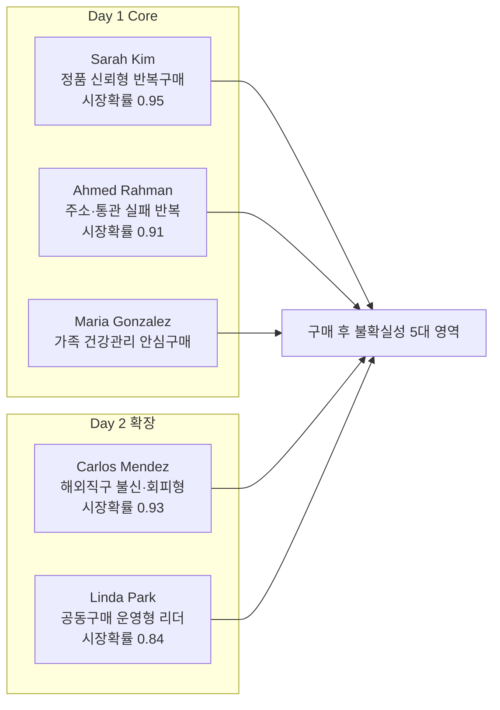
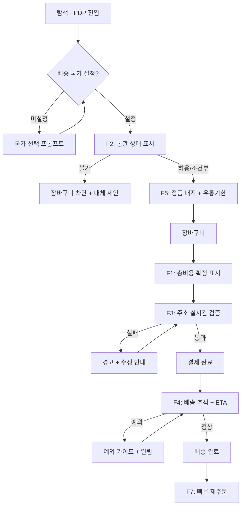
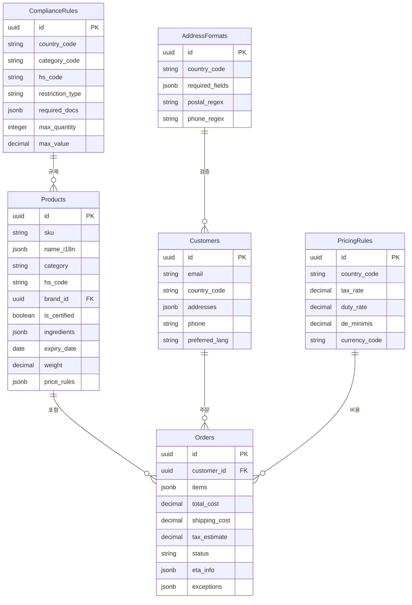
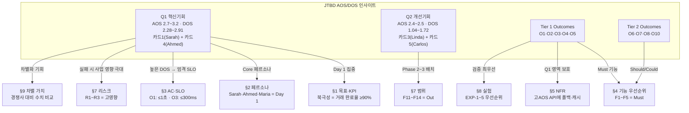
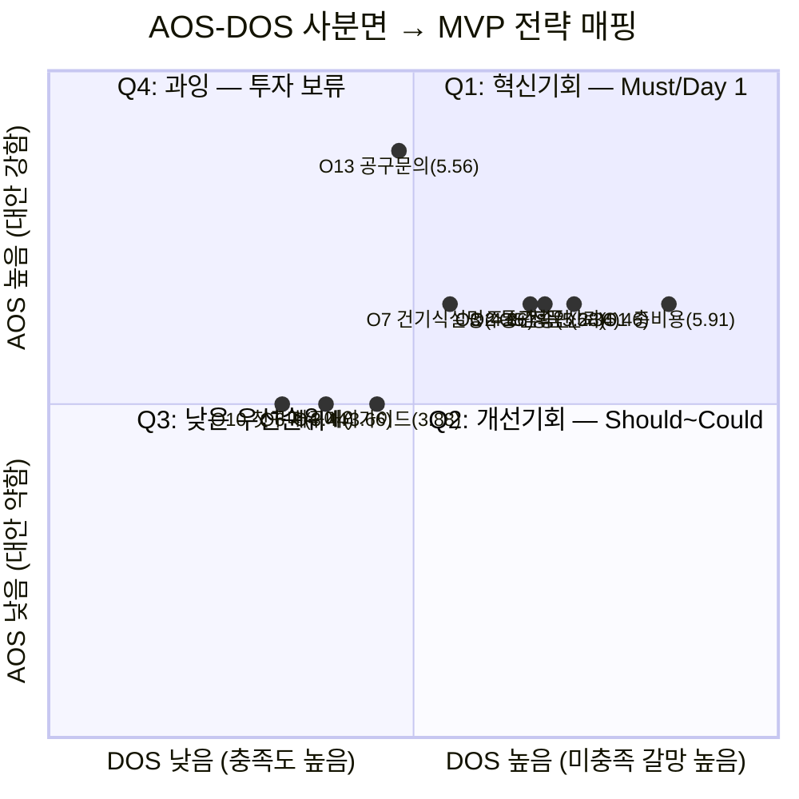

# 안심 CBT 역직구 플랫폼 — PRD v0.4
## 한국발 K-Beauty·건강기능식품 글로벌 Uncertainty Reduction Engine

- **Owner 팀:** Product · Growth · Ops
- **최종 업데이트:** 2026-04-25
- **상태:** Draft — 최종 검토 완료. 비즈니스 합의(D1~D5) 완료 후 SRS/TDD 전환 예정
- **기반 문서:** VPS 통합 기준 문서 V2 (2026-04-18)
- **변경 이력:** v0.1(초안) → v0.2(QA 리뷰) → v0.3(최종 검토) → v0.4(ADR-5 AOS/DOS Traceability Record 신설)

---

## 1. 개요·목표

### 1-1. 문제 정의 (Pain 지표 포함)

해외 고객이 한국 K-Beauty·건강기능식품을 구매할 때, **"상품이 좋은가"보다 "이 거래가 정말 완료될 수 있는가"를 먼저 걱정**한다. 5 Forces 분석에서 도출된 **구매 후 불확실성(Post-Purchase Uncertainty) 5대 영역**이 핵심 문제이며, 이는 단일 이슈가 아니라 5개 하위 불확실성이 결합된 상태이다.

| # | Pain 영역 | 실패 KPI (현재 추정 기준선) | 측정 방법 |
|---|---|---|---|
| P1 | **배송 불확실성** — 도착 시점 예측 불가, 추적 단절 | 배송 관련 CS 비중 ≥ 50%, 배송 실패율 ≥ 10% | CS 티켓 분류 / 전체 출고 대비 반송·분실 건수 |
| P2 | **통관·규제 불확실성** — 성분·카테고리 규제 부적합 반려 | 통관 실패율 ≥ 8%, 건기식 반려율 ≥ 15% | 통관 반려 건수 / 전체 출고 건수 |
| P3 | **세금·총비용 불확실성** — DDU 구조에서 수령 시점 추가 비용 인지 | 장바구니→결제 전환율 ≤ 10%, 결제 후 환불 ≥ 12% | Funnel 분석 / 환불 사유 분류 |
| P4 | **언어·CS 불확실성** — 성분·복용법 오해, 문화적 맥락 불일치 | CS 재문의율 ≥ 35%, 건기식 설명 이해 시간 ≥ 15분 | CS 재발행률 / 사용자 테스트 |
| P5 | **신뢰·정품·품질 불확실성** — 정품 여부, 유통기한, 보관 상태 | 첫 구매 이탈률 ≥ 70%, 정품 CS 문의 ≥ 20% | Funnel 이탈 / CS 카테고리 분류 |

### 1-2. 목표 (Desired Outcome 수치화)

> **"해외 고객이 K-Beauty 및 건강기능식품을 구매할 때 두려워하는 모든 불확실성을 결제 전 단계에서 선제적으로 제거해 주는, 100% 예측 가능한 안심 CBT 역직구 플랫폼"**

| Desired Outcome | 현재 기준선 | 목표값 (6개월) | 목표값 (12개월) |
|---|---|---|---|
| 결제 전 총비용(TLC) 100% 확정 체감 | 미제공 (0%) | 대표 5개국 100% 표시 | 12개국 100% 표시 |
| 통관 가능 여부(Green/Red) 사전 확인 | 미제공 | Beauty 전 SKU + 건기식 고위험 SKU | 전 카테고리·전 국가 |
| 가품 의심 원천 제거 (공식 채널 직배송) | — | 정품 보증 커버리지 100% | 100% |
| 배송 예외 시 사전 행동 가이드 제공 | 미제공 | 4대 예외 시나리오 커버 | 8대 예외 + 자동 알림 |

### 1-3. 성공 지표

#### 🌟 북극성 KPI

| KPI | 정의 | 기준선 | 목표값 | 측정 주기 | 측정 도구 · 소스 |
|---|---|---|---|---|---|
| **거래 완료율** | (수령 확인 건 ÷ 결제 완료 건) × 100 | 추정 75% | Beta ≥ 82% → GA ≥ 90% | 주간 | Mixpanel `order_delivered_confirmed` + 물류사 수령 Webhook |

#### 보조 KPI

| KPI | 정의 (분모·분자) | 기준선 | Beta 목표 | GA 목표 | 측정 주기 | 측정 도구 · 소스 |
|---|---|---|---|---|---|---|
| 장바구니→결제 전환율 | (결제 완료 수 ÷ 장바구니 생성 수) × 100 | ≤ 10% | ≥ 12% | ≥ 15% | 주간 | Mixpanel Funnel(`cart_created`→`payment_completed`) |
| 주소 오류율 | (검증 실패 후 미수정 제출 건 ÷ 전체 주문 건) × 100 | ≥ 15% | ≤ 8% | ≤ 5% | 주간 | Address Verification 로그 + Order 테이블 JOIN |
| 통관 실패율 | (통관 반려·반송 건 ÷ 전체 출고 건) × 100 | ≥ 8% | ≤ 5% | ≤ 3% | 월간 | 물류사 통관 이벤트 API + 수동 반려 보고 |
| 배송 CS 비중 | (배송 카테고리 CS 건 ÷ 전체 CS 건) × 100 | ≥ 50% | ≤ 40% | ≤ 30% | 월간 | CS 티켓 태그 분류(Zendesk/Freshdesk) |
| 첫 구매 이탈률 | (첫 방문 후 30일 내 미구매 ÷ 첫 방문) × 100 | ≥ 70% | ≤ 65% | ≤ 60% | 월간 | Mixpanel Cohort(`first_visit`→`first_purchase`, 30d) |
| 60일 재구매율 | (60일 내 2회+ 결제 고객 ÷ 첫 구매 고객) × 100 | 미측정 | ≥ 15% | ≥ 25% | 월간 | Order 테이블 고객별 집계 |
| NPS | 표준 NPS 설문 (0~10점) | 미측정 | ≥ 30 | ≥ 40 | 분기 | 주문 후 7일 자동 이메일 설문(Typeform) |

---

## 2. 사용자와 페르소나

### 2-1. 핵심 페르소나 요약

### 2-2. 페르소나별 여정 Pain·Needs 링크

| 페르소나 | 핵심 Pain (실패 KPI) | 핵심 Needs | 여정 이탈 지점 | 대응 Outcome |
|---|---|---|---|---|
| **Sarah Kim** | 정품·총비용·배송 불안 → 전환율 ≤ 10% | 공식 채널 신뢰, 재주문, 배송 가시성 | 결정 단계 — 최종 비용 확신 불가 | O1, O3, O5 |
| **Maria Gonzalez** | 건기식 설명 부족·통관 불확실 → 반려 ≥ 15% | 성분·복용법 설명, 통관 안내 | 탐색 — "가족이 먹는 거라 실패 불가" | O2, O7 |
| **Ahmed Rahman** | 주소·통관 실패 반복 → 배송 실패 ≥ 10% | 주소 검증, 사전 경고, 예외 가이드 | 주문 — "배송 과정이 더 스트레스" | O3, O4 |
| **Carlos Mendez** | 첫 구매 진입장벽 → 이탈률 ≥ 70% | 명확한 세금·배송·반송 위험 안내 | 인지 — 해외직구 자체에 대한 회피 | O1, O10 |
| **Linda Park** | 운영 피로·CS 독박 → 리더 이탈 | 배송·결제·CS 플랫폼 위임 | 주문 취합 — 수기 운영 피로 | O11, O12, O13 |

---

## 3. 사용자 스토리와 수용 기준 (AC)

### Story 1: 결제 전 총비용 확정 (Clarity Job)

> **As a** 정품 신뢰형 반복구매 고객(Sarah Kim),  
> **I want** 장바구니·결제 전 화면에서 상품가·국제배송비·예상 세금·관세를 포함한 최종 결제금액(TLC)을 한눈에 확인하고 싶다,  
> **So that** 결제 후 숨겨진 추가비용 없이 안심하고 주문을 완료할 수 있다.

| AC | Given | When | Then | 임계치 |
|---|---|---|---|---|
| AC1-1 | 대표 5개국 중 하나를 배송지로 선택 | 결제 페이지 진입 | 상품가·배송비·세금·관세 항목별 분리 + 합산액 노출 | 응답 ≤ 1초, 항목 누락 0% |
| AC1-2 | 현지 통화로 변경 | 환율 적용 총비용 확인 | 실시간 환율(1시간 갱신) 기반 현지 통화 표시 | 환율 오차 ≤ 0.5%, API 실패율 < 0.5% |
| AC1-3 | 세금 불확실 국가/SKU | 총비용 표시 시 | disclaimer 표시 + 확정/예상 항목 분리 | disclaimer 미표시 오류 0% |
| AC1-F1 | 환율/세금 API 타임아웃(3초 초과) | 총비용 표시 시도 | 캐시값(TTL ≤ 2시간) 기반 표시 + "최종 업데이트: HH:MM" 노출. 캐시 TTL 초과 시 결제 차단 + "잠시 후 재시도" 표시 | 캐시 폴백 성공률 ≥ 99%, 차단 시 메시지 표시율 100% |
| AC1-F2 | 대표 5개국 외 비지원 국가 배송지 선택 | 총비용 표시 시도 | "해당 국가는 세금·관세 예상 미제공" 안내 + 상품가·배송비만 표시 | 비지원국 안내 표시율 100%, 안내 없는 결제 진행 차단율 100% |

### Story 2: 통관 가능 여부 사전 확인 (Certainty Job)

> **As a** 주소·통관 실패 반복 사용자(Ahmed Rahman),  
> **I want** PDP에서 내 국가 통관 가능 여부(Green/Yellow/Red)를 주문 전에 확인하고 싶다,  
> **So that** 통관 실패 없이 수령 가능한 상품만 구매할 수 있다.

| AC | Given | When | Then | 임계치 |
|---|---|---|---|---|
| AC2-1 | 배송 국가 설정 상태 | PDP 진입 | 통관 상태(✅/⚠️/❌) 즉시 표시 | 응답 ≤ 500ms, 정확도 ≥ 95% |
| AC2-2 | ⚠️ 조건부 상태 | 상세 클릭 | 필요서류·수량·금액 제한 등 조건 안내 | 조건 설명 누락 ≤ 2% |
| AC2-3 | ❌ 불가 상태 | 장바구니 추가 시도 | 추가 차단 + 대체 상품 제안 | 차단 우회 0%, 대체 제안 ≥ 80% |
| AC2-F1 | 해당 국가/카테고리/HS Code 룰 미등록 | 통관 상태 표시 시도 | ⚠️ "통관 정보 확인 중. 주문 전 고객센터 문의" + CS 링크 표시, 운영팀 자동 티켓 생성 | 무판정(빈 상태) 노출률 0%, 티켓 생성 지연 ≤ 1분 |
| AC2-F2 | 룰 엔진 서비스 장애(5xx/타임아웃) | 통관 상태 표시 시도 | 캐시된 최근 판정 결과 표시 + "정보가 최신이 아닐 수 있습니다" 경고 | 캐시 폴백 성공률 ≥ 95%, 장애 5분+ 시 PagerDuty 알림 |

### Story 3: 주소·연락처 실시간 검증 (Accuracy Job)

> **As a** 배송 실패 경험 고객(Ahmed Rahman),  
> **I want** 주문 시 주소·연락처가 해당 국가 형식에 맞는지 즉시 검증받고 싶다,  
> **So that** 주소 오류로 인한 배송 실패를 원천 방지할 수 있다.

| AC | Given | When | Then | 임계치 |
|---|---|---|---|---|
| AC3-1 | 주소 입력 중 | 필드 값 변경 시 | 우편번호·필수필드·지역-도시 매칭 실시간 검증 | 지연 ≤ 300ms, 오탐 ≤ 1% |
| AC3-2 | 전화번호 입력 | 형식 확인 | 유효하지 않으면 경고 + 올바른 형식 예시 | 포맷 오류 미검출 ≤ 3% |
| AC3-3 | 배송 실패 위험 높은 주소 | 결제 진행 시도 | 블로킹 경고 + 수정 안내 | 경고-실제 실패 상관도 ≥ 70% |
| AC3-F1 | AddressFormats에 해당 국가 룰 미등록 | 주소 검증 시도 | 기본 필수 필드(이름·주소1·도시·국가) 존재 여부만 검증 + "상세 주소 검증 미지원 국가" 안내 | 미등록국 무검증(경고 없이 결제) 통과율 0% |
| AC3-F2 | 주소 검증 외부 API(Google/Loqate) 장애(5xx/타임아웃) | 주소 검증 시도 | 자체 Regex 기반 폴백 검증으로 자동 전환 + "기본 형식 검증만 적용 중" 안내 표시. 장애 5분 이상 시 Slack 알림 | Regex 폴백 전환 지연 ≤ 5초, 폴백 중 검증 누락률 0% |

### Story 4: 배송 예외 상황 가이드 (Guidance Job)

> **As a** 가족 건강관리 안심구매 고객(Maria Gonzalez),  
> **I want** 배송 예외(지연·보류·추가서류) 발생 시 내 행동을 즉시 이해하고 싶다,  
> **So that** 가족용 건기식 도착 여부를 불안해하지 않을 수 있다.

| AC | Given | When | Then | 임계치 |
|---|---|---|---|---|
| AC4-1 | "통관 보류" 상태 변경 | 알림 수신/상태 페이지 접근 | 추가서류 안내 + 제출 방법 + 예상 처리기간 | 알림 지연 ≤ 10분, 가이드 100% |
| AC4-2 | "현지 배송 지연" 상태 | 상태 확인 | 지연일수 + 사유 + 대응 옵션 표시 | ETA 재계산 정확도 ≥ 80% |
| AC4-3 | 예외 해소·정상 복귀 | 상태 변경 시 | "문제 해결, 예상 도착일: X" 알림 발송 | 복귀 알림 누락 ≤ 1% |
| AC4-F1 | 물류사 Tracking API 24시간+ 무응답 | 주문 상태 페이지 조회 | 마지막 수신 상태 + "마지막 업데이트: YYYY-MM-DD HH:MM" + "48시간 내 미갱신 시 CS 자동 연락" 표시 | 48시간 초과 시 CS 자동 티켓 생성율 100% |
| AC4-F2 | 알림 발송 시스템(이메일/푸시) 장애로 예외 알림 발송 실패 | 배송 예외 상태 변경 발생 | 발송 실패 건은 재시도 큐(최대 3회, 간격 5분·15분·60분)에 등록 + 3회 실패 시 CS팀에 수동 연락 대상 목록으로 에스컬레이션 | 알림 최종 미도달률 ≤ 0.5%, 에스컬레이션 지연 ≤ 70분 |

### Story 5: 공식성·정품 신뢰 신호 (Trust Job)

> **As a** 해외직구 불신 잠재고객(Carlos Mendez),  
> **I want** 공식 채널·정품 취급 신호를 빠르게 확인하고 싶다,  
> **So that** 첫 해외직구를 사기·가품 걱정 없이 시도할 수 있다.

| AC | Given | When | Then | 임계치 |
|---|---|---|---|---|
| AC5-1 | 인증 브랜드 상품 조회 | 목록/PDP 진입 | 브랜드 공식 인증 배지 즉시 표시 | 미표시 오류 0% |
| AC5-2 | 정품 보증 정책 확인 | 링크 클릭 | 정책·반품·직배송 프로세스 1페이지 내 확인 | 로드 ≤ 2초, 정보 완결성 100% |
| AC5-3 | 유통기한 확인 | PDP 확인 | SKU별 유통기한 + 잔여일 표시 | 커버리지 ≥ 95% |
| AC5-F1 | 유통기한 정보 미등록 SKU | PDP 유통기한 영역 표시 | "유통기한 정보 확인 중" 플레이스홀더 표시 + 운영팀 데이터 입력 요청 자동 알림 | 미등록 SKU에 잘못된 유통기한 표시 오류율 0%, 알림 지연 ≤ 5분 |
| AC5-F2 | 브랜드 인증 DB와 상품 카탈로그 간 인증 상태 불일치 (DB=미인증인데 카탈로그=인증 배지 표시, 또는 그 반대) | PDP 진입 시 인증 배지 렌더링 | 인증 DB를 단일 진실 소스(SSOT)로 사용하여 배지 표시/미표시 판정. 불일치 감지 시 배지 미표시(안전 방향) + 운영팀 데이터 정합성 검토 티켓 자동 생성 | 인증 불일치 건 중 잘못된 배지 표시율 0%, 불일치 감지→티켓 생성 지연 ≤ 5분 |

---

## 4. 기능 요구사항 (Functional) — MoSCoW 우선순위

| 우선순위 | ID | 기능명 | 대안 대비 가치 근거 | 의존성 | 추정 공수 | MVP |
|---|---|---|---|---|---|---|
| **Must** | F1 | 예상 총액 확정 보기 | 기존 대안 TLC 전 항목 분리 표시 미지원 → **전환율 30% 미달 해소** | PricingRules DB, 환율 API, 세금 계산 API, Stripe PG | 3 스프린트 | ✔ |
| **Must** | F2 | 통관 가능 여부 사전 확인 | 경쟁사 통관 필터링 미제공 → **통관 실패 8%→3%** | ComplianceRules DB (운영팀 초기 데이터 입력), HS Code 매핑 | 3 스프린트 | ✔ |
| **Must** | F3 | 주소·연락처 실시간 검증 | 대부분 국가별 주소 검증 부재 → **배송 실패 10%→3%** | AddressFormats DB, libphonenumber, (2차) Google/Loqate API | 2 스프린트 | ✔ |
| **Must** | F4 | 배송 ETA·예외 가이드 | K-Beauty 특화 예외 가이드 부재 → **CS 비중 50%→30%** | 물류사 Tracking API(D3), 알림 시스템(이메일/푸시) | 2 스프린트 | ✔ |
| **Must** | F5 | 정품 신뢰 신호 | JTBD O5(Importance 5, AOS 3.0): 미확보 시 **첫 구매 이탈률 70%↑**. 인증 배지 시 **전환 +3%p** (EXP-4) | 브랜드 인증 DB(운영팀 입력), Products.is_certified | 1 스프린트 | ✔ |
| **Should** | F6 | 건기식 설명 카드 | JTBD O7(Importance 5, AOS 3.0, DOS 1.86): 부재 시 **이해 15분, CS 35%** → 제공 시 **≤ 5분, 15%** | Products.ingredients, 성분·복용법 구조화 데이터(운영팀) | 2 스프린트 | ✔ |
| **Should** | F7 | 빠른 재주문 | Amazon 1-Click 기대치 → **재주문 10분→2분** | Orders.order_history, 장바구니 복제 로직 | 1 스프린트 | ✔ |
| **Could** | F8 | 저위험 첫 구매 패키지 | 첫 구매 이탈률 해소 → **이탈 70%→60%** | F2(통관 안전 SKU 조합), 운영팀 번들 구성 | **1 스프린트** (규칙 기반 번들 구성) | ✖ |
| **Could** | F9 | 재입고 알림 | 희소 SKU 리텐션 → **알림→재구매 전환 추적** | Products 재고 상태 필드, 알림 시스템 | **0.5 스프린트** (핵심 SKU만) | ✖ |
| **Could** | F10 | 안전 번들 추천 | 객단가 향상 → **번들 전환율 추적** | F2(통관 룰), PricingRules(합산 최적화) | **1 스프린트** (규칙 기반) | ✖ |
| **Won't** | F11~F14 | B2B2C 도구·추천·구독 | Phase 3 이후. 거래 안정성 KPI 달성 후 단계적 도입 | Partner 엔터티, CRM, 추천 엔진 | Phase 3 | ✖ |

### MVP 기능 흐름 (사용자 여정)

---

## 5. 비기능 요구사항 (NFR)

| 영역 | 요구사항 | 기준 |
|---|---|---|
| **성능** | 총비용 계산 API | p95 ≤ 1,000ms |
| **성능** | 통관 룰 판정 API | p95 ≤ 500ms |
| **성능** | 주소 검증 피드백 | p95 ≤ 300ms |
| **성능** | 페이지 로드 (CDN) | p95 ≤ 2,000ms |
| **성능** | 외부 API 타임아웃 | 환율·세금·주소검증 각 API 타임아웃 ≤ 3초, 실패 시 최대 2회 재시도 (지수 백오프 1s→2s) |
| **성능** | DB 핵심 쿼리 응답 | 상품 조회·주문 생성·룰 판정 p95 ≤ 200ms |
| **성능** | 부하 테스트 통과 | 동시 접속 500명: p95 응답 ≤ 2초, 에러율 ≤ 1% (k6/Locust, GA 전 필수 통과) |
| **신뢰성** | 월 가용성 | ≥ 99.5% |
| **신뢰성** | 비용 계산 오류율 | ≤ 0.5% |
| **신뢰성** | 통관 판정 정확도 | ≥ 95% |
| **신뢰성** | 결제 실패율 | ≤ 1% |
| **신뢰성** | 데이터 백업·복구 | RPO ≤ 1시간, RTO ≤ 4시간 |
| **신뢰성** | 외부 API 장애 내성 | 환율·세금 API → 캐시 폴백(TTL ≤ 2h), 주소 검증 API → 자체 Regex 폴백 |
| **보안** | 개인정보 | GDPR·CCPA 준수, AES-256 암호화 |
| **보안** | 결제 | PCI DSS Level 1 (Stripe 위임) |
| **비용** | 인프라 월비용 | ≤ $3,000 (초기 AWS) |
| **확장성** | 동시 접속 | 초기 500 → 6개월 후 2,000 |
| **다국어** | i18n | Phase 1: 영어·한국어 / Phase 2: +일본어·중국어 |

### 모니터링 항목

| 항목 | 도구 | 알림 기준 |
|---|---|---|
| 서버 응답 p95 | CloudWatch / Datadog | > 2초 시 Slack |
| 비용 계산 오류율 | Application 로그 | > 1% 시 PagerDuty |
| 통관 판정 실패 | 수동 검수 대시보드 | 일 5건 이상 운영팀 알림 |
| 배송 추적 단절 | Fulfillment 로그 | 24시간 무상태 변경 시 알림 |
| 결제 실패율 | PG 대시보드 | > 2% 시 알림 |
| 환율 API 상태 | Health Check (1분 주기) | 연속 3회 실패 → Slack + 캐시 폴백 확인 |
| 주소 검증 API 상태 | Health Check (1분 주기) | 연속 3회 실패 → Slack + Regex 폴백 전환 |
| 세금 계산 API 상태 | Health Check (1분 주기) | 연속 3회 실패 → PagerDuty + 캐시 폴백 |
| DB 슬로우 쿼리 | CloudWatch / Datadog APM | p95 > 500ms 발생 시 Slack |
| 룰 테이블 미등록 요청 | Application 로그 | 미등록 국가/카테고리 일 10건 초과 시 운영팀 알림 |

---

## 6. 데이터·인터페이스 개요

### 6-1. 핵심 엔터티 및 주요 필드

### 6-2. 외부·내부 API 개요

| API | 유형 | 입력 | 출력 | 제약 |
|---|---|---|---|---|
| 환율 (Open Exchange Rates) | 외부 | base/target currency | 환율 JSON | 1시간 캐시, 1K req/월(무료) |
| 주소 검증 (Google/Loqate) | 외부 | 국가코드, 주소 필드 | 유효성 판정 | 2차 연동, 1차는 자체 Regex |
| 물류사 Tracking | 외부 | 운송장 번호 | 배송 상태 이벤트 | 물류사별 상이, 폴링 ≥ 1시간 |
| 결제 PG (Stripe) | 외부 | 결제정보, 금액, 통화 | 결제 결과 | PCI DSS 위임, 다통화 |
| Pricing Engine | 내부 | SKU[], 국가, 배송옵션 | 항목별+합산 비용 | 룰테이블+외부API 조합 |
| Compliance Engine | 내부 | SKU, 국가, 수량 | 허용/조건부/불가 | 룰테이블, 1차 5개국 |

---

## 7. 범위(In/Out), 리스크·가정·의존성

### 7-1. 범위

| 구분 | 항목 |
|---|---|
| ✅ **In** | F1~F7 (총비용·통관·주소·ETA·신뢰·건기식·재주문), 대표 5개국, Beauty-first 20~30 SKU |
| ❌ **Out** | 전 세계 통합몰, 자체 풀필먼트, F11~F14 (B2B2C·추천·구독), 복잡한 멤버십, CS 자동 라우팅 |

### 7-2. 리스크 (최소 3개 + 추가)

| # | 리스크 | 영향 | 확률 | 완화 전략 |
|---|---|---|---|---|
| R1 | **세금·관세 계산 부정확** | 🔴 높음 | 🟡 중간 | 5개국 수동 검증 + disclaimer + 분기 감사 |
| R2 | **통관 룰 변경 업데이트 지연** | 🔴 높음 | 🟡 중간 | 규제 모니터링 프로세스 + 룰테이블 버전 관리 |
| R3 | **건기식 통관 실패 클레임** | 🔴 높음 | 🟡 중간 | 고위험 카테고리 사전 체크 + 면책 고지 + F2 차단 |
| R4 | **신규 플랫폼 신뢰 부족** | 🔴 높음 | 🟡 중간 | F5 신뢰 신호 + 교민 커뮤니티 시딩 |
| R5 | **물류사 API 불안정** | 🟡 중간 | 🟢 낮음 | 상태 사전 정의 폴백, Full tracking 2차 |
| R6 | **환율 변동 마진 침식** | 🟡 중간 | 🟡 중간 | 갱신 주기 관리 + 가격 버퍼 |

### 7-3. 가정·의존성

| 구분 | 내용 | 결정 링크 |
|---|---|---|
| 가정 | 5개국 세금·관세 데이터 수동 수집·검증으로 런칭 가능 | D1 |
| 가정 | Beauty-first 20~30 SKU로 전환율 가설 검증 가능 | D2 |
| 가정 | DDP 적용 시 고객 신뢰 지표 DDU 대비 유의미 개선 | D6 |
| 의존성 | 물류 파트너 DDP 지원 + Tracking API 수준 | D3 |
| 의존성 | Stripe 다통화 결제 + 대상국 커버리지 | D4 |
| 의존성 | 브랜드 공식 인증 자료 확보 (브랜드사 협력) | 운영팀 |

### 7-4. ADR (Architecture Decision Records)

#### ADR-1: 통관·세금 로직을 룰 테이블 기반으로 설계

| 항목 | 내용 |
|---|---|
| **컨텍스트** | 국가별 규제·세율은 빈번히 변경되며 SKU·국가·성분 조합에 따라 판정이 달라짐. 하드코딩 시 변경 대응에 코드 배포가 필요하고, 운영팀의 즉시 대응이 불가능 |
| **결정** | ComplianceRules·PricingRules를 DB 테이블(룰 테이블)로 분리하고, 운영팀이 어드민에서 직접 룰을 CRUD할 수 있게 설계 |
| **근거** | KSF 분석 #3 "규제·성분 필터링 룰 엔진" + Problem Definition 문제 10 "국가별 규제 변화 대응이 느림" → 정확성뿐 아니라 변경 대응 속도가 핵심 |
| **기각된 대안** | (A) 하드코딩: 변경마다 배포 필요 → 규제 변경 속도에 부적합. (B) 외부 SaaS 전면 위임: 비용 과다 + 커스터마이징 제한 |
| **결과·리스크** | 룰 테이블 초기 데이터 입력 공수(운영팀) 필요. 룰 버전 관리 미비 시 판정 불일치 리스크 → 변경 이력 추적 + 분기 감사로 완화 |

#### ADR-2: 에셋 라이트 4PL/API 연합망 (자체 물류 자산 미투자)

| 항목 | 내용 |
|---|---|
| **컨텍스트** | 초기 스타트업 단계에서 자체 풀필먼트·창고 투자는 자본 집약적이며, 권역별 운영 모듈 확장에 불리 |
| **결정** | 물류 파트너 API 연동 기반 4PL 구조 채택. 자산은 보유하지 않고 데이터·프로세스로 고객 경험을 통제 |
| **근거** | KSF #1 "에셋 라이트 4PL/API 연합망" + Value Chain 분석 「외부 의존 영역을 데이터로 흡수해 일관된 경험 제공」 |
| **기각된 대안** | (A) 자체 창고·풀필먼트: 초기 CAPEX 과다 + 국가별 확장 시 반복 투자 필요. (B) 단일 물류사 종속: SLA 불안정 시 대안 없음 |
| **결과·리스크** | 물류사 API 품질에 의존(R5). 초기에는 수동+반자동 운영, 2차에서 API 연동 고도화 |

#### ADR-3: DDP(관세 포함 배송) 우선 정책

| 항목 | 내용 |
|---|---|
| **컨텍스트** | DDU 구조에서는 고객이 수령 시점에 예상치 못한 추가 비용을 부담하며, 이는 5 Forces 분석의 "세금/총비용 불확실성"의 직접 원인 |
| **결정** | 대표 5개국에 DDP 모델을 기본 적용하여 결제 시점에 총비용을 확정. DDU는 DDP 미지원 국가에만 예외 적용 |
| **근거** | 5 Forces 7.3 "DDU 구조에서는 총비용이 뒤늦게 드러남" + JTBD O1(Importance 5) "결제 전 총비용 예측" + 가정 D6 "DDP가 신뢰의 핵심" |
| **기각된 대안** | (A) DDU 기본 + DDP 옵션: 고객 혼란, 추가비용 인식 훼손 → VP 핵심 가치 위반. (B) 전 국가 DDP: 물류 파트너 DDP 미지원국 존재 → 현실적 불가 |
| **결과·리스크** | DDP 마진 구조 설계 필요(관세 대납분 가격 반영). 물류 파트너 DDP 지원 여부가 출시국 결정(D1)에 직접 영향 |

#### ADR-4: 서비스 모듈 분리 아키텍처 (Pricing·Compliance·Fulfillment)

| 항목 | 내용 |
|---|---|
| **컨텍스트** | TAM/SAM/SOM 분석의 "글로벌 코어 플랫폼 + 권역별 운영 모듈" 원칙에 따라, 국가 확장 시 핵심 로직은 유지하면서 국가별 룰·파트너·결제만 교체 가능해야 함 |
| **결정** | Pricing Engine, Compliance Engine, Fulfillment Tracker를 독립 서비스로 분리. 각 서비스는 국가 코드를 파라미터로 받아 권역별 동작 |
| **근거** | TAM/SAM/SOM 「전 세계 통합몰이 아니라 글로벌 코어 + 권역 모듈」 + KSF #6·#7 「하이퍼 로컬라이제이션」 |
| **기각된 대안** | (A) 모놀리식: 초기 빠르지만 국가 추가 시 코드 복잡도 폭발. (B) 마이크로서비스 전면 도입: 초기 팀 규모 대비 운영 부담 과다 |
| **결과·리스크** | 모듈 경계 설계가 미흡하면 서비스 간 결합도 증가. 초기에는 모놀리스 내 모듈 분리(모듈러 모놀리스)로 시작, 트래픽 증가 시 점진적 분리 |

#### ADR-5: AOS/DOS 인사이트가 PRD 전체 구조에 미친 영향 (Traceability Record)

> **배경:** JTBD 분석에서 도출된 **AOS(Alternative Opportunity Score)**와 **DOS(Desired Outcome Score)**는 본 PRD의 모든 섹션 의사결정에 구조적으로 영향을 미쳤습니다. 이 ADR은 "어떤 점수가 어떤 결정을 유발했는가"를 투명하게 기록합니다.

##### 5-1. AOS/DOS 원본 데이터 — JTBD 카드별 점수

| JTBD 카드 | 페르소나 | AOS | DOS | 사분면 | OG Score (AOS+DOS) | 해석 |
|---|---|---|---|---|---|---|
| 카드 1: 정품 신뢰형 반복구매 | Sarah Kim | **3.2** | **2.91** | **Q1 혁신기회** | 6.11 | 기존 대안의 충족도가 가장 높으면서도 여전히 미해결 갭이 존재 → **가장 먼저, 가장 깊이 풀어야 할 Job** |
| 카드 2: 가족 건강관리 안심구매 | Maria Gonzalez | 3.0 | 2.35 | Q1-Q2 경계 | 5.35 | 중요도 높지만 대안 충족도가 상대적으로 낮음 → **설명·안내 강화로 빠르게 갭 축소 가능** |
| 카드 3: 공동구매 운영 경감 | Linda Park | 2.5 | 1.58 | **Q2 개선기회** | 4.08 | 대안도 약하고 현재 충족도도 낮음 → **즉시 필수는 아니지만 확장 시 핵심** |
| 카드 4: 주소·통관 성공 보장 | Ahmed Rahman | **2.7** | **2.30** | **Q1 혁신기회** | 5.00 | 반복 실패 경험자 — 대안이 문제를 잘 못 풀고 있음 → **기술적 검증 기능으로 즉시 해결 가능** |
| 카드 5: 첫 구매 진입장벽 해소 | Carlos Mendez | 2.4 | 1.72 | Q2 경계 | 4.12 | 비사용자 전환 — 대안 경험 자체가 적음 → **신뢰 신호로 진입 허들 낮추기** |

##### 5-2. Outcome 우선순위 — AOS/DOS 기반 Tier 분류

| Tier | Outcome | Imp. | AOS | DOS | AOS 해석 | DOS 해석 | OG (AOS+DOS) |
|---|---|---|---|---|---|---|---|
| **Tier 1** | O1 결제 전 총비용 예측 | 5 | 3.0 | 2.91 | 기존 대안(iHerb·Amazon)이 부분적으로만 제공 | 고객이 가장 절실히 원하지만 충분히 얻지 못하는 Outcome | **5.91** |
| **Tier 1** | O5 공식성·정품 신호 | 5 | 3.0 | 2.46 | Olive Young·StyleKorean이 일부 제공 | 높은 불만족 — 새 플랫폼의 가장 큰 허들 | **5.46** |
| **Tier 1** | O2 통관 가능성 사전 확인 | 5 | 3.0 | 2.34 | 현재 어떤 대안도 자동화하지 못함 | 미충족 수준 높음 → 우리가 해결하면 즉시 차별화 | **5.34** |
| **Tier 1** | O3 주소 검증 | 5 | 3.0 | 2.28 | 대안에서 거의 무시되는 영역 | 실패 시 실제 비용 손실과 직결 | **5.28** |
| **Tier 1** | O4 배송 예외 가이드 | 4 | 2.4 | 1.48 | 대안 충족도 낮음 (대부분 무안내) | 불안 해소에 중요하나 빈도가 상대적으로 낮음 | **3.88** |
| **Tier 2** | O7 건기식 설명 이해 | 5 | 3.0 | 1.86 | iHerb가 부분 제공 | 높은 중요도지만 AOS 대비 DOS 갭이 큼 → **컨텐츠 투자로 빠르게 해결 가능** | **4.86** |
| **Tier 2** | O6 재구매 단축 | 4 | 2.4 | 1.26 | Amazon 1-Click이 기준 | 현재 충족도 매우 낮음 | **3.66** |
| **Tier 2** | O10 첫 구매 저위험 시험 | 4 | 2.4 | 1.04 | 대안 거의 부재 | 비사용자에게만 중요 → 타깃 좁음 | **3.44** |
| **Tier 3** | O13 공동구매 문의 분산 | 5 | 4.0 | 1.56 | **가장 높은 AOS** — 대안이 매우 강함(카카오톡) | 플랫폼 가치 인식 낮음 → **Day 3에서 해결** | **5.56** |

##### 5-3. AOS/DOS → PRD 섹션별 영향 추적 매트릭스

##### 5-4. PRD 8개 섹션별 AOS/DOS 영향 상세

| PRD 섹션 | AOS/DOS 영향 | 구체적 의사결정 |
|---|---|---|
| **§1 목표·KPI** | Q1 혁신기회(AOS 3.2, DOS 2.91)가 북극성 KPI를 결정 | 북극성 = "거래 완료율"로 설정한 이유: **O1(DOS 2.91)이 전체 Outcome 중 가장 높은 미충족 갈망** → 매출이 아니라 "거래가 끝까지 완료되는가"가 이 시장의 핵심 성공 척도. 보조 KPI(전환율·통관 실패율·주소 오류율)도 모두 **Tier 1 Outcome(O1~O5)의 실패 지표를 역전시키는 구조**로 설계됨 |
| **§2 페르소나** | AOS/DOS 점수로 Day 1·Day 2 분리 | Sarah(AOS 3.2) + Ahmed(AOS 2.7) = **Q1에 동시 위치 → Day 1 Core**. Maria(AOS 3.0)도 O2·O7의 높은 Importance로 Day 1 포함. Linda(AOS 2.5, Q2) + Carlos(AOS 2.4) = **Day 2 확장**. 이 분리는 "누구부터 만족시키면 사업 지표가 가장 빨리 움직이는가"에 대한 답 |
| **§3 AC·SLO** | Tier 1 Outcome의 높은 DOS가 SLO 엄격도를 결정 | O1(DOS 2.91) → F1 **응답 ≤ 1초** 설정 이유: 고객이 가장 간절히 원하는 Outcome이므로 **경험의 마찰이 0에 가까워야** 관성(Habit: Amazon·iHerb)을 이길 수 있음. O3(DOS 2.28) → F3 **지연 ≤ 300ms**: 주소 검증은 입력 중 실시간이어야 실패를 사전 차단 가능. 반면 O4(DOS 1.48, Tier 1이지만 낮은 DOS) → F4 **알림 지연 ≤ 10분**: 예외 상황은 빈도가 낮으므로 실시간까지는 불필요 |
| **§4 기능 우선순위** | AOS-DOS Tier가 MoSCoW를 직접 결정 | **Must = Tier 1(O1~O5)**: AOS ≥ 2.4 + DOS ≥ 1.48 + Importance ≥ 4 → F1~F5. **Should = Tier 2 중 높은 Importance**: O7(Imp 5, AOS 3.0이지만 DOS 1.86) → F6 건기식 설명 카드, O6(Imp 4) → F7 재주문. **Could = Tier 2 중 낮은 DOS**: O10(DOS 1.04) → F8, O8(DOS 1.12) → F10. **Won't = Tier 3**: O13(AOS 4.0으로 가장 높지만 DOS 1.56으로 낮음) → F11~F14. 특히 **O13의 AOS 4.0은 대안(카카오톡)이 너무 강해 우리가 즉시 이길 수 없음을 의미** → Day 3로 배치 |
| **§5 NFR** | Q1 Outcome을 서빙하는 API에 가장 엄격한 NFR 적용 | O1(AOS 3.0, DOS 2.91) → **Pricing Engine p95 ≤ 1,000ms + 캐시 폴백 TTL ≤ 2시간**: 가장 높은 DOS이므로 API 장애 시에도 반드시 작동해야 함. O2(AOS 3.0, DOS 2.34) → **Compliance Engine p95 ≤ 500ms**: 통관 판정은 PDP 진입 시 즉시 필요. O3(AOS 3.0, DOS 2.28) → **Address Verification p95 ≤ 300ms**: 입력 중 실시간 피드백. **폴백 우선순위도 DOS 순**: 환율/세금(O1용) > 통관 룰(O2용) > 주소 검증(O3용) |
| **§7 리스크** | Q1 Outcome 실패 = 사업 실패 → 최고 영향도 리스크로 분류 | R1(세금 계산 부정확) = **O1(DOS 2.91) 직접 위반** → 🔴 높음. R2(통관 룰 변경 지연) = **O2(DOS 2.34) 직접 위반** → 🔴 높음. R3(건기식 통관 클레임) = **O2+O7 교차 위험** → 🔴 높음. 반면 R5(물류 API 불안정) = O4(DOS 1.48, 가장 낮은 Tier 1) → 🟡 중간. **리스크 영향도 우선순위가 DOS 순서와 정렬됨** |
| **§8 실험** | 실험 우선순위 = OG Score(AOS+DOS) 순 | EXP-1(O1, OG 5.91) → **가장 먼저, A/B n≥500**: 가장 높은 OG이므로 가장 확실한 검증 필요. EXP-4(O5, OG 5.46) → **A/B n≥500**: 두 번째 OG. EXP-2(O2, OG 5.34)·EXP-3(O3, OG 5.28) → **Before/After n≥300**: OG 유사해서 같은 크기. EXP-5(O4, OG 3.88) → **Before/After n≥200**: 가장 낮은 OG이므로 최소 표본 |
| **§9 차별 가치** | Q1 Outcome이 경쟁사 벤치마크 축을 결정 | 비용 투명성 벤치마크 = **O1(AOS 3.0)**: 기존 대안(iHerb)이 AOS 3.0 수준으로 제공하므로 "그 이상"을 증명해야 함 → 항목 수 1.7~2.5배↑. 통관 실패율 벤치마크 = **O2(AOS 3.0)**: Olive Young이 AOS 3.0 수준이므로 ≤ 3% 목표. **AOS가 높을수록 경쟁사가 이미 일부 해결하고 있다는 뜻 → 차별화 증명의 허들이 높아짐 → 더 엄격한 벤치마크 목표를 설정한 이유** |

##### 5-5. 핵심 인사이트: AOS와 DOS가 다르게 말해주는 것

| 인사이트 | AOS가 말해주는 것 | DOS가 말해주는 것 | PRD에 미친 영향 |
|---|---|---|---|
| **O13(공동구매 문의 분산)은 AOS가 4.0으로 가장 높지만 Won't** | 기존 대안(카카오톡·엑셀)이 이 Job을 꽤 충족시키고 있음 | 고객이 현재 얻는 결과에 "충족은 아니지만 참을 만함" | **AOS가 높다 = 우리가 이기기 어렵다. Phase 3에서 대안보다 확실히 나은 도구를 준비한 후 진입** |
| **O1(총비용 예측)은 AOS도 DOS도 모두 가장 높음** | 기존 대안이 부분적으로 제공하지만 불완전 | 고객의 미충족 갈망이 가장 높음 → 해결하면 즉시 가치 인식 | **AOS와 DOS가 동시에 높다 = 기존 대안이 시도했지만 실패한 영역 → 우리가 제대로 풀면 가장 큰 차별화. F1을 Must 1순위로 설정한 핵심 근거** |
| **O4(배송 예외 가이드)는 Tier 1이지만 DOS가 1.48로 낮음** | 대안이 거의 제공하지 않음(AOS 2.4) | 고객이 필요하지만 빈도·절감 기대치가 상대적으로 낮음 | **Tier 1에 포함시키되 SLO를 느슨하게 설정(알림 ≤ 10분). NFR에서 "있으면 안심"이지 "없으면 이탈"은 아닌 수준으로 리소스 배분** |
| **O7(건기식 설명)은 Importance 5, AOS 3.0이지만 Tier 2** | iHerb가 AOS 3.0 수준으로 어느 정도 제공 | DOS 1.86으로 "갈망은 있지만 극심하지 않음" | **Should로 분류. 컨텐츠 투자(운영팀 설명 카드)로 빠르게 갭 축소 가능 → 기술 복잡도 낮은 F6으로 배치** |

##### 5-6. Q1/Q2 사분면 → MVP Stage 매핑

> **한 줄 요약:** AOS는 "경쟁 강도"를, DOS는 "고객 갈망 강도"를 말하며, **AOS와 DOS가 동시에 높은 O1·O5·O2·O3가 이 PRD의 Must 기능(F1~F5)과 북극성 KPI(거래 완료율)를 결정**했습니다. AOS가 높지만 DOS가 낮은 O13은 "대안이 강해 지금은 이길 수 없는 영역"으로 읽어 Won't로 배치했고, DOS가 높지만 AOS가 낮은 O4는 "경쟁이 약해 빠르게 차별화 가능한 영역"으로 읽어 Must에 포함하되 SLO를 현실적으로 설정했습니다.

---

## 8. 실험·롤아웃·측정

### 8-1. 롤아웃 단계

| 단계 | 기간 | 범위 | 목적 |
|---|---|---|---|
| Alpha | W10~12 | 내부 + 10명 테스터 | 기능 안정성·UX 검증 |
| Closed Beta | W13~16 | 50명 교민 커뮤니티 | 거래 완료율·CS 패턴 |
| Open Beta | W17~20 | 500명 (3개국) | 전환율·통관·NPS |
| GA | W21~ | 5개국 전면 오픈 | 북극성 KPI 추적 |

### 8-2. 실험 가설·측정·성공 기준

| 실험 | 가설 | 설계 | 성공 기준 | 통제 조건 | 측정 도구 |
|---|---|---|---|---|---|
| EXP-1 총비용 표시 | TLC 표시 시 전환율 상승 | A/B (n≥500/군, 최소 2주). Control: 상품가+배송비만 / Treatment: TLC 전체 | 전환율 +5%p (10→15%), p < 0.05, 검정력 ≥ 0.8 | 동일 기간·동일 트래픽 소스·동일 SKU 구성 무작위 배정 | Mixpanel Funnel, 카이제곱 검정 |
| EXP-2 통관 필터 | 통관 상태 표시 시 실패율 감소 | Before/After (n≥300 주문/군), 4주 vs 4주 | 실패율 8→3%, p < 0.05 | SKU·국가 비중 일정 유지. 규제 변경 발생 주 데이터 제외 후 재분석 | 물류사 반려 API, Fisher 정확 검정 |
| EXP-3 주소 검증 | 실시간 검증 시 배송 실패 감소 | Before/After (n≥300 주문/군), 4주 vs 4주 | 주소 오류 실패 15→5%, p < 0.05 | 국가 비중 일정, 물류사 변경 없음 확인 | 배송 실패 사유 로그, 이항 비율 검정 |
| EXP-4 신뢰 신호 | 배지·보증 시 첫 구매 전환 상승 | A/B (n≥500/군, 최소 2주). 배지+보증 유/무 | 첫 구매 전환 +3%p, p < 0.05 | 동일 기간·동일 트래픽·동일 PDP 무작위 배정 | Funnel 카이제곱 + 5점 신뢰도 설문 |
| EXP-5 예외 가이드 | 가이드 시 CS 감소 | Before/After (n≥200 예외건/군), 4주 vs 4주 | CS 비중 50→30%, p < 0.05 | CS 인력·응대 프로세스 변경 없음. 프로모션 기간 제외 | CS 티켓 태그 분류, 이항 비율 검정 |

### 8-3. 경쟁 벤치마크 계획

| 축 | 대상 | 우리 목표 | 측정 |
|---|---|---|---|
| 비용 투명성 | Amazon, iHerb | TLC 100% 사전 표시 → 전환 15%↑ | 전환율 + 미스터리 쇼핑 |
| 통관 실패율 | Olive Young, StyleKorean | ≤ 3% (경쟁사 추정 5~10%) | 월간 물류 데이터 |
| 배송 예측 | Amazon | ETA 정확도 ≥ 80% (±2일) | 예측 vs 실제 도착일 |
| 운영 비용 | 업계 평균 $3~5/건 | ≤ $2/건 | 건당 CS 비용 산출 |

---

## 9. 근거 (Proof)

### 9-1. 리서치 출처

| 출처 | 핵심 인사이트 | 파일 |
|---|---|---|
| 5 Forces 분석 | 프리미엄 신뢰·규제 대응 영역에 전략적 공백 | `1_5Forces_merged_CBT_KBeauty_Health.md` |
| 경쟁사 분석 | K-Beauty+건기식 통합 + 총비용 투명성 결합 플랫폼 부재 | `2_Competitior_merged_CBT_KBeauty_Health.md` |
| Value Chain 분석 | 5단계(통관·세금)와 7단계(CS)가 핵심 병목 | `3_Value-Chain_merged_CBT_KBeauty_Health.md` |
| KSF 분석 | 7대 KSF 중 DDP 자동화·규제 룰엔진·정품 신뢰 MVP 필수 | `4_KSF_merged_CBT_KBeauty_Health.md` |
| Problem Definition | 고객 불확실성·셀러 장벽·락인 부재의 구조적 문제 | `5_Problem-Definition_merged_CBT_KBeauty_Health.md` |
| TAM/SAM/SOM·Persona | SOM US$65.2bn, 페르소나 시장 존재 확률 0.84~0.95 | `6_TAMSAMSOM_MarketSegment_Persona_merged.md` |
| JTBD 분석 | Q1 혁신기회: 정품 신뢰(AOS 3.2)+주소·통관(AOS 2.7) | `8_jtbd_merged_final_report.md` |

### 9-2. 주장별 검증 계획

| 주장 | 기준선 정의 | 실험 설계 | n (최소) | 통계 검정 | 측정 도구 |
|---|---|---|---|---|---|
| 총비용 표시 → 전환율 상승 | TLC 미표시 시 전환율 (GA 직전 2주) | A/B, 2주+ | ≥ 500/군 | 카이제곱, p < 0.05 | Mixpanel Funnel |
| 통관 사전 확인 → 실패율 감소 | 필터 미적용 4주 실패율 | Before/After, 4주 vs 4주 | ≥ 300 주문/군 | Fisher, p < 0.05 | 물류사 반려 데이터 |
| 주소 검증 → 배송 성공률 향상 | 검증 미적용 4주 주소 오류 실패율 | Before/After, 4주 vs 4주 | ≥ 300 주문/군 | 이항 비율, p < 0.05 | 배송 실패 사유 로그 |
| 정품 신호 → 전환 상승 | 배지 미표시 군 첫 구매 전환율 | A/B, 2주+ | ≥ 500/군 | 카이제곱, p < 0.05 | Funnel + 5점 신뢰도 설문 |
| 주문→수령 속도 개선 | 자사 MVP 첫 4주 평균 일수 + 경쟁사 미스터리 쇼핑 | 3개월 파일럿 + 미스터리 쇼핑 2회/월 | ≥ 200(자사), ≥ 20(미스터리) | Mann-Whitney U, p < 0.05 | 물류 DB + 미스터리 쇼핑 기록 |

### 9-3. 차별 가치 수치 비교

| 축 | 기존 1위 대안 | 기존 수준 | 우리 목표 | 개선폭 | 측정 기준 |
|---|---|---|---|---|---|
| 비용 투명성 (항목 분리 수) | iHerb | 결제 전 2~3개 항목 (상품가·배송비·일부 세금) | TLC 5개 항목 분리 (상품가·배송비·관세·부가세·총합) | 항목 수 **1.7~2.5배↑** | 미스터리 쇼핑: 동일 SKU·국가 주문 시 결제 전 노출 항목 수 비교 |
| 통관 실패율 | Olive Young | 추정 5~10% (업계 보고서) | ≤ 3% | **40~70%↓** | (통관 반려 ÷ 전체 출고) × 100, 월간 물류 리포트 |
| 운영 비용 (건당 CS) | 업계 평균 | $3~5/건 (Statista 2025 + 자체 추정) | ≤ $2/건 | **40~60%↓** | (월 CS 총비용 ÷ 월 CS 건수), 월간 정산 |
| 첫 구매 탐색→결제 시간 | 신뢰 기반 플랫폼 | 10~15분 (PDP 첫 진입→결제 완료) | ≤ 5분 | **50~67%↓** | Mixpanel `pdp_first_view`→`payment_completed` 중앙값, 신규 코호트 |
| 주문→수령 소요일 | Amazon Global (3~7일) | 자사 초기 추정 10~14일 | ≤ 10일 (5개국 평균) | **30%↓** | 물류 출고일→수령 확인일 p50·p95, 국가별 분리 |

---

> **한 문장 결론:** 이 PRD가 명세하는 제품은 "한국 제품을 파는 몰"이 아니라, **"해외에서 한국 제품을 살 때 가장 문제 없이 거래가 완료되도록 보장하는 Uncertainty Reduction Engine"**이며, 거래 완료율 ≥ 90%를 북극성으로 삼아 반복구매와 B2B2C 확장 수익의 토대를 만드는 것이 목표입니다.

---

*문서 버전: PRD v0.4 (ADR-5 AOS/DOS Traceability Record 추가)*  
*작성일: 2026-04-25*  
*기반 문서: VPS 통합 기준 문서 V2 (2026-04-18)*  
*상태: Draft — 비즈니스 합의(D1~D5) 완료 후 SRS/TDD 전환 예정*  
*변경 이력: v0.1(초안) → v0.2(QA 리뷰) → v0.3(최종 검토) → v0.4(ADR-5 AOS/DOS Traceability Record 신설)*
