# Value Proposition Sheet — 통합 기준 문서 (V2)
## 한국발 CBT 기반 K-Beauty·건강기능식품 글로벌 역직구 플랫폼

- **문서 버전:** V2 (비즈니스 분석 결과 직접 통합본)
- **작성일:** 2026-04-18
- **문서 성격:** 7개 비즈니스 리서치 산출물(5 Forces, 경쟁사 분석, Value Chain, KSF, Problem Definition, TAM/SAM/SOM·Persona, JTBD)의 핵심 분석 결과를 **직접 본문에 포함**시켜, **시장 구조 → 가치 제안 → 수익 구조 → 기능 우선순위 → MVP 구현 계획 → 사전 합의**까지 하나의 흐름으로 정리한 통합 기준 문서
- **대상 독자:** 예비창업자(의사결정자), 기획자, 초기 개발팀, 투자자

> **이 문서 하나로 아래 질문에 순서대로 답할 수 있어야 합니다.**
> 1. 우리가 진입할 시장은 어떤 구조이며, 누구의 어떤 불확실성을 제거해 줄 것인가? — **Part 1**
> 2. 그 가치를 통해 어떻게 돈을 벌 것인가? — **Part 2**
> 3. 이를 위해 어떤 기능을 어떤 순서로 만드는가? — **Part 3**
> 4. 그 기능을 기술적으로 어떻게 구현하는가? — **Part 4**
> 5. 시작하기 전에 무엇을 먼저 결정해야 하는가? — **Part 5**

---

# Part 1. 가치 제안 — 누구의 어떤 문제를 푸는가

---

## 1-1. 사업의 출발점

이 사업의 출발점은 **"한국 제품을 많이 파는 글로벌몰"**이 아닙니다.

> **해외 고객이 한국 K-Beauty·건강기능식품을 구매하려 할 때, "상품이 좋은가"보다 "이 거래가 정말 완료될 수 있는가"를 먼저 걱정한다.**

### 1-1-1. 시장 구조가 말해주는 것 (5 Forces 분석 결과)

본 시장의 5 Forces 분석은 다음과 같은 구조적 결론을 도출했습니다.

| Force | 통합 강도 | 주요 근거 | 우리에게 미치는 영향 |
|---|---|---|---|
| **기존 경쟁 강도** | 매우 높음 | 글로벌 마켓플레이스 + 중국계 초저가 + 소셜 커머스 + D2C가 동시에 경쟁 | 상품만으로 차별화 어려움 |
| **신규 진입 위협** | 중~높음 | 브랜드 런칭은 쉬우나 운영(통관·물류·CS) 안정화는 어려움 | 신규 플레이어는 많지만 지속 운영은 제한적 |
| **대체재 위협** | 중~높음 | 소셜 커머스, 로컬 유통, 현지 브랜드, 서비스형 대체재 | 탐색·구매 채널이 분산됨 |
| **공급자 교섭력** | 높음 | 제조사·특송사·포워더·세금/통관 인프라에 대한 의존 | 단가와 운영 품질이 외부 파트너에 좌우됨 |
| **구매자 교섭력** | 매우 높음 | 낮은 전환비용, 높은 기대치, 정보 접근성 매우 높음 | 가격경쟁 압박과 이탈 위험이 큼 |

**핵심 시사점:** 이 시장은 "상품을 팔 수 있는가"보다 "국가별로 문제 없이 전달할 수 있는가"가 더 중요한 구조입니다. 즉, **전환 전 경쟁보다 전환 후 운영 경쟁의 비중이 큽니다.** 범용 저가 시장에서는 중국계 초저가 플랫폼과의 정면 경쟁이 불리하지만, **프리미엄·신뢰·규제 대응이 중요한 K-Beauty·건기식 버티컬 영역에서는 차별화 가능성이 명확히 남아 있습니다.**

### 1-1-2. 구매 후 불확실성(Post-Purchase Uncertainty)의 5대 영역

5 Forces 분석에서 가장 핵심적으로 도출된 것은 **"구매 후 불확실성"이라는 단일 이슈가 아니라 5개 하위 불확실성이 결합된 상태**라는 통찰입니다. 크로스보더 환경에서 고객은 "주문은 했지만 확신은 없는 상태"에 오래 머무릅니다.

1. **배송 불확실성** — 언제 도착하는지, 통관 지연 여부, 라스트마일 상태, 추적 정보의 단절. 고객 스트레스의 핵심은 "느림"이 아니라 "예측 불가"입니다.
2. **통관/규제 불확실성** — 성분이나 카테고리가 현지 규제에 부합하는지, 추가 서류 요구 가능성, 인증·표기 문제로 인한 반려 위험. 통관 실패는 단순 CS 이슈가 아니라 **신뢰 손실 이슈**입니다.
3. **세금/총비용 불확실성** — DDU 구조에서는 고객이 수령 시점에 비용을 뒤늦게 인지하며, 국가별 면세 한도와 과세 기준이 다릅니다. "처음 본 가격과 실제 지불 가격이 다르다"는 인식은 신뢰를 크게 훼손합니다.
4. **언어/CS 불확실성** — 단순 번역이 부족하면 곧 불안으로 이어집니다. 특히 뷰티·건기식은 성분, 사용법, 복용법, 유의사항이 문화권별 맥락에 맞지 않으면 오해와 클레임이 발생합니다.
5. **신뢰/정품/품질 불확실성** — 진짜 한국 정품인지, 유통기한, 보관 상태, 파손·누락·오배송 시 책임 처리 기준의 불명확성. 고관여 카테고리에서는 가격보다 신뢰가 더 결정적입니다.

### 1-1-3. JTBD 인터뷰가 보여준 결제 전 5대 불안

JTBD 분석 결과, 고객이 결제 전에 던지는 5가지 질문이 결정적으로 식별되었습니다.

| # | 고객이 결제 전에 먼저 묻는 것 | 대응 가치 | 관련 Outcome |
|---|---|---|---|
| 1 | 이 채널은 **정말 공식적이고 믿을 만한가?** | Trust | O5 공식성/정품 신호 |
| 2 | 결제하면 **추가비용 없이 받을 수 있는가?** | Clarity | O1 결제 전 총비용 예측 |
| 3 | 내 국가에서 **통관 문제가 없는가?** | Compliance | O2 통관 가능 여부 사전 확인 |
| 4 | 내 주소로 **실제로 배송이 가능한가?** | Accuracy | O3 주소·수령 가능성 검증 |
| 5 | 문제가 생기면 **내가 무엇을 해야 하는가?** | Guidance | O4 배송 예외 시 액션 이해 |

따라서 이 MVP는 **"더 많은 상품 진열"이 아니라, "거래 불확실성 제거"를 위해 존재합니다.**

---

## 1-2. 시장 규모와 진입 전략 (TAM/SAM/SOM 분석 결과 직접 통합)

### 1-2-1. 시장 규모 산출

| 구분 | 시장 정의 | 예상 시장 규모 | 산출 근거 |
|---|---|---|---|
| **TAM** | 전 세계 온라인 뷰티·웰니스 카테고리 수요 전체 (한국 CBT의 물류·규제·채널 제약 미반영) | **US$445.6bn** | 글로벌 personal care e-commerce US$302.9bn + global health care e-commerce US$142.6bn (2025년 기준) |
| **SAM** | 한국 CBT가 실제 서비스 가능한 7개 권역의 12개국 basket 기준 시장 (결제·인터넷·물류·규제 반영) | **US$127.1bn** | Beauty proxy US$85.998bn + Wellness proxy US$41.148bn |
| **SOM (Beauty-first)** | 초기 런치 시점의 beauty-first beachhead market | **US$65.2bn** | 북미 Beauty US$60.994bn + 동남아(인니·베트남) US$3.659bn + GCC(사우디·UAE) US$0.548bn |
| **확장 SOM** | 위 SOM에 북미·중동의 웰니스(건기식)를 얹은 확장형 초기 공략시장 | **US$91.1bn** | + 북미·GCC Health 확장분 US$25.948bn |

### 1-2-2. SAM 내부 5대 세그먼트 맵

| 코드 | 세그먼트 | 핵심 구매맥락 | 주력 카테고리 | 대표 권역 | 2025 규모 |
|---|---|---|---|---|---|
| **S1** | 성분 검증형 루틴 재구매층 | 효능 검증된 스킨케어를 반복 구매, 단일 히어로 SKU 재구매 | K-Beauty | 북미·유럽 | **US$76.7bn** |
| **S2** | 플랫폼 발견형 트렌드 뷰티층 | 트렌드·콘텐츠·라이브·프로모션 보고 즉시 구매 | K-Beauty | 동남아·중남미·아프리카 | **US$8.7bn** |
| **S3** | 과학근거형 웰니스 최적화층 | 건강·웰니스 루틴, 장문 PDP 열람, 성분 비교, 구독 선호 | 건강기능식품 | 북미·유럽 | **US$35.0bn** |
| **S4** | 안심 구매형 가족 건강관리층 | 공식 판매처·설명·안심 중시, FAQ·CS 의존, 인증 중시 | 건강기능식품 | 동남아·중남미·중앙아시아 | **US$5.7bn** |
| **S5** | 프리미엄 프레스티지·기프트층 | 프리미엄 뷰티·웰니스를 선물·자기보상 맥락으로 구매 | K-Beauty + Wellness | 중동(GCC) | **US$1.0bn** |

### 1-2-3. 진입 전략: Beauty-first, Modular-expansion-later

TAM/SAM/SOM 보고서의 전략적 결론은 명확합니다. **"전 세계 통합몰"이 아니라 "글로벌 코어 플랫폼 + 권역별 운영 모듈"** 구조 위에서 K-Beauty와 건기식을 서로 다른 방식으로 확장해야 합니다.

- **1단계 (0~6개월):** 북미 K-Beauty D2C + 동남아 marketplace 파일럿. 핵심 SKU 20~30개, hero product 중심, 리뷰 확보, 배송 SLA, 채널별 콘텐츠 템플릿 표준화
- **2단계 (6~12개월):** GCC premium bundle, 동남아 공식스토어 확장, 북미 웰니스 파트너 실험. 권역별 운영 모듈 표준화
- **3단계 (12~24개월):** 유럽 일부 국가, 중남미·아프리카 파일럿 국가 선별 진입

**카테고리 비대칭성 원칙:** K-Beauty는 **브랜드 직접 통제 모델**(D2C·마켓플레이스)로 시작하고, 건기식은 **브랜드-파트너 공동운영 모델**(B2B2C)로 확장하는 것이 손실을 줄입니다. 미국의 supplement 규제와 EU의 health claim 체계는 건기식을 "브랜드가 마음대로 말하고 파는 카테고리"가 아니게 만들기 때문입니다.

---

## 1-3. 페르소나 스펙트럼과 핵심 페르소나 (Persona 분석 결과 직접 통합)

### 1-3-1. 페르소나 스펙트럼 (12명 풀)

페르소나 분석은 4개 그룹의 스펙트럼으로 구조화되었습니다.

| 구분 | 인원 | 핵심 특징 |
|---|---|---|
| **핵심 사용자 (Core)** | 5명 | 매출·재구매·객단가·추천 전환에 직접 기여하는 주력 고객군 |
| **확장 사용자 (Adjacent)** | 3명 | 유사 니즈는 있지만 브랜드 충성도나 구매 맥락이 다른 인접 시장군 |
| **극단 사용자 (Extreme)** | 2명 | 배송 실패, 주소 입력, 디지털 취약 등 문제를 가장 크게 드러내는 집단 |
| **비활성 사용자 (Non-user)** | 2명 | 진입장벽 때문에 아직 활성화되지 않은 집단 |

### 1-3-2. 도출된 핵심 페르소나 4명 (시장 존재 확률 포함)

| 구분 | 이름 | 페르소나 유형 | 시장 존재 확률 |
|---|---|---|---|
| **Core** | **Sarah Kim** | 한국 본사 직배송 신뢰형 회원 (캐나다 거주, 사무직) | **0.95** |
| **Core / B2B2C 확장** | **Linda Park** | 공동구매 운영형 교민 커뮤니티 리더 | **0.84** |
| **Extreme** | **Ahmed Rahman** | 주소·통관 실패 반복 사용자 (UAE 거주, 영업) | **0.91** |
| **Non-user** | **Carlos Mendez** | 해외직구 불신·회피형 잠재고객 | **0.93** |

### 1-3-3. Day 1 핵심 고객과 그들의 Job

#### 고객 1: Sarah Kim — 한국 본사 직배송 신뢰형 회원
> **"현지 판매처에서 정품의 진위와 유통기한을 확신할 수 없을 때, 불안 없이 반복 구매하기 위해 한국 본사 기준의 공식 채널에서 신뢰 가능한 상품을 사고 싶다."**

- **핵심 Pain:** 정품 여부·유통기한·총비용·배송 안정성 불안
- **핵심 Needs:** 공식 채널 신뢰, 빠른 재주문, 배송 가시성
- **현재 대안:** 한인마트, 오픈마켓 셀러, 지인 대리구매
- **여정상의 결정적 이탈 지점:** 결정 단계의 감정곡선이 1까지 떨어짐 — "결제 직전까지 최종 부담비용과 배송 성공 가능성을 완전히 확신하기 어렵다"

#### 고객 2: Maria Gonzalez — 안심 구매형 가족 건강관리자
> **"가족용 건강기능식품을 대신 고르고 주문해야 할 때, 실수 없는 구매를 위해 성분·복용법·통관 가능 여부가 명확한 채널에서 한 번에 안심하고 주문하고 싶다."**

- **핵심 Pain:** 건기식 설명 부족, 통관 가능성 불확실, 가족 구매 책임 부담
- **핵심 Needs:** 성분·복용법 설명, 국가별 통관 안내, 안심 구매 구조
- **현재 대안:** iHerb, Amazon, 현지 약국, 교민 추천 구매
- **고객 발화:** "제 거면 그냥 시도해보겠는데, 가족이 먹는 거라 실패하면 안 돼요."

#### 고객 3: Ahmed Rahman — 주소·통관 실패 반복 사용자
> **"과거에 주소·연락처·통관 문제로 배송 실패를 겪었을 때, 같은 스트레스를 겪지 않기 위해 한 번에 정확하게 수령 가능한 구매 경험을 원한다."**

- **핵심 Pain:** 주소·연락처·통관 실패 경험 반복
- **핵심 Needs:** 주소 검증, 사전 경고, 예외 시 행동 가이드
- **현재 대안:** 현지 재판매자, 구매대행, 안정성 높은 품목만 선택
- **고객 발화:** "제품보다 배송 과정이 더 스트레스예요."

### 1-3-4. Day 2 확장 고객
- **Linda Park** — 공동구매 운영형 교민 커뮤니티 리더 (B2B2C 확장 핵심 연결자)
- **Carlos Mendez** — 해외직구 불신·회피형 잠재고객 (첫 구매 진입장벽 대표)

---

## 1-4. JTBD 카드 — 5가지 핵심 Job (JTBD 분석 결과 직접 통합)

JTBD 분석 결과 본 사업의 핵심 Job은 5가지 카드로 정리되었습니다.

### 카드 1. 정품 신뢰형 반복구매 Job (Sarah Kim)
- **Job Statement:** "나는 가품·오래된 재고·불안정한 판매채널을 피하기 위해, 한국 본사 기준의 공식 채널에서 안심하고 반복 구매하고 싶다."
- **Desired Outcome:** 정품 확신 100%, 결제 전 총비용 예측 가능, 재구매 시간 10분→2분 단축
- **4 Forces:**
    - Push: 현지 판매처의 정품·보관 상태 불신
    - Pull: 한국발 공식성, 정품 보증, 통합 배송 추적
    - Habit: 한인마트·지인 대리구매·오픈마켓 셀러
    - Anxiety: 결제 후 추가 비용, 통관 지연, 배송 실패
- **AOS = 3.2 / DOS = 2.91 (Q1 혁신기회)**

### 카드 2. 가족 건강관리 안심구매 Job (Maria Gonzalez)
- **Job Statement:** "나는 실수 없는 구매를 위해, 성분·복용법·통관 가능 여부가 명확한 공식 채널에서 한 번에 안심 구매하고 싶다."
- **Desired Outcome:** 가족용 번들 주문 시 통관 실패 0건, 주의사항 이해 시간 15분→5분 단축
- **AOS = 3.0 / DOS = 2.35**

### 카드 3. 공동구매 운영 경감 Job (Linda Park)
- **Job Statement:** "나는 관계 신뢰를 잃지 않으면서도 운영 피로를 줄이기 위해, 공동구매를 쉽게 연결하고 주문 이후 대응은 플랫폼이 대신해주기를 원한다."
- **Desired Outcome:** 주문 취합 시간 2시간→20분 단축, 배송 문의 50% 이상 분산
- **AOS = 2.5 / DOS = 1.58 (Q2 개선기회 — Day 2/3 MVP 적합)**

### 카드 4. 주소·통관 성공 보장 Job (Ahmed Rahman)
- **Job Statement:** "나는 다시 같은 스트레스를 겪지 않기 위해, 주소와 통관 요건이 주문 전에 검증된 한 번에 정확한 배송 경험을 원한다."
- **Desired Outcome:** 배송 실패율 0건, 주소 오류 사전 검출, 예외 발생 시 대응 시간 1일→10분 단축
- **AOS = 2.7 / DOS = 2.30 (Q1 혁신기회)**

### 카드 5. 첫 구매 진입장벽 해소 Job (Carlos Mendez)
- **Job Statement:** "나는 문제 없이 첫 구매를 끝내기 위해, 세금·배송·반송 위험이 단순하고 명확한 채널을 원한다."
- **Desired Outcome:** 첫 구매 전 이해 시간 10분→1분 단축, 시험구매 진입률 상승
- **AOS = 2.4 / DOS = 1.72**

### 1-4-1. 4 Forces 종합 해석

- **Push (밀어내는 힘):** ① 정품·품질·유통기한 불신 ② 총비용·통관 실패에 대한 반복 스트레스 ③ 배송 실패·운영 피로 누적 → 고객은 더 싼 채널보다 **덜 불안한 채널**을 원한다.
- **Pull (끌어당기는 힘):** ① 한국 본사 공식성 ② 결제 전 확정 총비용 ③ 통관 가능 여부 사전 안내 ④ 배송 예외 시 이해 가능한 가이드 → 끌어당김의 핵심은 "기능이 많음"이 아니라 **"문제가 생기지 않을 것 같은 신뢰감"**이다.
- **Habit (관성):** 한인마트·Amazon·iHerb·오픈마켓 셀러·지인 대리구매에 대한 익숙함, 카카오톡/엑셀 공동구매 관성 → 새로운 플랫폼은 단순히 좋아 보여서는 안 되고, **기존 관성을 깨고도 시도할 만한 확실한 이유**를 제공해야 한다.
- **Anxiety (불안):** 추가 세금, 통관 보류·반송, 주소·수취인 오류, 배송 정체, 직접 추가 대응 부담 → 이 시장의 불안은 단순 UX 불편이 아니라 **실제 비용·시간·관계 손실로 이어질 수 있는 리스크**다.

---

## 1-5. Outcome 우선순위표 (JTBD 분석 결과 직접 통합)

JTBD 인터뷰에서 도출된 18개 Outcome 중 우선순위가 높은 항목입니다.

| Outcome ID | Outcome 문장 | Importance | AOS | DOS | Tier |
|---|---|---|---|---|---|
| **O1** | 결제 전에 최종 부담비용을 정확히 예측할 수 있다 | 5 | 3.0 | 2.91 | **Tier 1** |
| **O2** | 내 국가에서 해당 상품이 통관 가능한지 주문 전에 알 수 있다 | 5 | 3.0 | 2.34 | **Tier 1** |
| **O3** | 내 배송지 정보가 실제 수령 가능 형식인지 즉시 검증할 수 있다 | 5 | 3.0 | 2.28 | **Tier 1** |
| **O4** | 배송 중 멈춤·예외가 생겼을 때 내가 해야 할 행동을 즉시 이해할 수 있다 | 4 | 2.4 | 1.48 | **Tier 1** |
| **O5** | 이 채널이 공식적이고 정품이라는 신호를 빠르게 확인할 수 있다 | 5 | 3.0 | 2.46 | **Tier 1** |
| O6 | 재구매 시 이전 주문 기반으로 빠르게 다시 주문할 수 있다 | 4 | 2.4 | 1.26 | Tier 2 |
| O7 | 가족용 건기식의 성분·복용법·주의사항을 쉽게 이해할 수 있다 | 5 | 3.0 | 1.86 | Tier 2 |
| O8 | 여러 상품을 같이 구매할 때 어떤 조합이 더 안전·효율적인지 알 수 있다 | 4 | 2.4 | 1.12 | Tier 2 |
| O10 | 첫 구매를 낮은 위험으로 시험해볼 수 있다 | 4 | 2.4 | 1.04 | Tier 2 |
| O12 | 공동구매 참여자별 주문·배송 상태를 운영자가 한눈에 파악할 수 있다 | 4 | 3.2 | 1.29 | Tier 2 |
| O13 | 공동구매 운영자에게 배송·통관 문의가 집중되지 않게 할 수 있다 | 5 | 4.0 | 1.56 | Tier 3 |
| O18 | 주문 후 도착 예정일과 실제 진행 상태의 차이를 납득할 수 있다 | 4 | 2.4 | 1.22 | Tier 2 |

### 1-5-1. AOS-DOS 매트릭스 해석

페르소나 분석의 기회점수표를 함께 보면 다음과 같은 결론이 나옵니다.

| Pain/Goal | AOS | DOS | Quadrant | 전략 |
|---|---|---|---|---|
| 정품 신뢰·총비용·배송 안정성에 대한 불안 | 3.2 | 2.91 | **Q1 혁신기회** | 타게팅 1순위. 신뢰·가격·배송 예측성 통합 설계 |
| 주소·통관 문제로 인한 반복 실패 | 2.7 | 2.30 | **Q1 혁신기회** | 타게팅 1순위. 주소검증·통관가이드·배송정확도 개선 |
| 공동구매 운영 부담과 책임 집중 | 2.5 | 1.58 | Q2 개선기회 | 커뮤니티 리더용 운영지원 도구·프로세스 |
| 현지 미판매 SKU와 재고·배송 불확실성 | 2.6 | 1.98 | Q2 개선기회 | 수요 높은 SKU부터 안정공급 구조 설계 |

**Q1 혁신기회 영역**은 핵심 사용자에게 매우 중요하고, 비활성 사용자 진입장벽에도 직접 연결되며, 재구매율과 CS 비용에 동시에 영향을 미칩니다. **플랫폼 레벨에서 먼저 해결할수록 전체 사업 지표에 가장 크게 기여하는 영역**입니다.

---

## 1-6. Value Proposition Sheet (가치 제안서)

### 페르소나 및 핵심 문제 (Pain / Needs)

**페르소나 1 — 배송불안 소비자 (주소/통관 실패 반복형)**
- **Pain:** 직구 시 숨겨진 추가비용, 주소오류·통관보류 등 배송 실패로 인한 극심한 스트레스
- **Needs:** 주문 시점부터 내 나라에 무사히 배송이 가능한지, 총 비용이 얼마인지 분명하게 알고 싶음

**페르소나 2 — 가족 건강관리자 (정품 및 규제 민감형)**
- **Pain:** 건기식 등에 대해 성분, 유통기한, 내수 규제 등 가족이 먹기 안전한지 확인이 어려움
- **Needs:** 공식적인 정품 보증과 상세한 성분·복용법 가이드, 수입 통관 가능 여부 확신이 필요

**페르소나 3 — 공동구매 운영형 교민 리더 (유통 확장형)**
- **Pain:** 수기 엑셀 주문 단톡방 취합의 피로, 배송 분실·파손 시 CS 책임을 독박 쓸 것이라는 두려움
- **Needs:** 추천 및 수요만 모으고, 배송·결제·CS 관리는 플랫폼이 위임받아 책임을 덜어주는 B2B2C 도구

### 고객의 Job (JTBD 관점 목표)

- **투명한 총비용 (Clarity Job):** *"나는 해외 직구로 결제할 때 숨겨진 텍스나 배송비 덤터기 없이 총비용이 정확히 얼마인지 결제 전에 알아서 멈칫하지 않고 구매하고 싶다."*
- **통관·배송 확신 (Certainty Job):** *"가족을 위한 건기식을 고를 때, 내 국가에서 통관 문제가 없는 확실한 품목만 골라 안전하게 수령하고 싶다."*
- **운영 피로 제거 (Efficiency Job):** *"커뮤니티 사람들에게 제품을 추천하고 수요를 모을 때, 개별 결제와 배송 트래킹을 자동화하여 내 운영 스트레스와 책임을 덜고 싶다."*

### 핵심 가치 제안 (Value Proposition Statement)

> *"해외 고객이 K-Beauty 및 건강기능식품을 구매할 때 두려워하는 모든 '불안과 불확실성(가품, 통관 실패, 깜깜이 세금)'을 결제 전 단계에서 선제적으로 제거해 주는, 100% 예측 가능한 안심 CBT 역직구 플랫폼"*

### 고객이 원하는 Outcome (기대효과)

1. 장바구니·결제 전 화면에서 수입 세금 및 배송비를 포함한 **'최종 결제 금액(Total Landed Cost)' 100% 확정 및 체감**
2. 상품 상세페이지(PDP)에서 **'통관 가능 여부(Green/Red Light)' 사전 확인 가능**
3. 공식 채널 직배송으로 **가품(Fake)에 대한 일말의 의심 원천 제거**
4. 배송 오류 발생 시 **주문 단계에서 즉각 사전 필터링 및 행동 가이드** 획득

### 기존 대안 vs 우리의 차별적 가치 (경쟁사 분석 결과 직접 통합)

| 차별화 축 | Amazon Global Selling | AliExpress | Olive Young Global | iHerb | StyleKorean | **우리 플랫폼** |
|---|---|---|---|---|---|---|
| **거래 안정성** | DDP·배송 예측 매우 강함 | 가격으로 덮음 | 카테고리 내 강함 | 통관 필터링 강함 | 유통 거점 활용 | **결제 전 불확실성 제거** |
| **비용 투명성** | DDP 일부 적용 | 무료배송 보조금 | 부분적 | 강함 | 부분적 | **총비용 사전 확정 표시** |
| **카테고리 전문성** | 범용 | 범용 | K-Beauty 강함 | 건기식 강함 | K-Beauty 강함 | **K-Beauty + 건기식 통합** |
| **B2B2C 확장 구조** | 셀러 종속 | 가격 의존 | 제한적 | 제한적 | 일부 가능 | **B2C → B2B2C 구조 설계** |
| **통합 신뢰 메시지** | "글로벌 표준" | "최저가" | "K-뷰티 신뢰" | "건기식 전문" | "유통·콘텐츠" | **"가장 예측 가능한 안심 거래"** |

#### 경쟁사 핵심 위협과 기회

**위협 요인 (경쟁사 분석 결과):**
1. Amazon이 제공하는 배송·반품·예측 가능성 기대치가 이미 글로벌 기준이 됨
2. AliExpress가 가격·무료배송에 대한 시장 기대치를 왜곡시킴
3. Olive Young Global, iHerb 등 카테고리 특화형 강자가 신뢰 자산을 선점
4. Craver, Silicon2 같은 운영형 플레이어가 B2B2C 확장성을 가짐
5. Shopee 같은 지역 마켓플레이스가 특정 시장에서 강한 유통 채널력을 가짐

**기회 요인:**
1. 저가 범용 시장이 아닌 **프리미엄 신뢰 시장**에는 여전히 공백이 존재
2. **K-Beauty와 건기식을 함께 묶어** 설명 가능한 플랫폼은 상대적으로 제한적
3. **배송·통관·세금·성분·정품 신뢰를 한 번에 설명**하는 경험은 아직 표준화되지 않음
4. **커뮤니티형 정보 제공과 운영형 안정성을 함께 갖춘** 플레이어는 많지 않음
5. 한국발 정품 신뢰와 해외 배송 운영 경험을 결합한 차별화 가능

### Proof (근거 / 검증 데이터)

- **5 Forces 분석:** 범용 뷰티 제품의 경쟁 강도는 극상이나, '통관 민감형 건기식 + 제품 신뢰' 시장은 아직 명확한 리더 부족
- **TAM/SAM/SOM 및 페르소나 분석:** 초전략 시장(US$65.2bn)에서의 1차 Beachhead 타깃은 '해외직구 배송·통관 불안 고객'으로 측정됨. Sarah Kim(시장 존재 확률 0.95), Ahmed Rahman(0.91), Carlos Mendez(0.93) 모두 매우 현실적인 페르소나로 검증됨
- **JTBD AOS/DOS 분석:** Q1 혁신기회 영역인 "정품 신뢰·총비용·배송 안정성"이 AOS 3.2로 가장 높고, "주소·통관 정확 배송"이 AOS 2.7로 두 번째 — 이 두 영역만으로도 1차 이탈률 급감 가설 도출

---

# Part 2. 가격 정책 및 수익 구조 — 어떻게 지속 가능한 수익을 만드는가

이 플랫폼은 '최저가'가 아니라 '안심 거래'를 팝니다. 따라서 가격 역시 싸 보이려는 것이 아니라 **철저히 예측 가능하게 설계**해야 합니다.

---

## 2-1. 가격 정책 설계의 시장 배경 (Value Chain·KSF 분석 결과 직접 통합)

### 2-1-1. Value Chain 8단계와 가치 창출 지점

본 시장의 밸류체인은 단순한 "상품 이동 과정"이 아니라 **"고객의 구매 후 불확실성을 줄이는 과정"**입니다.

| # | 밸류체인 단계 | 핵심 가치 | 주요 병목 | 경쟁우위 기회 |
|---|---|---|---|---|
| 1 | 상품 기획·조달 | 통과되고 설명될 수 있는 상품 선정 | 규제 적합성 판단, 브랜드 확보 | 정품 신뢰 + 규제 적합 큐레이션 |
| 2 | 제조·OEM/ODM | 생산, 품질, 라벨·서류 대응 | MOQ, 일정, 품질, 규제 문서 | 전략적 제조 파트너십 |
| 3 | 재고·풀필먼트 | 출고 정확도, 품질 보존, 리드타임 단축 | 자산 비용, 재고 불일치 | 권역별 선배치 또는 4PL 최적화 |
| 4 | 국제운송 | 국경 간 이동, SLA 관리 | 운임, 지연, 파손 | 라우팅 최적화, 추적 정확도 |
| 5 | **통관·세금** | 반입 적합성, 비용 확정 | 규정 변화, 계산 오류, 반송 | **DDP, 필터링, 확정가 제시** ★ |
| 6 | 현지 라스트마일 | 최종 배송 완성 | 주소 오류, 부재, 로컬 품질 편차 | 지역별 최적 파트너 운영 |
| 7 | 고객경험·CS·반품 | 신뢰 회복, 불만 해결 | 다국어·전문성 부족 | 선제적 안내, 전문 CS |
| 8 | 데이터·마케팅·재구매 | 유입, 개인화, 구독, LTV 확대 | CAC 상승, 재구매 약함 | 추천·리워드·구독·UGC |

이 분석에서 가장 중요한 것은 **"단계별로 분절된 비용을 가격에 어떻게 합쳐 보여줄 것인가"**입니다. 5단계(통관·세금)와 7단계(CS)가 가격 정책의 핵심 변수입니다.

### 2-1-2. KSF가 말해주는 수익 구조의 전제

KSF 통합 분석은 우리 사업이 반드시 확보해야 할 7개 핵심 성공요인을 도출했습니다.

1. **에셋 라이트 4PL/API 연합망** — 자체 물류 자산 확대 대신 파트너 연합 + 데이터 통제
2. **DDP 및 통관·세금 자동화** — 결제 단계에서 국가별 관부가세·통관 가능성·금지 성분 자동 계산·고지
3. **규제·성분 필터링 룰 엔진** — 사전 차단형 컴플라이언스
4. **K-프리미엄 버티컬 포지셔닝** — 가격경쟁 회피 + 고관여 카테고리 집중
5. **정품 신뢰 및 품질 보증 체계** — 고관여 카테고리의 핵심
6. **하이퍼 로컬라이제이션 CS** — 다국어를 넘어 문화·규제 맥락 반영
7. **커뮤니티·리워드 기반 재구매 구조** — CAC 완화

이 KSF들은 가격 정책의 **수익화 포인트**를 결정합니다. 즉 어디에서 마진을 만들지 않을 것인가(가격 경쟁 회피), 어디에서 추가 가치를 정당화할 것인가(서비스·신뢰 프리미엄), 어디에서 외부 비용을 흡수할 것인가(에셋 라이트)에 대한 답이 KSF에서 나옵니다.

---

## 2-2. 가격 정책 설계 4원칙

### 원칙 1: 싸게 보이기보다 예측 가능하게 보여야 한다
1. **총비용이 이해되게 한다**
2. **추가 비용이 왜 발생하는지 설명한다**
3. **고객이 통제 가능한 옵션을 구분한다**
4. 그 다음에야 **가격 경쟁력**을 보여준다

### 원칙 2: 상품 마진과 서비스 수익을 분리해서 봐야 한다
- **상품 판매 수익 (Product Margin)** — 기본 리테일 마진
- **거래 편의·신뢰 서비스 수익 (Service Margin)** — 프리미엄 배송, 안심 패키지
- **파트너·운영 도구 수익 (Platform Fee)** — B2B2C 도구 구독·수수료

### 원칙 3: 첫 구매 장벽은 낮추고, 반복구매와 파트너 확장에서 수익성을 높인다
첫 구매에서는 가격보다 불안이 더 큰 장벽이므로 과도한 수수료를 붙이면 전환이 떨어집니다. 수익화 포인트는 재구매 편의, 번들·세트, 빠른 배송 옵션, 공동구매 운영도구, 파트너용 관리 기능에서 만듭니다.

### 원칙 4: 가격표 자체가 신뢰 장치여야 한다
상품가, 국제배송비, 세금·예상수입비용, 선택형 프리미엄 서비스 비용이 분리되어 보이되, **최종 결제금액은 하나로 이해되게** 설계해야 합니다.

---

## 2-3. 3층 수익 모델 (Monetization Framework)

### Layer 1. 기본 상품 판매 수익

**구조:**
- 본사 공급가 또는 도매가 기반 원가 확보
- 국가·채널·카테고리별 차등 마진 설정
- SKU별 전략마진 운영

**카테고리별 권장 방식 (TAM/SAM/SOM 분석의 카테고리 비대칭성 원칙 반영):**
- **Beauty (D2C·마켓플레이스 모델 전제):** 상대적으로 낮은 진입 마진 + 번들·재구매로 객단가 확대. 북미 시장에서는 구독·정기배송 친화 구조로 마진 회수
- **Health supplement (B2B2C·파트너 모델 전제):** 규제·설명·리스크 비용을 반영한 보수적이지만 높은 목표 마진. 미국 supplement 규제와 EU health claim 체계로 인한 운영 비용을 가격에 반영
- **희소 SKU / 현지 미판매 SKU (Aigerim S. 페르소나 대응):** 프리미엄 허용 범위 내 추가 마진 가능. "현지에서 못 사는 것을 해결해주는" 가치에 대한 합리적 프리미엄

**실무 포인트:**
- 전 SKU에 동일 마진율 적용 금지
- 히어로 SKU는 낮은 마진으로 유입을 만들고, 번들·연관상품에서 총이익 확보

### Layer 2. 거래 신뢰 서비스 수익

불확실성을 줄여주는 서비스에 대한 명시적 과금. JTBD 분석의 5대 결제 전 불안을 직접 화폐화합니다.

1. **프리미엄 배송 옵션 요금** — 빠른 처리, 우선 출고, 안정성 높은 운송옵션 (Sarah Kim의 "확실한 도착" 니즈 대응)
2. **안심 패키지 요금** — 주소·수취정보 추가 검증, 민감 카테고리 사전 체크, 통관 예외 대응 강화 (Ahmed Rahman의 "주소·통관 성공" Job 대응)
3. **선물·공동구매 패키지 요금** — 포장 분리, 주문 분리 가이드, 상태공유 기능 (Linda Park의 "운영 피로 경감" Job 대응)
4. **건기식 안심 컨설팅 옵션** — 가족용 번들 추천, 복용법 가이드 (Maria Gonzalez의 "가족 건강관리 안심구매" Job 대응)

### Layer 3. 파트너·리더용 플랫폼 수익

B2B2C 확장 단계에서 운영도구 자체를 수익화. Value Chain 분석의 "B2B2C / SaaS 결합형" 모델 적용.

- **대상:** 교민 커뮤니티 리더(Linda Park 유형), 현지 미론칭 시장 보완 파트너, 소규모 셀러(Nur Aisyah 유형)
- **과금 방식:** 주문당 수수료형 / 월 구독형 / 거래액 연동형 / 혼합형
- **벤치마크:** Craver(애그리게이터)와 Silicon2(B2B/B2C 결합형)의 운영 통합 구조 참고

---

## 2-4. 고객군별 가격 접근법

### B2C 일반 고객
- **과금:** 상품 판매가 + 국제배송비 + 예상 세금·수입비용 + 선택형 프리미엄 배송비
- **메시지:** "가장 싸다"보다 **"얼마가 들지 미리 안다"**
- **포인트:** 숨겨진 수수료처럼 보이는 항목 최소화, 특정 국가에서는 DDP형 확정가 패키지 전면 배치
- **세그먼트별 대응:**
    - S1 성분 검증형 (북미·유럽): D2C 정기배송 + 구독 할인
    - S2 플랫폼 발견형 (동남아): 마켓플레이스·소셜 진입 가격 + 공식스토어 배지 강조
    - S5 프리미엄 (GCC): 프리미엄 패키지 + 빠른 배송 옵션을 기본 포함

### 반복구매 고객
- **구조:** Repeat Saver Bundle(자주 사는 SKU 묶음 할인 + 배송비 효율화), Membership Lite(월·분기·연 단위)
- **혜택:** 우선출고, 재구매 쿠폰, 일부 배송비 할인, 재입고 알림 우선권
- **주의:** 초기에는 무거운 유료 멤버십보다, 반복구매에 따라 자연스럽게 혜택이 커지는 구조가 적합 (JTBD 결론 4: "락인 전략은 가장 먼저가 아니라 신뢰형 거래 경험 이후")

### 첫 구매 고객
- **과금:** 저위험 스타터 번들 + 첫 구매 한정 배송 프로모션
- **핵심:** 매출 극대화가 아니라 **첫 성공 경험 확보**
- **메시지:** 첫 구매 전용 안전 번들, 추가 비용 예측이 쉬운 패키지
- **타깃:** Carlos Mendez 유형(해외직구 불신·회피형 잠재고객) — Outcome O10 "첫 구매를 낮은 위험으로 시험" 충족

### 공동구매 리더 / 커뮤니티 운영자
- **Free:** 링크 생성, 기본 상태 조회, 기본 FAQ 공유
- **Pro:** 참여자별 상태 대시보드, 주문 상태 자동 알림, 운영자 전용 CS 분산 기능, 리더 성과 리포트
- **전략:** 초기에는 수요를 모아오는 사람에게 먼저 보상, 도구 의존도가 생긴 뒤 Pro 기능 유료화
- **타깃:** Linda Park 유형 — Outcome O11/O12/O13/O16 충족

### 현지 파트너 / 소규모 셀러
- **Starter Partner:** 소량 테스트 발주, MOQ 완화, 제한된 운영지원
- **Growth Partner:** 더 낮은 공급가, 공동 마케팅 지원, 현지 고객 응대 템플릿
- **Managed Partner:** 운영 리포트, 월간 정산, 국가별 SKU 추천, 추가 수수료
- **타깃:** Nur Aisyah 유형(소규모 웰니스·뷰티 셀러), 현지 미론칭 시장 보완 파트너

---

## 2-5. 과금 모델 비교 및 권장

| 모델 | 구조 | 장점 | 한계 | 적용 시기 |
|---|---|---|---|---|
| **A. 기본형** | 상품 마진 + 국제배송비 + 예상 세금 노출 | 단순, 초기 운영 쉬움 | 상품 마진 의존, 차별적 수익화 어려움 | — |
| **B. 권장형** | 상품 마진 + 선택형 프리미엄 서비스 + 반복구매 혜택 | 지불의사 차이 반영, 수익·전환 균형 | 가격 설계·UI 복잡 | **MVP (초기)** |
| **C. 확장형** | 상품 마진 + 서비스 요금 + 파트너 구독·수수료 | B2C+B2B2C 동시 수익화, 지속가능 | 초기 구현 부담 큼 | **성장 단계** |

**최종 권장:** 초기에는 **모델 B**, 성장 단계에서는 **모델 C**로 이동

---

## 2-6. 절대 피해야 할 가격 정책

Problem Definition 분석이 식별한 "구조적 비효율"과 "세금·총비용 불확실성" 패턴이 다시 나타나지 않게 하기 위한 4가지 안티패턴.

- 결제 후 뒤늦게 드러나는 추가비용 (5 Forces 분석의 "세금/총비용 불확실성" 직접 위반)
- 국가별로 설명 없는 가격 차이 (TAM/SAM/SOM 분석의 "권역별 운영 모듈" 원칙 위반)
- 과도한 상시 할인 의존 (KSF 분석의 "가격경쟁 회피" 원칙 위반)
- 처음부터 너무 복잡한 멤버십 체계 (JTBD 결론 4: "락인은 신뢰형 거래 경험 이후")

---

## 2-7. 수익성·성장성·지속가능성 관점 요약

### 수익성
- 객단가가 배송비를 이겨야 → 번들 설계, 건기식·뷰티 조합 객단가 설계
- CS 비용을 가격구조로 흡수 → 사전 설명·예외 안내·자동화로 실질 마진 확보 (Value Chain 분석의 7단계 병목 대응)
- 희소 SKU·신뢰 민감 SKU는 프리미엄 허용 → 히어로 SKU는 유입용, 나머지는 마진용

### 성장성 (Problem Definition의 6단계 악순환을 6단계 선순환으로 전환)
- **1단계:** B2C 첫 구매 성공률 개선, 재구매 전환 증가, 국가별 실패율 감소
- **2단계:** 반복구매 묶음 판매 확대, 멤버십·리워드 정착, 특정 국가·카테고리 객단가 상승
- **3단계:** 공동구매 리더 유입, 파트너·셀러 도구 수익화, B2B2C 비중 확대

### 지속가능성 — 할인 없이도 버틸 수 있는 구조인가
1. 숨겨진 비용이 적고 고객 신뢰가 쌓일 것
2. 반복구매 고객 비중이 점점 늘 것
3. 운영 자동화로 CS와 예외 처리 비용이 낮아질 것
4. 상품 외의 수익원(서비스·파트너)이 생길 것

---

# Part 3. Job–MVP Feature Map — 어떤 기능을 어떤 순서로 만드는가

이 사업의 기능 우선순위는 "눈에 띄는 기능"이 아니라,
**거래 완료율을 높이고, 배송 실패를 줄이고, 재구매와 확장을 가능하게 하는 기능 순서**로 정해야 합니다.

---

## 3-1. JTBD 결론을 기능으로 번역하는 원칙 (JTBD MVP 전략 직접 통합)

JTBD 분석은 MVP를 3단계 Stage로 정리했고, 본 Part 3는 그 Stage를 14개의 구체 기능 ID(F1~F14)로 분해합니다.

### MVP Stage 1 — Uncertainty-Free Checkout (Day 1)
**목표:** 고객이 결제 직전 이탈하지 않게 만드는 것
- 연결 Outcome: O1 결제 전 총비용 / O2 통관 가능성 / O3 주소 검증 / O4 배송 예외 가이드 / O5 공식성 신호
- 핵심 KPI: 장바구니 → 결제 전환율, 결제 후 배송 성공률, 주소 오류율, 통관 실패율, 첫 구매 이탈률

### MVP Stage 2 — Repeat & Safe Reorder (Day 2)
**목표:** 첫 구매 성공 고객을 반복구매 고객으로 전환
- 연결 Outcome: O6 재구매 단축 / O7 건기식 설명 / O8 안전 조합 / O10 첫 구매 저위험 / O18 ETA 정합성
- 핵심 KPI: 60일 재구매율, 재주문 소요시간, 반복고객 객단가, 번들 전환율

### MVP Stage 3 — Community-assisted B2B2C (Day 3)
**목표:** 교민·커뮤니티 리더가 확산 채널이 되도록 구조화
- 연결 Outcome: O11 공동구매 링크화 / O12 대시보드 / O13 문의 집중 완화 / O16 리더 보호
- 핵심 KPI: 공동구매 링크당 주문수, 리더 재사용률, 운영자 문의 감소율

---

## 3-2. 기능 우선순위 표

| 기능 ID | 기능명 | 연결 Job / Value | 핵심 목적 | 중요도 | 난이도 | 우선순위 | MVP | 리스크 대응전략 |
| --- | --- | --- | --- | --- | --- | --- | --- | --- |
| F1 | 예상 총액 확정 보기 | 총비용 예측 (Clarity) / O1 | 상품가+배송비+예상세금을 결제 전 명확히 제시 | 5 | 3 | High | ✔ | 1차는 대표국(3~5개국)부터 적용 |
| F2 | 국가별 통관 가능 여부 사전 확인 | 통관 확신 (Certainty) / O2 | 상품·국가 조합별 구매 가능·주의·제한 상태 | 5 | 4 | High | ✔ | 고위험 카테고리 룰베이스 시작, 예외국 수동 운영 |
| F3 | 주소·연락처 실시간 검증 | 배송 성공률 (Accuracy) / O3 | 국가별 주소 형식·전화번호·필수값 검증 | 5 | 4 | High | ✔ | 출고량 상위 국가부터 적용, 실패 로그로 고도화 |
| F4 | 배송 ETA 및 예외 상황 가이드 | 배송 가시성 (Guidance) / O4 | 지연·보류·추가서류 시 고객 액션 안내 | 5 | 3 | High | ✔ | 상태 설명 사전 정의로 시작, Full tracking 2차 |
| F5 | 공식성·정품 신뢰 신호 | 정품 신뢰 (Trust) / O5 | 공식 채널, 정품 보증, 정책·FAQ 신뢰 요소 노출 | 5 | 2 | High | ✔ | UI 신호 먼저 적용, 운영정책 증빙 일치화 |
| F6 | 건기식 설명 카드 | 가족 건강관리 안심구매 / O7 | 성분·복용법·주의사항·통관 주의 요약 | 4 | 3 | Mid | ✔ | 베스트셀러·고위험 SKU 우선 적용 |
| F7 | 빠른 재주문 / 이전 주문 복제 | 반복구매 단축 / O6 | 재주문 클릭 수와 탐색 비용 절감 | 4 | 2 | Mid | ✔ | 주문이력 구조 단순화, 핵심 SKU 중심 |
| F8 | 저위험 첫 구매 패키지 | 비사용자 전환 / O10 | 첫 구매용 샘플·번들·안심 구성 | 4 | 2 | Mid | ✖ | 국가별 통관 안전 SKU 조합 중심 운영 |
| F9 | 재입고 알림 / 희소 SKU 추적 | SKU 확보 불안 해소 / O14 | 원하는 SKU 재고 회복 시점 안내 | 3 | 2 | Mid | ✖ | 핵심 SKU만 대상, 운영 복잡성 통제 |
| F10 | 안전 번들 추천 | 총비용 최적화 / O8 | 국가·카테고리 기준 안전 장바구니 조합 | 3 | 3 | Mid | ✖ | 규칙기반 번들부터 시작 |
| F11 | 공동구매 링크 생성 | 공동구매 운영 부담 감소 / O11 | 주문 취합 없이 링크로 수요 연결 | 4 | 3 | Mid | ✖ | 소수 리더 테스트로 오남용 방지 |
| F12 | 리더용 주문·배송 대시보드 | B2B2C 확장 / O12 | 참여자 상태 일괄 확인 | 4 | 4 | Low-Mid | ✖ | 수동 리포트로 검증 후 정식 개발 |
| F13 | FAQ 자동응대·상태공유 링크 | 문의 집중 완화 / O13 | 배송·통관 질문을 플랫폼이 처리 | 4 | 3 | Mid | ✖ | 템플릿 먼저 적용, 자동화는 후속 |
| F14 | 개인화 추천·구독 | 장기 LTV 확대 / O15 | 반복구매, 락인, 객단가 증대 | 3 | 4 | Low | ✖ | 재구매 데이터 축적 후 도입 |

---

## 3-3. Tier별 우선순위 해석

### Tier 1. Day 1 MVP 핵심 기능 (Uncertainty-Free Checkout)
- F1 예상 총액 확정 보기
- F2 국가별 통관 가능 여부 사전 확인
- F3 주소·연락처 실시간 검증
- F4 배송 ETA 및 예외 상황 가이드
- F5 공식성·정품 신뢰 신호

이 5개는 **고객의 결제 직전 이탈을 막고 배송 실패를 줄이는 기능**입니다. 즉, 매출을 만드는 기능이면서 동시에 CS 비용과 운영 리스크를 줄이는 기능입니다. JTBD 결론 2: **"Day 1 경쟁력은 상품 수가 아니라 신뢰 가능한 거래 완료율이다."**

### Tier 2. 초기 성장 기능 (Repeat & Safe Reorder)
- F6 건기식 설명 카드
- F7 빠른 재주문
- F8 저위험 첫 구매 패키지
- F9 재입고 알림
- F10 안전 번들 추천

**한 번 산 고객을 다시 사게 만들고, 아직 안 산 고객을 부담 없이 들어오게 하는 기능**입니다.

### Tier 3. 확장 기능 (Community-assisted B2B2C)
- F11 공동구매 링크 생성
- F12 리더용 대시보드
- F13 FAQ 자동응대·상태공유 링크
- F14 개인화 추천·구독

**B2B2C 확장과 장기 락인**을 위한 기능입니다. 너무 일찍 붙이면 MVP가 무거워질 수 있습니다.

---

## 3-4. Job(Value)–MVP Feature Map (시각화)

```mermaid
flowchart TD
    A[핵심 Value Proposition\n해외 고객이 한국 제품을\n가장 문제 없이 사게 해주는 신뢰형 CBT 플랫폼]

    A --> J1[Job/Value 1\n결제 전 총비용 예측]
    A --> J2[Job/Value 2\n국가별 통관 가능성 확신]
    A --> J3[Job/Value 3\n주소 정확성 및 배송 성공률 확보]
    A --> J4[Job/Value 4\n배송 중 예외 상황 행동 명확화]
    A --> J5[Job/Value 5\n공식성·정품 신뢰 확보]
    A --> J6[Job/Value 6\n반복구매와 첫 구매 진입장벽 완화]
    A --> J7[Job/Value 7\n공동구매·B2B2C 확장]

    J1 --> F1[F1 예상 총액 확정 보기\n중요도 5 / 난이도 3 / High / MVP✔]
    J2 --> F2[F2 통관 가능 여부 사전 확인\n중요도 5 / 난이도 4 / High / MVP✔]
    J3 --> F3[F3 주소·연락처 실시간 검증\n중요도 5 / 난이도 4 / High / MVP✔]
    J4 --> F4[F4 배송 ETA·예외 가이드\n중요도 5 / 난이도 3 / High / MVP✔]
    J5 --> F5[F5 공식성·정품 신뢰 신호\n중요도 5 / 난이도 2 / High / MVP✔]

    J6 --> F6[F6 건기식 설명 카드\n중요도 4 / 난이도 3 / Mid / MVP✔]
    J6 --> F7[F7 빠른 재주문\n중요도 4 / 난이도 2 / Mid / MVP✔]
    J6 --> F8[F8 저위험 첫 구매 패키지\n중요도 4 / 난이도 2 / Mid / MVP✖]
    J6 --> F9[F9 재입고 알림\n중요도 3 / 난이도 2 / Mid / MVP✖]
    J6 --> F10[F10 안전 번들 추천\n중요도 3 / 난이도 3 / Mid / MVP✖]

    J7 --> F11[F11 공동구매 링크 생성\n중요도 4 / 난이도 3 / Mid / MVP✖]
    J7 --> F12[F12 리더용 주문·배송 대시보드\n중요도 4 / 난이도 4 / Low-Mid / MVP✖]
    J7 --> F13[F13 FAQ 자동응대·상태공유 링크\n중요도 4 / 난이도 3 / Mid / MVP✖]
    J7 --> F14[F14 개인화 추천·구독\n중요도 3 / 난이도 4 / Low / MVP✖]

    classDef core fill:#ffe7cc,stroke:#d97a00,stroke-width:1.5px,color:#222;
    classDef mvp fill:#e7f4e4,stroke:#2e8b57,stroke-width:1.5px,color:#222;
    classDef growth fill:#e8f0ff,stroke:#4a67ff,stroke-width:1.5px,color:#222;
    classDef expand fill:#f3e8ff,stroke:#8a3ffc,stroke-width:1.5px,color:#222;

    class A core;
    class F1,F2,F3,F4,F5,F6,F7 mvp;
    class F8,F9,F10 growth;
    class F11,F12,F13,F14 expand;
```



---

## 3-5. MVP 단계별 NOT-DO 리스트

| 배제 항목 | 이유 (분석 근거) |
|---|---|
| 모든 국가에 같은 UX 적용 | TAM/SAM/SOM 분석: "전 세계 통합몰" 대신 "권역별 운영 모듈" 필요 |
| 모든 SKU 한 번에 확대 | KSF 분석: 통관 검증 없는 SKU 확대는 실패율만 높임 |
| 커뮤니티 기능 조기 도입 | JTBD 결론 4: 거래 안정성 없이 커뮤니티는 의미 없음 |
| 개인화 추천 (Day 1) | Problem Definition 문제 11: 거래 데이터 축적 전에는 추천 품질이 낮음 |
| 복잡한 멤버십 체계 (Day 1) | JTBD 4 Forces: 첫 구매 전환에 장벽이 됨 |
| 자체 풀필먼트·창고 자산 투자 | Value Chain 7-2: 에셋 라이트가 기본, KSF #1 |
| DDU 기본 + DDP 옵션 구조 (역방향) | 5 Forces 7.3: DDU 구조에서는 총비용이 뒤늦게 드러남 — 역방향이 맞음 |

---

# Part 4. MVP 구현 상세 계획 — 기술적으로 어떻게 만드는가

---

## 4-0. 기술 설계의 분석 근거 (Value Chain·KSF·Problem Definition 직접 통합)

### 4-0-1. 기술 설계의 3대 전제

본 MVP의 기술 설계는 다음 3가지 분석 결과로부터 직접 도출됩니다.

**전제 1: 통제 가능 영역과 외부 의존 영역의 분리 (Value Chain 8-1, 8-2)**
- **상대적으로 통제 가능한 영역:** 카테고리 포지셔닝, 상품 큐레이션, 국가별 판매 정책 룰, DDP·DDU 안내 구조, 통관·규제 필터링 로직, UI/UX, 주문 후 알림, 다국어 FAQ·CS, 구독·재구매 설계, 데이터 분석
- **외부 의존 영역:** 특송사 SLA, 국가별 세관 정책 변화, 로컬 라스트마일 품질, OEM·ODM 일정, 관세·세금 체계, 현지 규제 해석
- **전략적 함의:** 외부 의존 영역을 **데이터와 프로세스로 흡수해 고객에게는 하나의 일관된 경험처럼 보이게** 만드는 것이 핵심

**전제 2: 룰 엔진 기반 설계 (Problem Definition 문제 10, KSF 6-1)**
- 국가별 규제 변화 대응이 느리고, 상품·국가·성분 조합에 대한 자동 판단 구조가 약한 것이 시장의 구조적 문제
- 따라서 통관·주소·세금 로직을 **하드코딩하지 않고 룰 테이블 기반**으로 운영해야 함
- KSF 분석의 "애자일 컴플라이언스 대응 체계" — 정확성뿐 아니라 변화 대응 속도가 핵심

**전제 3: 점진적 자동화 (KSF 분석)**
- 1차는 수동+반자동, 2차에서 API 연동 자동화
- 초기 운영 데이터를 수집하면서 자동화 범위 결정
- 4PL/API 연합망 구축은 매우 높은 난이도 → 단계적 접근 필수

### 4-0-2. 통합 핵심 시스템 요구사항 (5 Forces·경쟁사·Value Chain·KSF·Problem Definition 공통 도출)

7개 리서치 파일 모두에서 공통적으로 도출된 시스템 요구사항을 통합하면 다음과 같습니다.

| 시스템 요구사항 | 출처 | MVP 포함 여부 |
|---|---|---|
| 국가별 규제 룰 엔진·룰 테이블 | 5 Forces, KSF, Problem Definition, Value Chain | ✔ Phase 1 |
| 관세·세금 계산 API 연동 | 5 Forces, 경쟁사, Value Chain, KSF | ✔ Phase 1 |
| 물류사 API 및 통합 트래킹 연동 | 모든 문서 공통 | ✔ Phase 1 (단계적) |
| 주소 검증 서비스 (국가별 포맷·우편번호·전화번호) | 경쟁사, Value Chain, JTBD | ✔ Phase 1 |
| 주문 상태 이벤트 기반 알림 시스템 | 5 Forces, 경쟁사, KSF, JTBD | ✔ Phase 1 |
| 다국어 콘텐츠 분기 구조 (i18n + 권역 모듈) | TAM/SAM/SOM, KSF, Value Chain | ✔ Phase 0 |
| CS 티켓 분류·라우팅 | 5 Forces, Value Chain, Problem Definition | ✖ Phase 2 |
| 정품·출고 검수 이력 관리 | 5 Forces, 경쟁사, KSF | ✖ Phase 2 |
| 분석 대시보드 (통관 보류율, 배송 지연율, 추가비용 이슈율, 재구매율) | 5 Forces, Value Chain, KSF | ✔ Phase 1 (최소) |
| CRM·리워드·구독 엔진 | 5 Forces, Value Chain, KSF, JTBD | ✖ Phase 2 |
| B2B SaaS 대시보드·플러그인 | 경쟁사, Value Chain, KSF | ✖ Phase 3 |

---

## 4-1. MVP 기능 스펙 및 기술 요구사항

### Tier 1: Day 1 MVP 핵심 기능 (5개)

| ID | 기능명 | 기술 요구사항 | 구현 난이도 | 리스크 대응 전략 |
|---|---|---|---|---|
| **F1** | 예상 총액 확정 보기 | 국가별 세금·관세 계산 로직, 배송비 API, 환율 API 연동 | ★★★☆☆ | 1차는 대표국(미국·일본·동남아 3~5개국)부터 적용, 나머지는 수동 운영 |
| **F2** | 국가별 통관 가능 여부 사전 확인 | 상품·국가 조합별 룰 엔진, HS Code 매핑, 규제 DB | ★★★★☆ | 고위험 카테고리(건기식)부터 룰베이스로 시작, 예외국은 수동 운영 병행 |
| **F3** | 주소·연락처 실시간 검증 | 국가별 주소 포맷 검증, 전화번호 포맷 검증, 필수값 체크 | ★★★★☆ | 출고량 상위 국가부터 적용, 실패 로그 기반으로 검증 룰 점진 고도화 |
| **F4** | 배송 ETA 및 예외 상황 가이드 | 물류사 Tracking API 연동, 상태 매핑, 예외 시나리오 정의 | ★★★☆☆ | 물류사 이벤트를 전부 연결 못해도 상태 설명 사전 정의로 시작 |
| **F5** | 공식성·정품 신뢰 신호 | 브랜드 인증 배지 UI, 정품 보증 정책 페이지, FAQ 구조 | ★★☆☆☆ | UI 신호부터 빠르게 적용, 운영 정책 문서와 증빙 일치화 |

### Tier 2: 초기 성장 기능 (MVP에 포함되되 간소화)

| ID | 기능명 | 기술 요구사항 | 구현 난이도 | MVP 포함 전략 |
|---|---|---|---|---|
| **F6** | 건기식 설명 카드 | 성분·복용법·주의사항 구조화 데이터, 국가별 통관 주의 연동 | ★★★☆☆ | 베스트셀러·고위험 SKU 우선 적용 |
| **F7** | 빠른 재주문 / 이전 주문 복제 | 주문 이력 저장, 장바구니 복제 로직 | ★★☆☆☆ | 핵심 SKU 중심 단순 구조로 제공 |

---

## 4-2. 시스템 아키텍처 초안

### 전체 아키텍처 개념도

```
┌─────────────────────────────────────────────────────────────────────┐
│                        CLIENT LAYER                                │
│  ┌─────────────┐  ┌──────────────┐  ┌───────────────────────────┐  │
│  │ Web App     │  │ Mobile Web   │  │ Admin Dashboard           │  │
│  │ (Next.js)   │  │ (Responsive) │  │ (Internal Ops)            │  │
│  └──────┬──────┘  └──────┬───────┘  └────────────┬──────────────┘  │
└─────────┼───────────────┼────────────────────────┼──────────────────┘
          │               │                        │
          ▼               ▼                        ▼
┌─────────────────────────────────────────────────────────────────────┐
│                        API GATEWAY                                 │
│                  (Rate Limiting, Auth, i18n)                       │
└──────────┬──────────────┬──────────────┬──────────────┬─────────────┘
           │              │              │              │
           ▼              ▼              ▼              ▼
┌──────────────┐ ┌────────────┐ ┌────────────┐ ┌──────────────────┐
│ Product &    │ │ Pricing &  │ │ Order &    │ │ Compliance &     │
│ Catalog      │ │ Cost       │ │ Fulfillment│ │ Verification     │
│ Service      │ │ Engine     │ │ Service    │ │ Service          │
│              │ │            │ │            │ │                  │
│ • SKU 관리    │ │ • 총비용계산 │ │ • 주문처리  │ │ • 통관 룰 엔진    │
│ • 건기식 설명  │ │ • 환율 연동 │ │ • ETA 추적 │ │ • 주소 검증      │
│ • 정품 인증   │ │ • 세금 계산 │ │ • 예외 가이드│ │ • 연락처 검증    │
│ • 브랜드 신호  │ │ • 배송비   │ │ • 재주문   │ │ • HS Code 매핑   │
└──────┬───────┘ └─────┬──────┘ └─────┬──────┘ └────────┬─────────┘
       │               │              │                 │
       ▼               ▼              ▼                 ▼
┌─────────────────────────────────────────────────────────────────────┐
│                      DATA & INTEGRATION LAYER                      │
│  ┌──────────┐  ┌───────────┐  ┌───────────┐  ┌───────────────┐    │
│  │ DB       │  │ Cache     │  │ Message   │  │ External APIs │    │
│  │ (RDB)    │  │ (Redis)   │  │ Queue     │  │               │    │
│  │          │  │           │  │           │  │ • 물류사 API   │    │
│  │ • 상품    │  │ • 환율    │  │ • 배송상태 │  │ • 환율 API    │    │
│  │ • 주문    │  │ • 통관룰  │  │ • 알림     │  │ • 결제 PG     │    │
│  │ • 고객    │  │ • 주소포맷 │  │ • CS 이벤트│  │ • 주소검증API │    │
│  │ • 규제    │  │           │  │           │  │ • 세금계산API │    │
│  └──────────┘  └───────────┘  └───────────┘  └───────────────┘    │
└─────────────────────────────────────────────────────────────────────┘
```

### 핵심 서비스 설계 원칙

| 원칙 | 설명 | 분석 근거 |
|---|---|---|
| **모듈 분리** | Pricing, Compliance, Fulfillment을 독립 서비스로 분리 | TAM/SAM/SOM의 "글로벌 코어 + 권역 모듈" 원칙 |
| **룰 엔진 기반** | 통관·주소·세금 로직을 하드코딩하지 않고 룰 테이블 기반 운영 | KSF 6-1 "자동화된 컴플라이언스 필터링 엔진" |
| **캐시 우선** | 환율·세금율·주소포맷 등 변동 적은 데이터는 캐시 활용 | Value Chain 5-4 "배송 예측 가능성 = 응답 속도" |
| **점진적 자동화** | 1차는 수동+반자동, 2차에서 API 연동 자동화 | Problem Definition 문제 4 "수작업 확인의 비효율" 단계적 해결 |
| **다국어·다통화 기본 설계** | i18n, 통화 변환을 아키텍처 레벨에서 기본 지원 | TAM/SAM/SOM "권역별 운영 모듈" + KSF 7-1 "하이퍼 로컬라이제이션" |

---

## 4-3. 핵심 기능별 기술 설계 초안

### F1. 예상 총액 확정 보기 — Pricing & Cost Engine

```
[사용자 장바구니]
      │
      ▼
┌──────────────────────────────┐
│  Pricing & Cost Engine       │
│                              │
│  1. 상품가 조회 (SKU 마진 적용)│
│  2. 배송비 계산               │
│     └─ 국가 + 무게 + 부피     │
│  3. 예상 세금·관세 계산        │
│     └─ HS Code + 국가별 세율  │
│  4. 환율 적용                 │
│  5. 총비용 합산 및 항목별 분리  │
└──────────────────────────────┘
      │
      ▼
[최종 결제 예상액 UI]
  ├─ 상품가: $XX.XX
  ├─ 국제배송비: $XX.XX
  ├─ 예상 세금·관세: $XX.XX
  ├─ (선택) 프리미엄 옵션: $XX.XX
  └─ 최종 예상 결제액: $XX.XX
```

**기술 선택 포인트:**
- 환율: 외부 API (Open Exchange Rates 등) + 캐시 (1시간 갱신)
- 세금·관세: 국가별 룰 테이블 (초기 5개국 수동 관리 → API 연동)
- 배송비: 물류 파트너 API 또는 구간별 요율 테이블

### F2. 국가별 통관 가능 여부 사전 확인 — Compliance Rule Engine

```
[상품 상세 페이지 진입]
      │
      ▼
┌──────────────────────────────┐
│  Compliance Rule Engine      │
│                              │
│  Input:                      │
│    - 상품 카테고리 / HS Code  │
│    - 배송 대상 국가            │
│    - 상품 속성 (성분, 중량 등) │
│                              │
│  Output:                     │
│    ✅ 구매 가능               │
│    ⚠️ 주의 (조건부 허용)       │
│    ❌ 구매 불가 (해당 국가 제한)│
│    ℹ️ 추가 서류 필요           │
└──────────────────────────────┘
```

**데이터 모델 초안:**
```
compliance_rules (
  id,
  country_code,       -- 대상 국가
  category_code,      -- 상품 카테고리
  hs_code,            -- HS Code
  restriction_type,   -- 'allowed' | 'conditional' | 'prohibited'
  condition_desc,     -- 조건부 허용 시 상세 설명
  required_docs,      -- 필요 서류 목록
  max_quantity,       -- 수량 제한
  max_value,          -- 금액 제한
  updated_at
)
```

### F3. 주소·연락처 실시간 검증 — Address Verification Service

```
[주소 입력 폼]
      │
      ▼
┌──────────────────────────────┐
│  Address Verification        │
│                              │
│  1. 국가별 주소 포맷 검증     │
│     └─ 필수 필드 체크          │
│     └─ 우편번호 형식 검증      │
│     └─ 지역·도시 매칭 검증     │
│  2. 전화번호 국가코드 + 형식   │
│  3. 수취인명 로마자·현지문자   │
│  4. 실시간 피드백              │
│     └─ "이 형식은 해당 국가에  │
│        서 배송 실패 가능성이   │
│        있습니다"               │
└──────────────────────────────┘
```

**기술 선택 포인트:**
- 1차: 국가별 Regex 기반 포맷 검증 (상위 5개국)
- 2차: Google Address Validation API 또는 Loqate 연동
- 전화번호: libphonenumber 라이브러리 활용

### F4. 배송 ETA 및 예외 상황 가이드 — Fulfillment Tracker

```
[주문 완료 후]
      │
      ▼
┌──────────────────────────────────────┐
│  Fulfillment Tracker                 │
│                                      │
│  상태 정의:                           │
│  1. 주문 접수                         │
│  2. 출고 준비 중                       │
│  3. 출고 완료 (국내 운송 시작)          │
│  4. 국제 운송 중                       │
│  5. 목적국 도착 / 통관 진행             │
│  6. 현지 배송 중                       │
│  7. 배송 완료                          │
│                                      │
│  예외 분기:                            │
│  ⚠️ 통관 보류 → "추가 서류 필요" 안내    │
│  ⚠️ 주소 오류 → "수정 방법" 안내         │
│  ⚠️ 수량·규격 초과 → "부분 반송" 안내    │
│  ⚠️ 현지 배송 지연 → "예상 지연일" 안내   │
└──────────────────────────────────────┘
```

### F5. 공식성·정품 신뢰 신호 — Trust Signal System

| 신호 유형 | 구현 방식 | 위치 |
|---|---|---|
| 브랜드 공식 인증 배지 | 인증 브랜드 DB + 배지 UI 컴포넌트 | 상품 상세, 검색 결과 |
| 정품 보증 정책 | 정적 페이지 + FAQ 구조화 데이터 | 푸터, 상품 상세 하단 |
| 유통기한 표시 | SKU별 유통기한 필드 + 잔여일 계산 | 상품 상세 |
| 회사·물류 투명성 | 한국 본사 기반 물류 프로세스 공개 | About, FAQ |
| 고객 리뷰·평점 | 구매 확인 리뷰 시스템 (2차) | 상품 상세 |

---

## 4-4. 데이터 모델 핵심 엔티티 (초안)

```
┌─────────────┐     ┌──────────────┐     ┌─────────────────┐
│  Products    │     │  Orders      │     │  Customers      │
├─────────────┤     ├──────────────┤     ├─────────────────┤
│ id           │◄──┐│ id            │──►│ id               │
│ sku          │   ││ customer_id   │   │ email            │
│ name (i18n)  │   ││ items[]       │   │ country_code     │
│ category     │   └│ product_id    │   │ addresses[]      │
│ hs_code      │    │ total_cost    │   │ phone            │
│ brand_id     │    │ shipping_cost │   │ preferred_lang   │
│ is_certified │    │ tax_estimate  │   │ order_history[]  │
│ ingredients  │    │ status        │   └─────────────────┘
│ expiry_info  │    │ eta_info      │
│ weight/volume│    │ exceptions[]  │
│ price_rules  │    │ created_at    │
└─────────────┘    └──────────────┘

┌───────────────────┐     ┌───────────────────┐
│ ComplianceRules   │     │ AddressFormats     │
├───────────────────┤     ├───────────────────┤
│ id                │     │ id                 │
│ country_code      │     │ country_code       │
│ category_code     │     │ required_fields[]  │
│ hs_code           │     │ postal_regex       │
│ restriction_type  │     │ phone_regex        │
│ conditions        │     │ address_template   │
│ required_docs     │     │ validation_rules   │
│ max_qty / max_val │     │ updated_at         │
└───────────────────┘     └───────────────────┘

┌───────────────────┐
│ PricingRules      │
├───────────────────┤
│ id                │
│ country_code      │
│ category_code     │
│ tax_rate          │
│ duty_rate         │
│ de_minimis        │
│ shipping_zones    │
│ currency_code     │
│ updated_at        │
└───────────────────┘
```

---

## 4-5. 기술 스택 후보 (의사결정 필요)

| 영역 | 후보 A | 후보 B | MVP 권장 | 비고 |
|---|---|---|---|---|
| **Frontend** | Next.js (React) | Nuxt.js (Vue) | Next.js | SSR·SEO, i18n 생태계 |
| **Backend** | Node.js (NestJS) | Python (FastAPI) | 팀 역량 기준 | 둘 다 가능, 일관성 중요 |
| **Database** | PostgreSQL | MySQL | PostgreSQL | JSON 컬럼 (룰·상품속성) 활용 |
| **Cache** | Redis | Memcached | Redis | TTL 기반 환율·룰 캐시 |
| **Message Queue** | RabbitMQ | Amazon SQS | 규모에 따라 선택 | 배송 상태 비동기 처리 |
| **Search** | Elasticsearch | Algolia | Algolia (초기) | 관리 부담 최소화 |
| **Hosting** | AWS | GCP | AWS | 글로벌 CDN, 물류사 연동 생태계 |
| **Payment** | Stripe | PayPal + 현지 PG | Stripe (1차) | 다통화 지원, 후속 현지 PG 확장 |

> **의사결정 원칙:** MVP 단계에서는 팀이 가장 빠르게 개발할 수 있는 스택 우선. 아키텍처 수준에서 교체 가능하도록 인터페이스 분리.

---

## 4-6. MVP 개발 로드맵 (Phase 구분)

### Phase 0: 기반 구축 (Week 1~4)

| 항목 | 세부 내용 |
|---|---|
| 프로젝트 환경 | 리포지토리 구성, CI/CD, 개발·스테이징 환경 |
| DB 스키마 | 핵심 엔티티 설계 및 마이그레이션 |
| 디자인 시스템 | UI 컴포넌트 라이브러리, 다국어 기본 구조 |
| 외부 API 검증 | 환율, 물류, 결제 API PoC |

### Phase 1: MVP 핵심 기능 (Week 5~12)

| 기능 | 주차 | 산출물 |
|---|---|---|
| F5 공식성·정품 신뢰 신호 | W5~6 | 브랜드 인증 배지, 정품 보증 페이지 |
| F1 예상 총액 확정 보기 | W6~8 | 비용 계산 엔진, 결제 전 총비용 UI |
| F2 통관 가능 여부 확인 | W8~10 | 통관 룰 엔진, 상품별 통관 상태 표시 |
| F3 주소·연락처 검증 | W9~11 | 국가별 주소 검증, 실시간 피드백 UI |
| F4 배송 ETA·예외 가이드 | W10~12 | 상태 추적 UI, 예외 안내 시스템 |
| F6 건기식 설명 카드 | W11~12 | 성분·복용법 카드 (상위 SKU) |
| F7 빠른 재주문 | W12 | 주문 이력 기반 재주문 |

### Phase 2: 초기 성장 기능 (Week 13~20)

| 기능 | 내용 |
|---|---|
| F8 저위험 첫 구매 패키지 | 국가별 안전 SKU 번들 (Carlos Mendez 페르소나 대응) |
| F9 재입고 알림 | 핵심 SKU 대상 알림 (Aigerim S. 페르소나 대응) |
| F10 안전 번들 추천 | 규칙 기반 장바구니 추천 |
| 반복구매 혜택 구조 | Repeat Saver Bundle |
| A/B 테스트 인프라 | 전환율 최적화 기반 |

### Phase 3: 확장 기능 (Week 21~)

| 기능 | 내용 |
|---|---|
| F11 공동구매 링크 생성 | 리더 프로그램 시작 (Linda Park 페르소나 대응) |
| F12 리더용 대시보드 | 참여자 상태 일괄 확인 |
| F13 FAQ 자동응대 | CS 분산 시스템 |
| F14 개인화 추천·구독 | 데이터 기반 추천 |
| 파트너 도구 | B2B2C 운영 SaaS (Craver·Silicon2 모델 참고) |

---

## 4-7. 리스크 식별 및 대응 전략

### 기술 리스크

| 리스크 | 영향도 | 발생 확률 | 대응 전략 |
|---|---|---|---|
| **국가별 세금·관세 계산 부정확** | 🔴 높음 | 🟡 중간 | 대표국 5개 수동 검증 → disclaimer 표시 ("예상치, 실제와 다를 수 있음") |
| **통관 룰 변경에 대한 업데이트 지연** | 🔴 높음 | 🟡 중간 | KSF 3-3 "애자일 컴플라이언스 대응 체계" — 규제 모니터링 프로세스 수립, 룰 테이블 버전 관리 |
| **물류사 API 불안정·미연동** | 🟡 중간 | 🟢 낮음 | 상태 설명 사전 정의로 시작, Full tracking은 2차 |
| **국가별 주소 검증 정확도 부족** | 🟡 중간 | 🟡 중간 | 실패 로그 기반 점진 개선, 고객 피드백 루프 |
| **다국어 콘텐츠 품질** | 🟡 중간 | 🟡 중간 | TAM/SAM/SOM 권장 우선순위 — 영어·일본어·중국어 우선, 나머지는 기계번역 + 검수 |

### 운영 리스크 (Value Chain 분석의 8단계 병목 직접 대응)

| 리스크 | 영향도 | 발생 확률 | 대응 전략 |
|---|---|---|---|
| **건기식 통관 실패 클레임** | 🔴 높음 | 🟡 중간 | Value Chain 6-5: 고위험 카테고리 사전 통관 체크 강화, 면책 고지 |
| **CS 비용 급증** | 🟡 중간 | 🟡 중간 | Value Chain 6-7: F4 예외 가이드로 사전 안내, FAQ 자동 응대 템플릿 |
| **환율 변동에 의한 마진 침식** | 🟡 중간 | 🟡 중간 | 환율 갱신 주기 관리, 가격 버퍼 설계 |
| **초기 SKU 부족으로 인한 전환율 저하** | 🟡 중간 | 🟢 낮음 | TAM/SAM/SOM 권장 — 히어로 SKU 20~30개 우선 확보, 카테고리 집중 전략 |

### 비즈니스 리스크 (5 Forces·Problem Definition 직접 대응)

| 리스크 | 영향도 | 발생 확률 | 대응 전략 |
|---|---|---|---|
| **신규 플랫폼 신뢰 부족** | 🔴 높음 | 🟡 중간 | F5 신뢰 신호 + 초기 인플루언서·교민 커뮤니티 검증 (Linda Park 활용) |
| **가격 경쟁력 부족 인식** | 🟡 중간 | 🟡 중간 | KSF 4-1 "가격 경쟁 회피, 신뢰 경쟁 집중" — "최저가" 대신 "예측 가능한 총비용" 메시지 전략 |
| **B2B2C 확장 시점 오판** | 🟡 중간 | 🟢 낮음 | JTBD 결론 3 "Day 1=B2C 신뢰 / Day 2=반복구매 / Day 3=B2B2C 확장" — B2C 거래 안정성 KPI 달성 후 단계적 전환 |

---

## 4-8. MVP 성공 KPI

> 초기 KPI는 매출이 아니라 **거래 안정성 지표**가 더 중요합니다. (JTBD MVP Stage 1 KPI 직접 적용)

### Primary KPI (MVP 핵심 지표)

| KPI | 목표 | 측정 방법 | 분석 근거 |
|---|---|---|---|
| 장바구니 → 결제 전환율 | ≥ 15% | 총비용 확정 보기 도입 전후 비교 | JTBD O1 |
| 주소 오류율 | ≤ 5% | 검증 실패 로그 / 전체 주문 | JTBD O3 |
| 통관 실패율 | ≤ 3% | 통관 반려 건수 / 전체 출고 | JTBD O2 |
| 배송 관련 CS 비중 | ≤ 30% | 배송 CS건 / 전체 CS건 | Value Chain 6-7 |
| 첫 구매 이탈률 | ≤ 60% | 첫 방문 → 첫 구매 실패 비율 | JTBD Carlos Mendez 페르소나 |

### Secondary KPI (성장 지표)

| KPI | 목표 | 측정 방법 | 분석 근거 |
|---|---|---|---|
| 재구매 전환율 | ≥ 25% (3개월 내) | 2회 이상 구매 고객 비율 | JTBD MVP Stage 2 |
| NPS (Net Promoter Score) | ≥ 40 | 정기 설문 | 5 Forces 9-1 신뢰 포지셔닝 |
| 거래 완료율 | ≥ 90% | 결제 완료 → 수령 확인 | Value Chain 전체 KPI |
| 평균 객단가 | 트래킹 | 번들·재구매 효과 모니터링 | 가격 정책 Layer 1·2 |

### Tertiary KPI (권역별 학습 지표 — TAM/SAM/SOM 11장 직접 통합)

| 권역 | 핵심 KPI |
|---|---|
| 북미 D2C | CAC, 재구매율, 구독 전환율, 리뷰 생성률 |
| 동남아 마켓플레이스 | 공식스토어 전환율, 라이브커머스 전환, 첫 구매 후 재구매율 |
| 건기식 (모든 권역) | 허용 클레임 준수율, 파트너 onboarding 기간, CS 문의 유형, 반품률 |
| GCC 프리미엄 | 객단가, 프리미엄 패키지 전환율, 빠른배송 선택률 |

---

# Part 5. 사전 합의 및 체크리스트 — 시작 전에 무엇을 결정해야 하는가

---

## 5-0. 사전 합의의 분석 근거 (Problem Definition·KSF 직접 통합)

Problem Definition 통합 분석은 본 사업의 본질을 다음과 같이 정리했습니다.

> **"이 사업의 본질은 단순한 역직구몰이 아니라, '글로벌 K-Beauty·건기식 거래에서 불확실성을 줄이고 반복사용을 만드는 운영·제품 인프라'를 설계하는 데 있다."**

이 본질을 구현하기 위해서는 다음 3가지 순서로 의사결정이 이루어져야 합니다.

1. **불확실성 제거** — DDP, 통관·규제·배송 예측 가능성 강화
2. **셀러 장벽 완화** — 글로벌 규제·물류·세금 자동화 지원
3. **락인 구조 설계** — 개인화, 커뮤니티, 구독, 리워드

따라서 Critical 의사결정은 모두 1번(불확실성 제거)에 집중되어야 하며, Important 결정은 2~3번을 단계적으로 다룹니다.

---

## 5-1. 기술 설계 전 필수 의사결정 목록

### 🔴 Critical (기술 설계 착수 전 필수 합의)

| # | 의사결정 항목 | 질문 | 영향 범위 | 분석 근거 |
|---|---|---|---|---|
| D1 | **1차 출시 대상 국가** | 어떤 5개국을 먼저 지원할 것인가? | 통관 룰, 주소 검증, 세금 계산, 배송비, 결제 PG 전체 | TAM/SAM/SOM 권장: 북미(미국·캐나다) + 동남아(인니·베트남) + GCC(사우디·UAE) 중 5개 선택 |
| D2 | **1차 카테고리·SKU 범위** | 뷰티 only? 건기식 포함? 몇 SKU? | 통관 룰 복잡도, 설명 카드 작업량, 운영 부하 | TAM/SAM/SOM 권장: Beauty-first 20~30 SKU, 건기식은 파트너 확보 후 |
| D3 | **물류 파트너 선정** | 어떤 물류사와 계약하는가? | 배송비 계산, Tracking API, ETA 정확도 | KSF 3-1 4PL/API 연합망: DDP 지원 여부, API 연동 수준, 트래킹 품질 우선 |
| D4 | **결제 수단·PG** | Stripe만? 현지 PG 포함? | 결제 모듈 설계, 다통화 처리, 수수료 구조 | TAM/SAM/SOM: 권역별 결제 모듈 분기 필수 |
| D5 | **가격 정책 확정** | 모델 B(권장형) 기반으로 갈 것인가? | 비용 계산 엔진 설계, UI 구조, 할인 로직 | Part 2 분석: MVP는 모델 B, 성장 단계는 모델 C |

### 🟡 Important (Phase 1 개발 중 결정 가능)

| # | 의사결정 항목 | 질문 | 영향 범위 | 분석 근거 |
|---|---|---|---|---|
| D6 | **DDP vs DDU** | 관세를 플랫폼이 대납(DDP)? 고객 부담(DDU)? | 비용 엔진 로직, UX 메시지, 마진 구조 | KSF 3-2 DDP 자동화 — DDP가 신뢰의 핵심 |
| D7 | **다국어 우선순위** | 영어·일본어·중국어 외 추가 언어? | i18n 범위, 콘텐츠 제작 비용 | TAM/SAM/SOM 권역별 권장 |
| D8 | **건기식 설명 깊이** | 성분 수준? FDA·식약처 기준 포함? | 데이터 모델, 콘텐츠 운영 비용 | JTBD 카드 2 Maria — "성분·복용법·통관 가능 여부 명확" 핵심 |
| D9 | **반품·환불 정책** | 국가별 차등? 일괄? | 주문 상태 머신, CS 플로우, 비용 | Value Chain 6-7 병목 |
| D10 | **멤버십·리워드 구조** | Phase 1에서 기본 리워드 포함? | 고객 DB 설계, 포인트 시스템 | JTBD 결론 4 — "락인은 신뢰형 거래 경험 이후" |

### 🟢 Deferred (Phase 2 이후 결정)

| # | 의사결정 항목 | 비고 |
|---|---|---|
| D11 | 공동구매 리더 프로그램 설계 | Phase 3에서 필요 (Linda Park 페르소나) |
| D12 | 파트너 등급제 구조 | B2B2C 확장 시 (Craver·Silicon2 모델 참조) |
| D13 | 개인화 추천 알고리즘 | 데이터 축적 후 |
| D14 | 구독 모델 상세 설계 | 재구매 패턴 분석 후 |

---

## 5-2. 가격-기술 연결 매트릭스

| 가격 정책 요소 | 기술 요구사항 | MVP 포함 | 비고 |
|---|---|---|---|
| 상품가 (SKU별 전략 마진) | SKU별 가격 관리 어드민, 마진율 설정 | ✔ | 기본 필수 |
| 국제배송비 표시 | 물류사 API 또는 구간별 요율 테이블 | ✔ | 대표국 우선 |
| 예상 세금·관세 계산 | 국가별 세율 DB, HS Code 매핑, de minimis 로직 | ✔ | disclaimer 필수 |
| 최종 결제 예상액 통합 표시 | Pricing Engine → 프론트 통합 UI | ✔ | 핵심 UX |
| 선택형 프리미엄 옵션 | 옵션 관리 시스템, 장바구니 옵션 선택 UI | ✔(최소) | Express만 1차 |
| 첫 구매 쿠폰 | 쿠폰 시스템, 사용 조건 로직 | ✔ | 단순 구조 |
| 번들 할인 | 번들 상품 관리, 할인 로직 | ✖ (Phase 2) | |
| 멤버십·리워드 | 포인트 시스템, 등급 로직 | ✖ (Phase 2) | |
| 리더 인센티브·커미션 | 제휴 관리 시스템 | ✖ (Phase 3) | |

---

## 5-3. 수익 구조 → 아키텍처 연결

```
┌─────────────────────────────────────────────────────────┐
│              수익 구조 → 아키텍처 매핑                      │
├─────────────────────────────────────────────────────────┤
│                                                         │
│  Layer 1. 상품 판매 수익 ─────► Product & Catalog Service│
│    • SKU 마진 관리                Pricing Rules Engine   │
│    • 카테고리별 차등 마진                                  │
│                                                         │
│  Layer 2. 거래 신뢰 서비스 수익 ─► Premium Option Module  │
│    • Express 배송 옵션              (MVP 최소 포함)       │
│    • 안심 패키지                                         │
│                                                         │
│  Layer 3. 파트너 플랫폼 수익 ───► Partner Management     │
│    • 리더 도구 구독                  (Phase 3 이후)       │
│    • B2B2C 수수료                                        │
│                                                         │
│  ★ 아키텍처 설계 시 Layer 3 모듈을 미리 자리만 잡아둠      │
│    (인터페이스만 정의, 구현은 Phase 3)                     │
└─────────────────────────────────────────────────────────┘
```

---

## 5-4. 7개 KSF 충족 체크리스트 (KSF 분석 직접 통합)

KSF 분석에서 도출된 7개 핵심 성공요인이 본 MVP 설계에 어떻게 반영되었는지를 확인하는 체크리스트입니다.

| # | KSF | MVP 반영 방식 | 충족 여부 |
|---|---|---|---|
| 1 | **에셋 라이트 4PL/API 연합망** | D3 물류 파트너 선정 + Phase 0 외부 API 검증 + 자체 창고 미투자 원칙 | ✔ |
| 2 | **DDP·통관·세금 자동화** | F1 + F2 + Pricing Engine + Compliance Rule Engine | ✔ |
| 3 | **규제·성분 필터링 룰 엔진** | F2 Compliance Rule Engine + 통관 룰 테이블 버전 관리 | ✔ |
| 4 | **K-프리미엄 버티컬 포지셔닝** | Beauty-first 진입 + K-Beauty/건기식 카테고리 집중 | ✔ |
| 5 | **정품 신뢰·품질 보증 체계** | F5 Trust Signal System + 브랜드 인증 배지 + 정품 보증 정책 | ✔ |
| 6 | **하이퍼 로컬라이제이션 CS** | 다국어 i18n + 권역별 운영 모듈 + Phase 2 CS 자동화 | △ (Phase 1 부분, Phase 2 본격) |
| 7 | **커뮤니티·리워드 기반 재구매** | Phase 2 Repeat Saver + Phase 3 공동구매 도구 | △ (Phase 2~3) |

---

## 5-5. 기술 설계 문서(TDD) 전환 체크리스트

아래 체크리스트를 모두 완료하면, 본 문서를 기반으로 기술 설계 문서(Technical Design Document)로 전환할 수 있습니다.

### 비즈니스 합의

- [ ] D1~D5 Critical 의사결정 완료
- [ ] 1차 출시 대상 국가 확정 (5개국)
- [ ] 1차 카테고리 및 히어로 SKU 목록 확정 (TAM/SAM/SOM 권장: Beauty 20~30 SKU)
- [ ] 물류 파트너 계약 또는 PoC 완료 (KSF #1 요건 충족)
- [ ] 결제 PG 선정 및 계약
- [ ] 가격 모델 (B형 기반) 세부 파라미터 확정

### 기술 검증

- [ ] 물류사 Tracking API 연동 PoC 완료
- [ ] 환율·세금 계산 API 정확도 검증
- [ ] 주소 검증 서비스 국가별 커버리지 확인
- [ ] 결제 PG 다통화 결제 테스트
- [ ] 성능 요구사항 정의 (동시 접속, 응답 시간)
- [ ] 통관 룰 엔진 운영 프로세스 정의 (KSF 3-3 애자일 컴플라이언스)

### 팀·리소스

- [ ] 개발 팀 구성 확정 (프론트·백엔드·인프라)
- [ ] 디자이너 확보 (다국어 UI/UX)
- [ ] 운영 담당자 확보 (통관 룰, CS, 권역별 운영)
- [ ] 개발 일정 확정 및 스프린트 계획

---

# 최종 요약

## 이 문서가 답하는 5가지 질문

| 질문 | 답 | 분석 근거 |
|---|---|---|
| **누구의 어떤 문제를 푸는가?** | 해외 고객이 한국 제품을 "가장 예측 가능하게, 가장 불안 없이" 구매하도록 | JTBD: 5대 결제 전 불안 / Persona: Sarah/Maria/Ahmed Day 1 핵심 / 5 Forces: 5대 구매 후 불확실성 |
| **어떻게 돈을 버는가?** | 초기: 상품 마진 + 프리미엄 옵션 (모델 B) → 확장: + 파트너 도구 (모델 C) | Value Chain: 8단계 가치 창출 지점 / KSF: 7개 성공요인 |
| **어떤 기능을 먼저 만드는가?** | ① 총비용 확정 ② 통관 확인 ③ 주소 검증 ④ 배송 예외 가이드 ⑤ 정품 신뢰 신호 | JTBD MVP Stage 1 / Outcome O1~O5 / 페르소나 AOS-DOS Q1 혁신기회 |
| **기술적으로 어떻게 구현하는가?** | 모듈 분리 아키텍처 + 룰 엔진 기반 + 점진적 자동화 | Problem Definition 문제 10·11 / KSF 6-1 컴플라이언스 룰 엔진 |
| **시작 전에 무엇을 결정하는가?** | D1~D5 Critical 의사결정(출시국, SKU, 물류, PG, 가격 모델) | Problem Definition 우선순위 + KSF 7개 필수 확보 세트 |

---

## 7개 리서치 파일이 수렴한 단일 결론

| 리서치 파일 | 핵심 결론 |
|---|---|
| **5 Forces 분석** | 본 시장은 거래액 성장 가능성은 높지만, 범용 플랫폼 관점에서는 경쟁 강도가 매우 높음. 그러나 **K-Beauty·건기식처럼 신뢰와 설명이 중요한 고관여 카테고리에서는 전략적 공백이 존재**하며, 그 공백은 "구매 후 불확실성을 구조적으로 줄여주는 운영 경험"에서 발생함 |
| **경쟁사 분석** | 당사의 직접적인 승부처는 범용 최저가 시장이 아니라, **K-Beauty·건기식 고관여 카테고리에서 정품 신뢰, 총비용 예측 가능성, 통관·배송 안정성, 설명 가능한 구매 경험을 결합한 버티컬 포지션** |
| **Value Chain 분석** | 8단계 밸류체인 전체를 매끄럽게 연결하는 것이 성패를 가름. **"어떤 상품을 팔 것인가"보다 "어떤 불확실성을 어떤 데이터와 프로세스로 줄일 것인가"**가 중심 질문 |
| **KSF 분석** | 성공은 단순 상품 소싱이나 마케팅 규모가 아니라, **① 구매 후 불확실성을 얼마나 줄일 수 있는가 ② 자본 집약형 경쟁을 피하면서도 운영 품질을 얼마나 높일 수 있는가 ③ 신뢰와 재구매 구조를 어떻게 데이터·커뮤니티로 축적할 수 있는가**에 달림 |
| **Problem Definition** | 핵심 문제는 단일 기능 부족이 아니라 **고객 불확실성, 셀러 글로벌화 장벽, 플랫폼 락인 부재가 서로 얽혀 있는 구조적 문제**. 본질은 "글로벌 K-Beauty·건기식 거래에서 불확실성을 줄이고 반복사용을 만드는 운영·제품 인프라" 설계 |
| **TAM/SAM/SOM·Persona** | "전 세계 통합몰"이 아니라 **"글로벌 코어 플랫폼 + 권역별 운영 모듈"** 구조 위에서 K-Beauty와 건기식을 서로 다른 방식으로 확장. **Beauty-first(북미·동남아·GCC), Modular-expansion-later(건기식·유럽)** |
| **JTBD** | 이 사업의 첫 MVP는 **더 많은 한국 상품을 보여주는 플랫폼이 아니라, 해외에서 한국 상품을 가장 예측 가능하게 받게 해주는 신뢰형 CBT 플랫폼**이어야 함 |

---

> **한 문장 결론**
> 이 MVP는 "한국 제품을 파는 몰"이 아니라, **"해외에서 한국 제품을 살 때 가장 문제 없이 거래가 완료되도록 보장하는 Uncertainty Reduction Engine"**이며, 이 신뢰 위에서 반복구매와 B2B2C 확장 수익을 만드는 것이 최종 목표입니다.

---

*문서 버전: V2 (비즈니스 분석 결과 직접 통합본)*
*작성일: 2026-04-18*
*상태: Draft — 비즈니스 합의(D1~D5) 완료 후 기술 설계 문서(TDD)로 전환 예정*

*통합 출처:*
- *VPS_V1_merged.md (목차 구조)*
- *1_5Forces_merged_CBT_KBeauty_Health.md*
- *2_Competitior_merged_CBT_KBeauty_Health.md*
- *3_Value-Chain_merged_CBT_KBeauty_Health.md*
- *4_KSF_merged_CBT_KBeauty_Health.md*
- *5_Problem-Definition_merged_CBT_KBeauty_Health.md*
- *6_TAMSAMSOM_MarketSegment_Persona_merged.md*
- *8_jtbd_merged_final_report.md*
