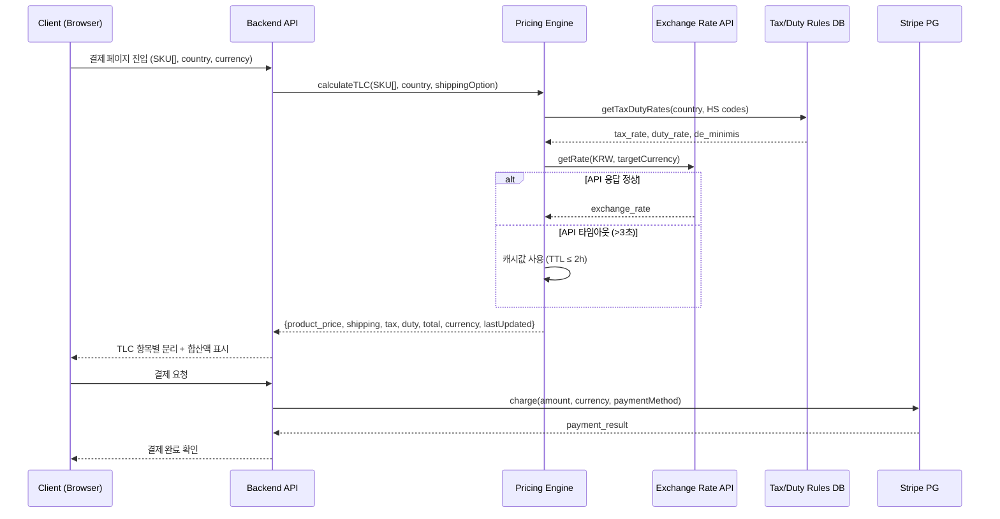
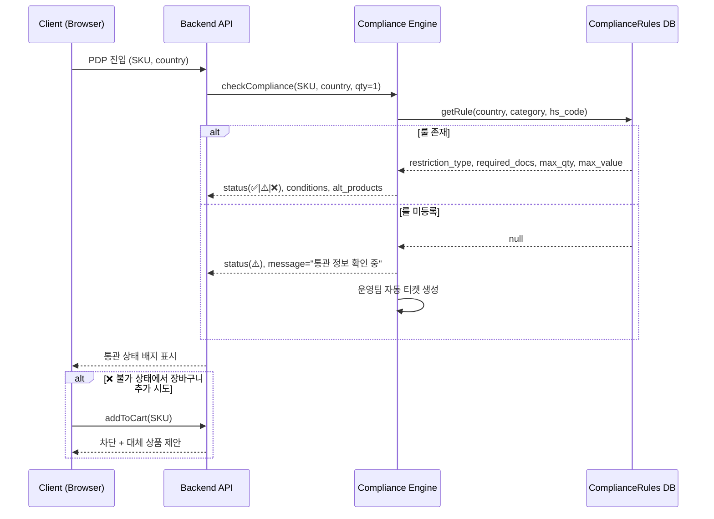
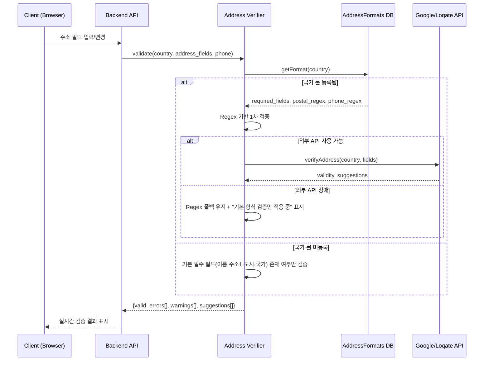
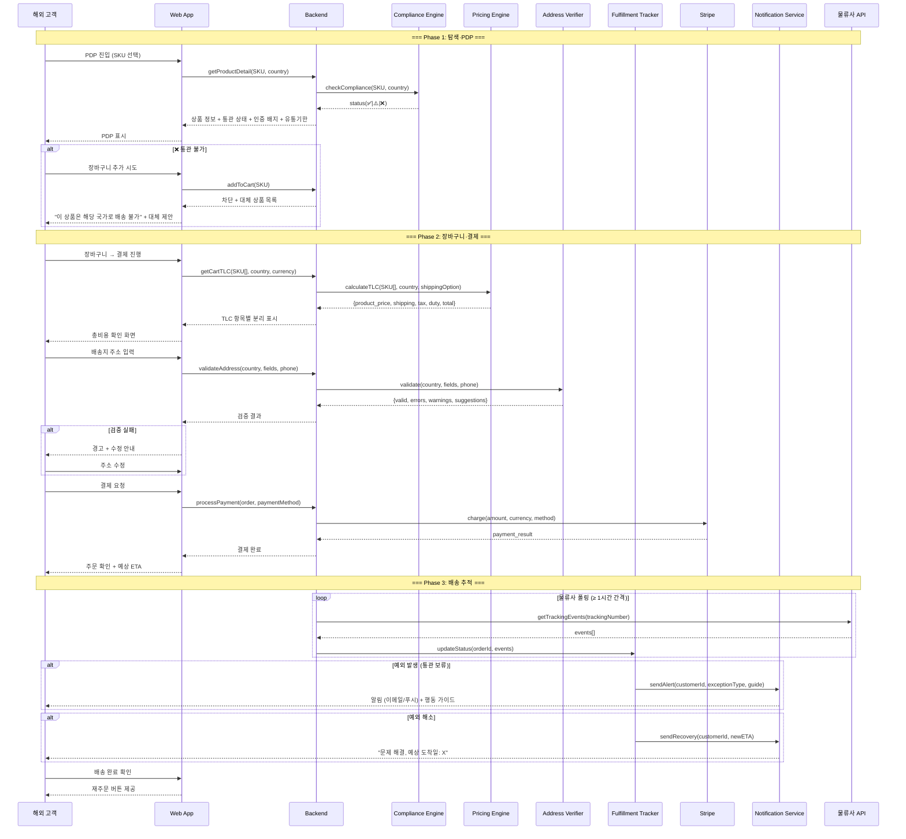
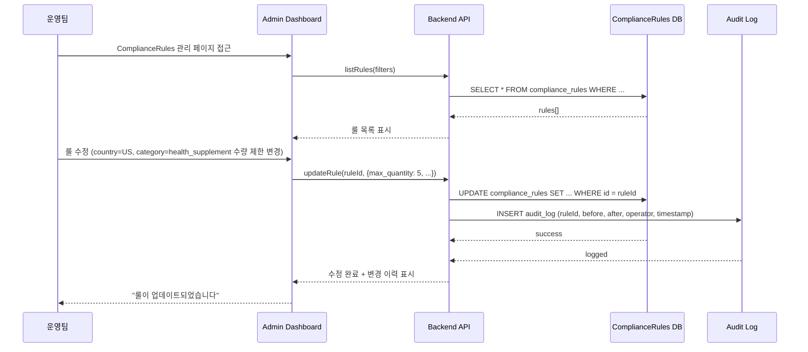
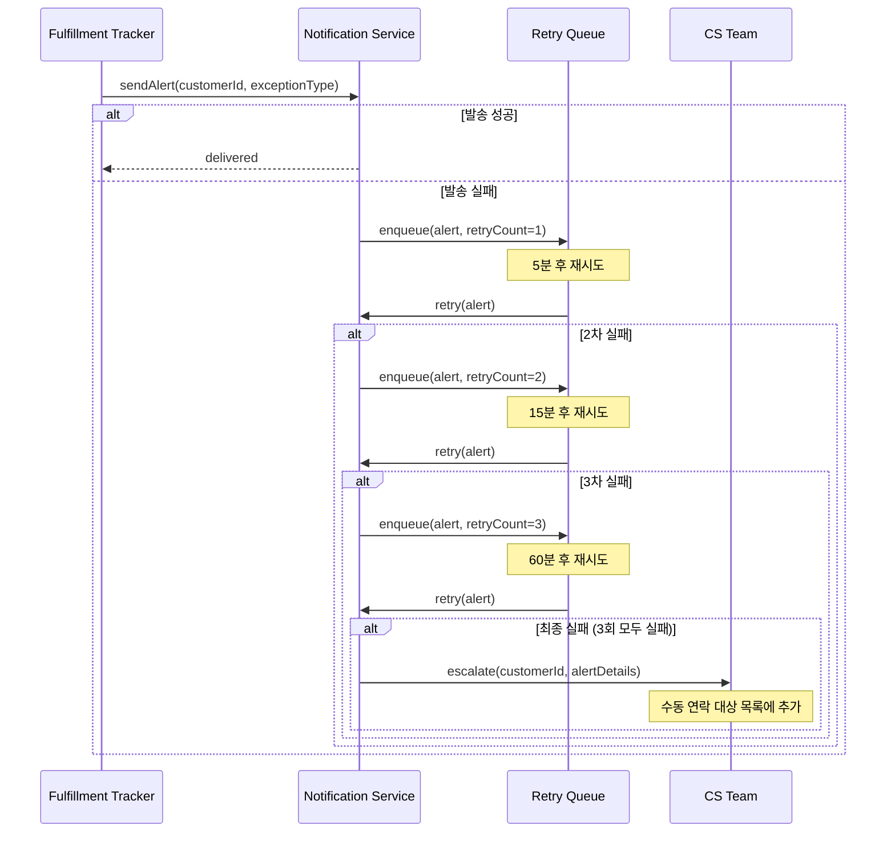
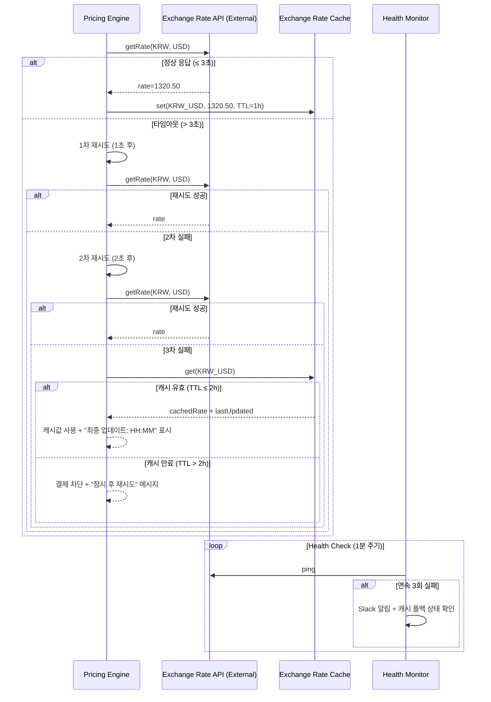

# Software Requirements Specification (SRS)

**Document ID:** SRS-001  
**Revision:** 1.0  
**Date:** 2026-04-29  
**Standard:** ISO/IEC/IEEE 29148:2018  
**Source PRD:** PRD v0.4 — 안심 CBT 역직구 플랫폼 (2026-04-25)  
**Status:** Draft

---

## 1. Introduction

### 1.1 Purpose

본 SRS는 "안심 CBT 역직구 플랫폼"의 소프트웨어 요구사항을 ISO/IEC/IEEE 29148:2018에 따라 명세한다. 해외 고객이 한국 K-Beauty 및 건강기능식품을 구매할 때 발생하는 **5대 구매 후 불확실성(Post-Purchase Uncertainty)**—배송, 통관·규제, 세금·총비용, 언어·CS, 신뢰·정품·품질—을 결제 전 단계에서 선제적으로 제거하여 **거래 완료율 ≥ 90%**를 달성하는 "Uncertainty Reduction Engine"을 구현하기 위한 기능·비기능·인터페이스·데이터 요구사항을 정의한다.

본 문서의 대상 독자는 개발팀, QA팀, 운영팀, 프로젝트 관리자이며, SRS/TDD 전환 및 구현·검증의 단일 기준 문서(Single Source of Truth)로 사용한다.

### 1.2 Scope

#### 1.2.1 In-Scope

| 항목 | 상세 |
|---|---|
| 기능 | F1 예상 총액 확정 보기, F2 통관 가능 여부 사전 확인, F3 주소·연락처 실시간 검증, F4 배송 ETA·예외 가이드, F5 정품 신뢰 신호, F6 건기식 설명 카드, F7 빠른 재주문 |
| 대상 국가 | 대표 5개국 (Phase 1), 12개국 (Phase 2) |
| 카테고리 | K-Beauty 전 SKU + 건강기능식품 고위험 SKU (Phase 1: 20~30 SKU) |
| 언어 | Phase 1: 영어·한국어 / Phase 2: +일본어·중국어 |
| 결제 | DDP(Delivered Duty Paid) 기본 적용, Stripe 다통화 결제 |

#### 1.2.2 Out-of-Scope

| 항목 | 비고 |
|---|---|
| 전 세계 통합몰 | Phase 3 이후 |
| 자체 풀필먼트·창고 | 에셋 라이트 4PL 구조 채택 (ADR-2) |
| F11~F14 (B2B2C 도구, 추천, 구독) | Phase 3 이후 |
| 복잡한 멤버십 | 미포함 |
| CS 자동 라우팅 | 미포함 |

### 1.3 Definitions, Acronyms, Abbreviations

| 약어/용어 | 정의 |
|---|---|
| CBT | Cross-Border Trade — 국가 간 전자상거래 |
| TLC | Total Landed Cost — 상품가+배송비+관세+부가세 합산 총비용 |
| DDP | Delivered Duty Paid — 관세·세금을 판매자가 선납하는 인코텀즈 조건 |
| DDU | Delivered Duty Unpaid — 관세·세금을 수령자가 부담하는 조건 |
| PDP | Product Detail Page — 상품 상세 페이지 |
| HS Code | Harmonized System Code — 국제 통일 상품분류 코드 |
| ETA | Estimated Time of Arrival — 예상 도착일 |
| AOS | Alternative Opportunity Score — 기존 대안의 Job 충족 정도 (높을수록 대안이 강함) |
| DOS | Desired Outcome Score — 고객의 미충족 갈망 강도 (높을수록 갈망이 큼) |
| OG Score | Opportunity Gap Score — AOS + DOS 합산 |
| JTBD | Jobs to Be Done — 고객이 달성하려는 과업 |
| MoSCoW | Must / Should / Could / Won't 우선순위 분류 |
| RPO | Recovery Point Objective — 데이터 복구 시점 목표 |
| RTO | Recovery Time Objective — 서비스 복구 시간 목표 |
| SLO | Service Level Objective — 서비스 수준 목표 |
| 4PL | Fourth-Party Logistics — 물류 자산 없이 데이터·프로세스로 물류 통제 |
| SKU | Stock Keeping Unit — 재고관리 단위 |
| PG | Payment Gateway — 결제 대행 |
| NFR | Non-Functional Requirement — 비기능 요구사항 |

### 1.4 References

| ID | 문서명 | 비고 |
|---|---|---|
| REF-01 | PRD v0.4 — 안심 CBT 역직구 플랫폼 (2026-04-25) | 본 SRS의 유일한 비즈니스 요구 원천 |
| REF-02 | VPS 통합 기준 문서 V2 (2026-04-18) | PRD 기반 문서 |
| REF-03 | 5 Forces 분석 (`1_5Forces_merged_CBT_KBeauty_Health.md`) | 전략적 공백 도출 |
| REF-04 | 경쟁사 분석 (`2_Competitior_merged_CBT_KBeauty_Health.md`) | 통합 플랫폼 부재 확인 |
| REF-05 | Value Chain 분석 (`3_Value-Chain_merged_CBT_KBeauty_Health.md`) | 병목 단계 식별 |
| REF-06 | KSF 분석 (`4_KSF_merged_CBT_KBeauty_Health.md`) | 7대 KSF 도출 |
| REF-07 | Problem Definition (`5_Problem-Definition_merged_CBT_KBeauty_Health.md`) | 구조적 문제 정의 |
| REF-08 | TAM/SAM/SOM·Persona (`6_TAMSAMSOM_MarketSegment_Persona_merged.md`) | 시장 규모 및 페르소나 |
| REF-09 | JTBD 분석 (`8_jtbd_merged_final_report.md`) | AOS/DOS 기반 우선순위 |

### 1.5 Constraints

| ID | 유형 | 내용 | 출처 |
|---|---|---|---|
| CON-01 | 아키텍처 | 통관·세금 로직은 룰 테이블(DB) 기반 설계. 하드코딩 금지. 운영팀이 어드민에서 CRUD 가능해야 함 | ADR-1 |
| CON-02 | 아키텍처 | 에셋 라이트 4PL/API 연합망. 자체 물류 자산 미투자 | ADR-2 |
| CON-03 | 비즈니스 | DDP 우선 정책. 대표 5개국 DDP 기본, DDU는 DDP 미지원 국가에만 예외 적용 | ADR-3 |
| CON-04 | 아키텍처 | Pricing Engine, Compliance Engine, Fulfillment Tracker를 독립 모듈로 분리. 초기에는 모듈러 모놀리스, 이후 점진적 분리 | ADR-4 |
| CON-05 | 인프라 | 월 인프라 비용 ≤ $3,000 (초기 AWS) | REF-01 §5 |
| CON-06 | 보안 | GDPR·CCPA 준수, AES-256 암호화, PCI DSS Level 1 (Stripe 위임) | REF-01 §5 |
| CON-07 | 결제 | Stripe 다통화 결제 PG 사용 | REF-01 §6 |

### 1.6 Assumptions

| ID | 내용 | 관련 결정 |
|---|---|---|
| ASM-01 | 5개국 세금·관세 데이터를 수동 수집·검증으로 런칭 가능 | D1 |
| ASM-02 | Beauty-first 20~30 SKU로 전환율 가설 검증 가능 | D2 |
| ASM-03 | DDP 적용 시 고객 신뢰 지표가 DDU 대비 유의미하게 개선됨 | D6 |
| ASM-04 | 물류 파트너가 DDP 지원 + Tracking API를 제공함 | D3 |
| ASM-05 | Stripe가 대상 5개국 다통화 결제를 커버함 | D4 |
| ASM-06 | 브랜드 공식 인증 자료를 운영팀이 확보할 수 있음 | 운영팀 |

### 1.7 Risks

| ID | 리스크 | 영향 | 확률 | 완화 전략 |
|---|---|---|---|---|
| RSK-01 | 세금·관세 계산 부정확 | 높음 | 중간 | 5개국 수동 검증 + disclaimer + 분기 감사 |
| RSK-02 | 통관 룰 변경 업데이트 지연 | 높음 | 중간 | 규제 모니터링 프로세스 + 룰테이블 버전 관리 |
| RSK-03 | 건기식 통관 실패 클레임 | 높음 | 중간 | 고위험 카테고리 사전 체크 + 면책 고지 + F2 차단 |
| RSK-04 | 신규 플랫폼 신뢰 부족 | 높음 | 중간 | F5 신뢰 신호 + 교민 커뮤니티 시딩 |
| RSK-05 | 물류사 API 불안정 | 중간 | 낮음 | 상태 사전 정의 폴백, Full tracking 2차 |
| RSK-06 | 환율 변동 마진 침식 | 중간 | 중간 | 갱신 주기 관리 + 가격 버퍼 |

---

## 2. Stakeholders

| 역할 (Role) | 페르소나/팀 | 책임 (Responsibility) | 관심사 (Interest) |
|---|---|---|---|
| 정품 신뢰형 반복구매 고객 | Sarah Kim | 정기적으로 K-Beauty 제품을 구매. 총비용 투명성·정품 보증·배송 가시성 요구 | 공식 채널 신뢰, 추가비용 없는 결제, 재주문 편의 |
| 가족 건강관리 안심구매 고객 | Maria Gonzalez | 가족용 건기식 구매. 성분·복용법 설명, 통관 안내 요구 | 건기식 안전성 확인, 통관 실패 방지, 설명 이해 |
| 주소·통관 실패 반복 고객 | Ahmed Rahman | 과거 배송 실패 경험. 주소 검증, 사전 경고, 예외 가이드 요구 | 주소 오류 원천 방지, 배송 과정 스트레스 해소 |
| 해외직구 불신·회피형 잠재고객 | Carlos Mendez (Day 2) | 첫 구매 진입장벽. 명확한 세금·배송·반송 위험 안내 요구 | 사기·가품 걱정 없는 첫 해외직구 시도 |
| 공동구매 운영형 리더 | Linda Park (Day 2) | 공동구매 취합·배송·CS 운영 피로. 플랫폼 위임 요구 | 운영 피로 경감, 배송·결제·CS 자동화 |
| Product 팀 | 내부 | PRD·SRS 작성, 기능 우선순위 결정, 실험 설계 | 북극성 KPI 달성, 전환율 개선 |
| Growth 팀 | 내부 | 사용자 획득, 전환 퍼널 최적화, 커뮤니티 시딩 | 첫 구매 이탈률 감소, 60일 재구매율 향상 |
| Ops 팀 | 내부 | 룰 테이블 관리, 브랜드 인증 데이터 입력, 물류 파트너 관리 | 통관 룰 정확성, 운영 효율 |
| 개발팀 | 내부 | 시스템 설계·구현·배포·운영 | 기술 실현 가능성, NFR 충족 |
| QA 팀 | 내부 | 테스트 계획·실행·결과 검증 | 테스트 가능한 AC, 추적성 |

---

## 3. System Context and Interfaces

### 3.1 External Systems

| ID | 시스템 | 유형 | 용도 | 제약 |
|---|---|---|---|---|
| EXT-01 | Open Exchange Rates API | 외부 REST API | 실시간 환율 조회 (base/target currency → 환율 JSON) | 1시간 캐시, 무료 티어 1K req/월 |
| EXT-02 | Google/Loqate Address Verification API | 외부 REST API | 주소 유효성 검증 (국가코드+주소 필드 → 판정 결과) | 2차 연동. 1차는 자체 Regex |
| EXT-03 | 물류사 Tracking API | 외부 REST API/Webhook | 배송 상태 이벤트 조회 (운송장번호 → 상태 이벤트) | 물류사별 상이, 폴링 ≥ 1시간 |
| EXT-04 | Stripe Payment Gateway | 외부 REST API | 다통화 결제 처리 (결제정보+금액+통화 → 결제 결과) | PCI DSS 위임, 다통화 지원 |
| EXT-05 | 알림 시스템 (이메일/푸시) | 외부 서비스 | 배송 예외·상태 변경 알림 발송 | 재시도 큐 필요 |

### 3.2 Client Applications

| 클라이언트 | 설명 |
|---|---|
| Web Application (SPA) | 해외 고객 대상 메인 쇼핑 인터페이스. PDP, 장바구니, 결제, 주문 추적 |
| Admin Dashboard | 운영팀 대상. 룰 테이블 CRUD, 브랜드 인증 관리, 주문·CS 모니터링 |

### 3.3 API Overview

| API | 유형 | 입력 | 출력 | 관련 기능 |
|---|---|---|---|---|
| Pricing Engine API | 내부 | SKU[], 국가코드, 배송옵션 | 항목별(상품가·배송비·관세·부가세)+합산 비용 | F1 |
| Compliance Engine API | 내부 | SKU, 국가코드, 수량 | 허용(✅)/조건부(⚠️)/불가(❌) + 조건 상세 | F2 |
| Address Verification API | 내부 | 국가코드, 주소 필드, 전화번호 | 유효성 판정 + 오류 상세 + 수정 제안 | F3 |
| Fulfillment Tracker API | 내부 | 주문ID, 운송장번호 | 배송 상태, ETA, 예외 정보 | F4 |
| Product Certification API | 내부 | SKU, 브랜드ID | 인증 배지 상태, 유통기한 정보 | F5 |
| Health Supplement Info API | 내부 | SKU | 성분·복용법 구조화 데이터 | F6 |
| Quick Reorder API | 내부 | 고객ID, 주문ID | 복제된 장바구니 | F7 |

### 3.4 Interaction Sequences (Core Flows)

#### 3.4.1 결제 전 총비용 확정 흐름 (F1)

#### 3.4.2 통관 가능 여부 확인 흐름 (F2)

#### 3.4.3 주소 실시간 검증 흐름 (F3)

---

## 4. Specific Requirements

### 4.1 Functional Requirements

#### 4.1.1 F1 — 예상 총액 확정 보기 (Pricing / TLC Display)

| ID | 요구사항 | Priority | Source | Acceptance Criteria |
|---|---|---|---|---|
| REQ-FUNC-101 | 시스템은 사용자가 결제 페이지에 진입할 때 대표 5개국 중 하나가 배송지로 설정된 경우 상품가·국제배송비·예상 세금·관세를 항목별로 분리하여 합산액과 함께 표시해야 한다. | Must | Story 1, AC1-1 | **Given** 대표 5개국 중 하나를 배송지로 선택한 상태 **When** 결제 페이지 진입 **Then** 상품가·배송비·세금·관세 항목별 분리 + 합산액이 노출된다. 응답 시간 ≤ 1초. 항목 누락률 0%. |
| REQ-FUNC-102 | 시스템은 사용자가 현지 통화를 선택할 때 실시간 환율(1시간 갱신)을 적용한 현지 통화 기준 총비용을 표시해야 한다. | Must | Story 1, AC1-2 | **Given** 사용자가 현지 통화로 변경 **When** 총비용 화면 표시 **Then** 환율 오차 ≤ 0.5%인 실시간 환율 기반 현지 통화 총비용 표시. 환율 API 실패율 < 0.5%. |
| REQ-FUNC-103 | 시스템은 세금이 불확실한 국가/SKU 조합에 대해 확정 항목과 예상 항목을 분리하고 disclaimer를 표시해야 한다. | Must | Story 1, AC1-3 | **Given** 세금 불확실 국가/SKU **When** 총비용 표시 시 **Then** disclaimer 표시 + 확정/예상 항목 분리. disclaimer 미표시 오류율 0%. |
| REQ-FUNC-104 | 환율/세금 API 타임아웃(3초 초과) 시 시스템은 캐시값(TTL ≤ 2시간)으로 폴백 표시하고 "최종 업데이트: HH:MM"을 노출해야 한다. 캐시 TTL 초과 시 결제를 차단하고 "잠시 후 재시도" 메시지를 표시해야 한다. | Must | Story 1, AC1-F1 | **Given** 환율/세금 API 타임아웃(>3초) **When** 총비용 표시 시도 **Then** 캐시 폴백 성공률 ≥ 99%. 캐시 TTL 초과 시 결제 차단 + 메시지 표시율 100%. |
| REQ-FUNC-105 | 대표 5개국 외 비지원 국가가 배송지로 선택된 경우 시스템은 "해당 국가는 세금·관세 예상 미제공" 안내를 표시하고 상품가·배송비만 표시해야 한다. 안내 없이 결제 진행을 차단해야 한다. | Must | Story 1, AC1-F2 | **Given** 비지원 국가 배송지 선택 **When** 총비용 표시 시도 **Then** 비지원국 안내 표시율 100%. 안내 없는 결제 진행 차단율 100%. |
| REQ-FUNC-106 | Pricing Engine은 PricingRules DB에서 국가코드·HS Code 기반으로 tax_rate, duty_rate, de_minimis 값을 조회하여 TLC를 산출해야 한다. | Must | F1, ADR-1 | **Given** 유효한 국가코드·HS Code **When** TLC 산출 요청 **Then** PricingRules 테이블에서 정확한 세율 조회 후 TLC 반환. 비용 계산 오류율 ≤ 0.5%. |
| REQ-FUNC-107 | 시스템은 장바구니 화면에서도 선택된 배송지 기준 TLC 예상 합산액을 표시해야 한다. | Must | Story 1 | **Given** 장바구니에 상품이 존재하고 배송지가 설정된 상태 **When** 장바구니 페이지 로드 **Then** TLC 예상 합산액 표시. |

#### 4.1.2 F2 — 통관 가능 여부 사전 확인 (Compliance Check)

| ID | 요구사항 | Priority | Source | Acceptance Criteria |
|---|---|---|---|---|
| REQ-FUNC-201 | 시스템은 사용자의 배송 국가가 설정된 상태에서 PDP 진입 시 해당 SKU의 통관 상태(✅ 허용 / ⚠️ 조건부 / ❌ 불가)를 즉시 표시해야 한다. | Must | Story 2, AC2-1 | **Given** 배송 국가 설정 상태 **When** PDP 진입 **Then** 통관 상태 배지 즉시 표시. 응답 ≤ 500ms. 정확도 ≥ 95%. |
| REQ-FUNC-202 | ⚠️ 조건부 상태인 경우 사용자가 상세를 클릭하면 필요서류·수량 제한·금액 제한 등 조건 안내를 표시해야 한다. | Must | Story 2, AC2-2 | **Given** ⚠️ 조건부 상태 **When** 상세 클릭 **Then** 조건 설명 표시. 조건 설명 누락률 ≤ 2%. |
| REQ-FUNC-203 | ❌ 불가 상태인 SKU에 대해 장바구니 추가를 차단하고 대체 상품을 제안해야 한다. | Must | Story 2, AC2-3 | **Given** ❌ 불가 상태 **When** 장바구니 추가 시도 **Then** 추가 차단(우회율 0%) + 대체 제안 ≥ 80%. |
| REQ-FUNC-204 | 해당 국가/카테고리/HS Code 룰이 미등록인 경우 ⚠️ "통관 정보 확인 중. 주문 전 고객센터 문의" + CS 링크를 표시하고 운영팀에 자동 티켓을 생성해야 한다. | Must | Story 2, AC2-F1 | **Given** 룰 미등록 **When** 통관 상태 표시 시도 **Then** 무판정(빈 상태) 노출률 0%. 티켓 생성 지연 ≤ 1분. |
| REQ-FUNC-205 | Compliance Engine 서비스 장애(5xx/타임아웃) 시 캐시된 최근 판정 결과를 표시하고 "정보가 최신이 아닐 수 있습니다" 경고를 표시해야 한다. 장애 5분 이상 지속 시 PagerDuty 알림을 발송해야 한다. | Must | Story 2, AC2-F2 | **Given** Compliance Engine 장애 **When** 통관 상태 표시 시도 **Then** 캐시 폴백 성공률 ≥ 95%. 5분+ 장애 시 PagerDuty 알림 발송. |
| REQ-FUNC-206 | Compliance Engine은 ComplianceRules DB 테이블에서 country_code, category_code, hs_code 기반으로 restriction_type, required_docs, max_quantity, max_value를 조회하여 판정해야 한다. | Must | F2, ADR-1 | **Given** 유효한 country_code, SKU **When** 통관 판정 요청 **Then** ComplianceRules 테이블 기반 판정 반환. |
| REQ-FUNC-207 | 운영팀은 Admin Dashboard에서 ComplianceRules의 국가별·카테고리별 룰을 생성·조회·수정·삭제(CRUD)할 수 있어야 한다. 변경 이력이 추적되어야 한다. | Must | ADR-1 | **Given** 운영팀 관리자 로그인 **When** ComplianceRules CRUD 수행 **Then** 즉시 반영 + 변경 이력(변경자, 변경일시, 변경 전후 값) 저장. |

#### 4.1.3 F3 — 주소·연락처 실시간 검증 (Address Verification)

| ID | 요구사항 | Priority | Source | Acceptance Criteria |
|---|---|---|---|---|
| REQ-FUNC-301 | 시스템은 주소 입력 필드 값 변경 시 우편번호·필수 필드·지역-도시 매칭을 실시간 검증해야 한다. | Must | Story 3, AC3-1 | **Given** 주소 입력 중 **When** 필드 값 변경 시 **Then** 실시간 검증 결과 표시. 지연 ≤ 300ms. 오탐률(false positive) ≤ 1%. |
| REQ-FUNC-302 | 시스템은 전화번호 입력 시 해당 국가 형식에 맞는지 검증하고 유효하지 않으면 경고와 올바른 형식 예시를 표시해야 한다. | Must | Story 3, AC3-2 | **Given** 전화번호 입력 **When** 형식 확인 **Then** 포맷 오류 미검출률 ≤ 3%. 올바른 형식 예시 표시. |
| REQ-FUNC-303 | 배송 실패 위험이 높은 주소로 결제를 진행하려 할 때 시스템은 블로킹 경고를 표시하고 수정 안내를 제공해야 한다. | Must | Story 3, AC3-3 | **Given** 배송 실패 위험 높은 주소 **When** 결제 진행 시도 **Then** 블로킹 경고 + 수정 안내. 경고-실제 실패 상관도 ≥ 70%. |
| REQ-FUNC-304 | AddressFormats에 해당 국가 룰이 미등록인 경우 기본 필수 필드(이름·주소1·도시·국가) 존재 여부만 검증하고 "상세 주소 검증 미지원 국가" 안내를 표시해야 한다. 미등록국에서 경고 없이 결제가 통과되면 안 된다. | Must | Story 3, AC3-F1 | **Given** 국가 룰 미등록 **When** 주소 검증 시도 **Then** 기본 필드 검증 + 안내 표시. 미등록국 무검증 통과율 0%. |
| REQ-FUNC-305 | 주소 검증 외부 API(Google/Loqate) 장애 시 자체 Regex 기반 폴백 검증으로 자동 전환하고 "기본 형식 검증만 적용 중" 안내를 표시해야 한다. 장애 5분 이상 시 Slack 알림을 발송해야 한다. | Must | Story 3, AC3-F2 | **Given** 외부 API 장애 **When** 주소 검증 시도 **Then** Regex 폴백 전환 지연 ≤ 5초. 폴백 중 검증 누락률 0%. 5분+ 시 Slack 알림. |
| REQ-FUNC-306 | 시스템은 libphonenumber 라이브러리를 사용하여 국가별 전화번호 형식을 검증해야 한다. | Must | F3 | **Given** 전화번호 및 국가코드 입력 **When** 검증 요청 **Then** libphonenumber 기반 검증 결과 반환. |

#### 4.1.4 F4 — 배송 ETA·예외 가이드 (Fulfillment Tracking & Exception Guide)

| ID | 요구사항 | Priority | Source | Acceptance Criteria |
|---|---|---|---|---|
| REQ-FUNC-401 | "통관 보류" 상태 변경 시 시스템은 10분 이내에 알림을 발송하고 추가서류 안내·제출 방법·예상 처리기간을 포함한 가이드를 제공해야 한다. | Must | Story 4, AC4-1 | **Given** "통관 보류" 상태 변경 **When** 알림 수신/상태 페이지 접근 **Then** 알림 지연 ≤ 10분. 가이드 제공률 100%. |
| REQ-FUNC-402 | "현지 배송 지연" 상태에서 시스템은 지연일수·사유·대응 옵션을 표시하고 ETA를 재계산해야 한다. | Must | Story 4, AC4-2 | **Given** "현지 배송 지연" 상태 **When** 상태 확인 **Then** 지연일수+사유+대응옵션 표시. ETA 재계산 정확도 ≥ 80%. |
| REQ-FUNC-403 | 예외 해소 후 정상 복귀 시 시스템은 "문제 해결, 예상 도착일: X" 알림을 발송해야 한다. | Must | Story 4, AC4-3 | **Given** 예외 해소·정상 복귀 **When** 상태 변경 시 **Then** 복귀 알림 발송. 누락률 ≤ 1%. |
| REQ-FUNC-404 | 물류사 Tracking API가 24시간 이상 무응답인 경우 시스템은 마지막 수신 상태 + "마지막 업데이트: YYYY-MM-DD HH:MM" + "48시간 내 미갱신 시 CS 자동 연락" 메시지를 표시해야 한다. 48시간 초과 시 CS 자동 티켓을 생성해야 한다. | Must | Story 4, AC4-F1 | **Given** Tracking API 24h+ 무응답 **When** 주문 상태 페이지 조회 **Then** 마지막 상태+타임스탬프+안내 표시. 48h 초과 시 CS 티켓 생성률 100%. |
| REQ-FUNC-405 | 알림 발송 시스템 장애로 예외 알림 발송 실패 시 재시도 큐(최대 3회, 간격 5분·15분·60분)에 등록하고, 3회 실패 시 CS팀에 수동 연락 대상 목록으로 에스컬레이션해야 한다. | Must | Story 4, AC4-F2 | **Given** 알림 발송 실패 **When** 배송 예외 상태 변경 발생 **Then** 재시도 큐 등록. 알림 최종 미도달률 ≤ 0.5%. 에스컬레이션 지연 ≤ 70분. |
| REQ-FUNC-406 | 시스템은 물류사 Tracking API에서 수신한 배송 이벤트를 표준 상태(출고·국제운송·통관진행·통관완료·현지배송·배송완료)로 매핑하여 고객에게 표시해야 한다. | Must | F4 | **Given** 물류사로부터 배송 이벤트 수신 **When** 이벤트 처리 **Then** 표준 상태로 매핑 후 고객 주문 상태 페이지에 반영. |
| REQ-FUNC-407 | 시스템은 4대 예외 시나리오(통관 보류, 현지 배송 지연, 반송, 수령 불가)에 대해 사용자 행동 가이드를 제공해야 한다. | Must | F4 | **Given** 4대 예외 중 하나 발생 **When** 고객이 주문 상태 확인 **Then** 해당 예외별 맞춤 행동 가이드 표시. |

#### 4.1.5 F5 — 정품 신뢰 신호 (Authenticity Trust Signals)

| ID | 요구사항 | Priority | Source | Acceptance Criteria |
|---|---|---|---|---|
| REQ-FUNC-501 | 인증된 브랜드 상품 조회 시 상품 목록 및 PDP에서 브랜드 공식 인증 배지를 즉시 표시해야 한다. | Must | Story 5, AC5-1 | **Given** 인증 브랜드 상품 조회 **When** 목록/PDP 진입 **Then** 인증 배지 즉시 표시. 미표시 오류율 0%. |
| REQ-FUNC-502 | 정품 보증 정책 링크 클릭 시 정책·반품·직배송 프로세스를 1페이지 내에서 확인할 수 있어야 한다. | Must | Story 5, AC5-2 | **Given** 정품 보증 정책 링크 클릭 **When** 페이지 로드 **Then** 로드 ≤ 2초. 정보 완결성 100%. |
| REQ-FUNC-503 | PDP에서 SKU별 유통기한 및 잔여일을 표시해야 한다. | Must | Story 5, AC5-3 | **Given** PDP 확인 **When** 유통기한 영역 표시 **Then** SKU별 유통기한+잔여일 표시. 커버리지 ≥ 95%. |
| REQ-FUNC-504 | 유통기한 정보 미등록 SKU의 경우 "유통기한 정보 확인 중" 플레이스홀더를 표시하고 운영팀에 데이터 입력 요청 알림을 자동 발송해야 한다. 잘못된 유통기한을 표시해서는 안 된다. | Must | Story 5, AC5-F1 | **Given** 유통기한 미등록 SKU **When** PDP 표시 **Then** 플레이스홀더 표시. 잘못된 유통기한 표시 오류율 0%. 알림 지연 ≤ 5분. |
| REQ-FUNC-505 | 브랜드 인증 DB와 상품 카탈로그 간 인증 상태 불일치 감지 시 인증 DB를 SSOT로 사용하여 안전 방향(배지 미표시)으로 판정하고 운영팀에 데이터 정합성 검토 티켓을 자동 생성해야 한다. | Must | Story 5, AC5-F2 | **Given** 인증 DB-카탈로그 불일치 **When** PDP 진입 **Then** 잘못된 배지 표시율 0%. 불일치 감지→티켓 생성 지연 ≤ 5분. |
| REQ-FUNC-506 | Products 테이블의 is_certified 필드는 브랜드 인증 DB에서만 갱신되어야 하며, 카탈로그 동기화 시 인증 DB를 SSOT로 사용해야 한다. | Must | F5, AC5-F2 | **Given** 상품 카탈로그 동기화 실행 **When** is_certified 값 갱신 **Then** 인증 DB 기준으로만 갱신. |

#### 4.1.6 F6 — 건기식 설명 카드 (Health Supplement Info Card)

| ID | 요구사항 | Priority | Source | Acceptance Criteria |
|---|---|---|---|---|
| REQ-FUNC-601 | PDP에서 건강기능식품 SKU의 성분·복용법·주의사항을 구조화된 카드 형태로 표시해야 한다. | Should | F6 | **Given** 건기식 SKU PDP 진입 **When** 설명 카드 영역 표시 **Then** 성분·복용법·주의사항 구조화 표시. |
| REQ-FUNC-602 | 건기식 설명 카드는 사용자의 preferred_lang에 맞는 언어로 표시되어야 한다. | Should | F6 | **Given** 사용자 언어 설정 (en/ko) **When** 설명 카드 로드 **Then** 해당 언어로 표시. |
| REQ-FUNC-603 | 운영팀은 Admin Dashboard에서 SKU별 성분·복용법 구조화 데이터를 입력·수정할 수 있어야 한다. | Should | F6 | **Given** 운영팀 로그인 **When** 건기식 데이터 입력/수정 **Then** 즉시 반영 + 변경 이력 저장. |

#### 4.1.7 F7 — 빠른 재주문 (Quick Reorder)

| ID | 요구사항 | Priority | Source | Acceptance Criteria |
|---|---|---|---|---|
| REQ-FUNC-701 | 시스템은 고객의 과거 주문 내역에서 "재주문" 버튼을 통해 동일 상품을 장바구니에 복제할 수 있어야 한다. | Should | F7 | **Given** 주문 내역 화면 **When** "재주문" 버튼 클릭 **Then** 해당 주문의 상품이 장바구니에 복제됨. |
| REQ-FUNC-702 | 재주문 시 품절·단종·가격 변동·통관 불가 상태 변경이 있는 경우 사용자에게 즉시 알려야 한다. | Should | F7 | **Given** 재주문 요청 **When** 상품 상태 변경이 존재 **Then** 변경 사항 알림 표시 (품절/단종/가격변동/통관불가). |

#### 4.1.8 F8~F10 — Could 기능

| ID | 요구사항 | Priority | Source | Acceptance Criteria |
|---|---|---|---|---|
| REQ-FUNC-801 | 시스템은 통관 안전 SKU 조합으로 구성된 저위험 첫 구매 패키지를 제안할 수 있어야 한다. | Could | F8 | **Given** 첫 방문 고객 **When** 메인/카테고리 페이지 **Then** 저위험 번들 제안 표시. |
| REQ-FUNC-901 | 품절 SKU에 대해 재입고 알림을 신청할 수 있어야 한다. | Could | F9 | **Given** 품절 SKU PDP **When** 알림 신청 **Then** 재입고 시 알림 발송. |
| REQ-FUNC-1001 | 시스템은 통관 룰·합산 최적화 기반의 안전 번들 추천을 표시할 수 있어야 한다. | Could | F10 | **Given** 장바구니 또는 PDP **When** 번들 추천 영역 **Then** 통관 안전+가격 최적화 번들 제안. |

### 4.2 Non-Functional Requirements

#### 4.2.1 성능 (Performance)

| ID | 요구사항 | 기준 | 측정 방법 | Source |
|---|---|---|---|---|
| REQ-NF-001 | Pricing Engine API (TLC 계산) 응답 시간 | p95 ≤ 1,000ms | APM (CloudWatch/Datadog) | REF-01 §5 |
| REQ-NF-002 | Compliance Engine API (통관 판정) 응답 시간 | p95 ≤ 500ms | APM | REF-01 §5 |
| REQ-NF-003 | Address Verification 피드백 응답 시간 | p95 ≤ 300ms | APM | REF-01 §5 |
| REQ-NF-004 | 페이지 로드 시간 (CDN) | p95 ≤ 2,000ms | APM / Lighthouse | REF-01 §5 |
| REQ-NF-005 | 외부 API 타임아웃 (환율·세금·주소검증) | 각 API ≤ 3초, 실패 시 최대 2회 재시도 (지수 백오프 1s→2s) | Application 로그 | REF-01 §5 |
| REQ-NF-006 | DB 핵심 쿼리 응답 (상품 조회·주문 생성·룰 판정) | p95 ≤ 200ms | APM / Slow Query Log | REF-01 §5 |
| REQ-NF-007 | 부하 테스트 통과 | 동시 접속 500명: p95 응답 ≤ 2초, 에러율 ≤ 1% | k6 또는 Locust (GA 전 필수 통과) | REF-01 §5 |

#### 4.2.2 신뢰성 (Reliability)

| ID | 요구사항 | 기준 | 측정 방법 | Source |
|---|---|---|---|---|
| REQ-NF-008 | 월 가용성 | ≥ 99.5% | Uptime 모니터링 | REF-01 §5 |
| REQ-NF-009 | 비용 계산 오류율 | ≤ 0.5% | 수동 검증 + 자동 비교 | REF-01 §5 |
| REQ-NF-010 | 통관 판정 정확도 | ≥ 95% | 수동 검수 대시보드 | REF-01 §5 |
| REQ-NF-011 | 결제 실패율 | ≤ 1% | PG 대시보드 | REF-01 §5 |
| REQ-NF-012 | 데이터 백업·복구 | RPO ≤ 1시간, RTO ≤ 4시간 | 복구 훈련 | REF-01 §5 |
| REQ-NF-013 | 외부 API 장애 내성 (환율·세금) | 캐시 폴백 TTL ≤ 2시간 | Application 로그 | REF-01 §5 |
| REQ-NF-014 | 외부 API 장애 내성 (주소 검증) | 자체 Regex 폴백 | Application 로그 | REF-01 §5 |

#### 4.2.3 보안 (Security)

| ID | 요구사항 | 기준 | Source |
|---|---|---|---|
| REQ-NF-015 | 개인정보 보호 | GDPR·CCPA 준수 | REF-01 §5 |
| REQ-NF-016 | 데이터 암호화 | AES-256 (저장 데이터), TLS 1.2+ (전송 데이터) | REF-01 §5 |
| REQ-NF-017 | 결제 보안 | PCI DSS Level 1 (Stripe 위임) | REF-01 §5 |
| REQ-NF-018 | 접근 제어 | Admin Dashboard RBAC (역할 기반 접근 제어) | REF-01 §5 |
| REQ-NF-019 | 감사 로그 | 룰 테이블 변경, 관리자 행동 로그 기록. 최소 1년 보존 | ADR-1 |

#### 4.2.4 확장성 (Scalability)

| ID | 요구사항 | 기준 | Source |
|---|---|---|---|
| REQ-NF-020 | 동시 접속 확장 | 초기 500 → 6개월 후 2,000 | REF-01 §5 |
| REQ-NF-021 | 국가 확장 | 모듈 구조로 국가 코드 파라미터 기반 권역별 동작 | ADR-4 |

#### 4.2.5 유지보수성 (Maintainability)

| ID | 요구사항 | 기준 | Source |
|---|---|---|---|
| REQ-NF-022 | 룰 테이블 운영팀 자체 관리 | 코드 배포 없이 운영팀이 Admin Dashboard에서 CRUD 가능 | ADR-1 |
| REQ-NF-023 | 룰 변경 이력 추적 | 변경자·변경일시·변경 전후 값 기록 | ADR-1 |

#### 4.2.6 비용 (Cost)

| ID | 요구사항 | 기준 | Source |
|---|---|---|---|
| REQ-NF-024 | 월 인프라 비용 | ≤ $3,000 (초기 AWS) | REF-01 §5 |
| REQ-NF-025 | 건당 CS 비용 | ≤ $2/건 (업계 평균 $3~5 대비) | REF-01 §9 |

#### 4.2.7 다국어 (i18n)

| ID | 요구사항 | 기준 | Source |
|---|---|---|---|
| REQ-NF-026 | Phase 1 지원 언어 | 영어·한국어 | REF-01 §5 |
| REQ-NF-027 | Phase 2 지원 언어 | +일본어·중국어 | REF-01 §5 |

#### 4.2.8 모니터링 (Monitoring)

| ID | 요구사항 | 알림 기준 | 도구 | Source |
|---|---|---|---|---|
| REQ-NF-028 | 서버 응답 p95 모니터링 | > 2초 시 Slack 알림 | CloudWatch/Datadog | REF-01 §5 |
| REQ-NF-029 | 비용 계산 오류율 모니터링 | > 1% 시 PagerDuty | Application 로그 | REF-01 §5 |
| REQ-NF-030 | 통관 판정 실패 모니터링 | 일 5건 이상 운영팀 알림 | 수동 검수 대시보드 | REF-01 §5 |
| REQ-NF-031 | 배송 추적 단절 모니터링 | 24시간 무상태 변경 시 알림 | Fulfillment 로그 | REF-01 §5 |
| REQ-NF-032 | 결제 실패율 모니터링 | > 2% 시 알림 | PG 대시보드 | REF-01 §5 |
| REQ-NF-033 | 환율 API 상태 Health Check | 1분 주기. 연속 3회 실패 → Slack + 캐시 폴백 확인 | Health Check | REF-01 §5 |
| REQ-NF-034 | 주소 검증 API 상태 Health Check | 1분 주기. 연속 3회 실패 → Slack + Regex 폴백 전환 | Health Check | REF-01 §5 |
| REQ-NF-035 | 세금 계산 API 상태 Health Check | 1분 주기. 연속 3회 실패 → PagerDuty + 캐시 폴백 | Health Check | REF-01 §5 |
| REQ-NF-036 | DB 슬로우 쿼리 모니터링 | p95 > 500ms 발생 시 Slack | CloudWatch/Datadog APM | REF-01 §5 |
| REQ-NF-037 | 룰 테이블 미등록 요청 모니터링 | 미등록 국가/카테고리 일 10건 초과 시 운영팀 알림 | Application 로그 | REF-01 §5 |

#### 4.2.9 북극성 및 보조 KPI

| ID | KPI | 정의 | 기준선 | 목표 | 측정 주기 | 측정 도구 |
|---|---|---|---|---|---|---|
| REQ-NF-038 | 거래 완료율 (북극성) | (수령 확인 건 ÷ 결제 완료 건) × 100 | 추정 75% | Beta ≥ 82%, GA ≥ 90% | 주간 | Mixpanel `order_delivered_confirmed` + 물류사 Webhook |
| REQ-NF-039 | 장바구니→결제 전환율 | (결제 완료 수 ÷ 장바구니 생성 수) × 100 | ≤ 10% | Beta ≥ 12%, GA ≥ 15% | 주간 | Mixpanel Funnel |
| REQ-NF-040 | 주소 오류율 | (검증 실패 후 미수정 제출 건 ÷ 전체 주문 건) × 100 | ≥ 15% | Beta ≤ 8%, GA ≤ 5% | 주간 | Address Verification 로그 + Order JOIN |
| REQ-NF-041 | 통관 실패율 | (통관 반려·반송 건 ÷ 전체 출고 건) × 100 | ≥ 8% | Beta ≤ 5%, GA ≤ 3% | 월간 | 물류사 통관 API + 수동 반려 보고 |
| REQ-NF-042 | 배송 CS 비중 | (배송 CS 건 ÷ 전체 CS 건) × 100 | ≥ 50% | Beta ≤ 40%, GA ≤ 30% | 월간 | CS 티켓 태그 (Zendesk/Freshdesk) |
| REQ-NF-043 | 첫 구매 이탈률 | (첫 방문 후 30일 내 미구매 ÷ 첫 방문) × 100 | ≥ 70% | Beta ≤ 65%, GA ≤ 60% | 월간 | Mixpanel Cohort |
| REQ-NF-044 | 60일 재구매율 | (60일 내 2회+ 결제 고객 ÷ 첫 구매 고객) × 100 | 미측정 | Beta ≥ 15%, GA ≥ 25% | 월간 | Order 테이블 집계 |
| REQ-NF-045 | NPS | 표준 NPS 설문 (0~10점) | 미측정 | Beta ≥ 30, GA ≥ 40 | 분기 | 주문 후 7일 자동 이메일 설문 (Typeform) |

---

## 5. Traceability Matrix

| Story / Feature | REQ-FUNC ID(s) | REQ-NF ID(s) | Test Case ID(s) |
|---|---|---|---|
| Story 1 (결제 전 총비용 확정) / F1 | REQ-FUNC-101, 102, 103, 104, 105, 106, 107 | REQ-NF-001, 005, 008, 009, 013, 024, 028, 029, 033, 035, 038, 039 | TC-F1-01 ~ TC-F1-07 |
| Story 2 (통관 가능 여부 확인) / F2 | REQ-FUNC-201, 202, 203, 204, 205, 206, 207 | REQ-NF-002, 006, 010, 030, 037, 041 | TC-F2-01 ~ TC-F2-07 |
| Story 3 (주소·연락처 검증) / F3 | REQ-FUNC-301, 302, 303, 304, 305, 306 | REQ-NF-003, 005, 014, 034, 040 | TC-F3-01 ~ TC-F3-06 |
| Story 4 (배송 예외 가이드) / F4 | REQ-FUNC-401, 402, 403, 404, 405, 406, 407 | REQ-NF-004, 008, 031, 042 | TC-F4-01 ~ TC-F4-07 |
| Story 5 (정품 신뢰 신호) / F5 | REQ-FUNC-501, 502, 503, 504, 505, 506 | REQ-NF-008, 019, 043 | TC-F5-01 ~ TC-F5-06 |
| F6 (건기식 설명 카드) | REQ-FUNC-601, 602, 603 | REQ-NF-026, 027 | TC-F6-01 ~ TC-F6-03 |
| F7 (빠른 재주문) | REQ-FUNC-701, 702 | REQ-NF-006, 044 | TC-F7-01 ~ TC-F7-02 |
| F8 (저위험 첫 구매 패키지) | REQ-FUNC-801 | REQ-NF-043 | TC-F8-01 |
| F9 (재입고 알림) | REQ-FUNC-901 | — | TC-F9-01 |
| F10 (안전 번들 추천) | REQ-FUNC-1001 | — | TC-F10-01 |
| 북극성 KPI | — | REQ-NF-038 | TC-KPI-01 |
| 성능·가용성 전체 | — | REQ-NF-001~007, 008, 012, 020 | TC-NF-PERF-01 ~ TC-NF-PERF-07, TC-NF-REL-01 ~ TC-NF-REL-03 |
| 보안 | — | REQ-NF-015, 016, 017, 018, 019 | TC-NF-SEC-01 ~ TC-NF-SEC-05 |
| 모니터링 | — | REQ-NF-028~037 | TC-NF-MON-01 ~ TC-NF-MON-10 |

---

## 6. Appendix

### 6.1 API Endpoint List

| # | Endpoint | Method | 내부/외부 | 설명 | 관련 REQ |
|---|---|---|---|---|---|
| 1 | `POST /api/v1/pricing/calculate` | POST | 내부 | TLC 계산 (SKU[], country, shippingOption → 항목별+합산 비용) | REQ-FUNC-101~107 |
| 2 | `GET /api/v1/compliance/check` | GET | 내부 | 통관 판정 (SKU, country, qty → ✅/⚠️/❌ + 조건) | REQ-FUNC-201~206 |
| 3 | `POST /api/v1/address/validate` | POST | 내부 | 주소·전화번호 검증 (country, fields, phone → 판정+오류+제안) | REQ-FUNC-301~306 |
| 4 | `GET /api/v1/fulfillment/status/{orderId}` | GET | 내부 | 배송 상태·ETA·예외 정보 조회 | REQ-FUNC-401~407 |
| 5 | `GET /api/v1/products/{sku}/certification` | GET | 내부 | 인증 배지 상태, 유통기한 정보 | REQ-FUNC-501~506 |
| 6 | `GET /api/v1/products/{sku}/supplement-info` | GET | 내부 | 건기식 성분·복용법 구조화 데이터 | REQ-FUNC-601~603 |
| 7 | `POST /api/v1/orders/reorder` | POST | 내부 | 과거 주문 장바구니 복제 | REQ-FUNC-701~702 |
| 8 | `GET /api/v1/exchange-rates` | GET | 외부 프록시 | Open Exchange Rates 환율 조회 (캐시 1h) | REQ-FUNC-102, 104 |
| 9 | `POST /api/v1/payments/charge` | POST | 외부 프록시 | Stripe 결제 처리 | REQ-FUNC-101 |
| 10 | `GET /api/v1/tracking/{trackingNumber}` | GET | 외부 프록시 | 물류사 Tracking API 조회 | REQ-FUNC-406 |
| 11 | `POST /api/v1/admin/compliance-rules` | CRUD | 내부 | ComplianceRules 관리 (Admin) | REQ-FUNC-207 |
| 12 | `POST /api/v1/admin/pricing-rules` | CRUD | 내부 | PricingRules 관리 (Admin) | REQ-FUNC-106 |
| 13 | `POST /api/v1/notifications/send` | POST | 내부 | 알림 발송 (이메일/푸시) | REQ-FUNC-401, 403, 405 |

### 6.2 Entity & Data Model

#### 6.2.1 Products

| 필드 | 타입 | 제약 | 설명 |
|---|---|---|---|
| id | UUID | PK | 상품 고유 식별자 |
| sku | VARCHAR(50) | UNIQUE, NOT NULL | 재고관리 단위 코드 |
| name_i18n | JSONB | NOT NULL | 다국어 상품명 (예: {"en": "...", "ko": "..."}) |
| category | VARCHAR(50) | NOT NULL | 상품 카테고리 (beauty, health_supplement 등) |
| hs_code | VARCHAR(20) | NOT NULL | HS Code |
| brand_id | UUID | FK → Brands.id | 브랜드 참조 |
| is_certified | BOOLEAN | NOT NULL, DEFAULT false | 공식 인증 여부 (인증 DB가 SSOT) |
| ingredients | JSONB | NULLABLE | 성분 정보 (건기식용) |
| expiry_date | DATE | NULLABLE | 유통기한 |
| weight | DECIMAL(10,2) | NOT NULL | 무게 (g) |
| price_rules | JSONB | NOT NULL | 가격 정책 |

#### 6.2.2 Orders

| 필드 | 타입 | 제약 | 설명 |
|---|---|---|---|
| id | UUID | PK | 주문 고유 식별자 |
| customer_id | UUID | FK → Customers.id, NOT NULL | 고객 참조 |
| items | JSONB | NOT NULL | 주문 상품 목록 (SKU, qty, unit_price) |
| total_cost | DECIMAL(12,2) | NOT NULL | 합산 총비용 (TLC) |
| shipping_cost | DECIMAL(10,2) | NOT NULL | 배송비 |
| tax_estimate | DECIMAL(10,2) | NOT NULL | 세금·관세 예상액 |
| status | VARCHAR(30) | NOT NULL | 주문 상태 (pending, paid, shipped, customs_hold, delivered 등) |
| eta_info | JSONB | NULLABLE | ETA 정보 (예상 도착일, 갱신일시) |
| exceptions | JSONB | NULLABLE | 예외 이벤트 기록 |

#### 6.2.3 Customers

| 필드 | 타입 | 제약 | 설명 |
|---|---|---|---|
| id | UUID | PK | 고객 고유 식별자 |
| email | VARCHAR(255) | UNIQUE, NOT NULL | 이메일 |
| country_code | VARCHAR(3) | NOT NULL | ISO 3166-1 alpha-2/3 국가코드 |
| addresses | JSONB | NULLABLE | 저장된 배송지 목록 |
| phone | VARCHAR(30) | NULLABLE | 전화번호 |
| preferred_lang | VARCHAR(5) | NOT NULL, DEFAULT 'en' | 선호 언어 (en, ko, ja, zh) |

#### 6.2.4 ComplianceRules

| 필드 | 타입 | 제약 | 설명 |
|---|---|---|---|
| id | UUID | PK | 룰 고유 식별자 |
| country_code | VARCHAR(3) | NOT NULL | 대상 국가 |
| category_code | VARCHAR(50) | NOT NULL | 상품 카테고리 |
| hs_code | VARCHAR(20) | NULLABLE | HS Code (세부 필터) |
| restriction_type | VARCHAR(20) | NOT NULL | allowed / conditional / prohibited |
| required_docs | JSONB | NULLABLE | 필요 서류 목록 |
| max_quantity | INTEGER | NULLABLE | 최대 허용 수량 |
| max_value | DECIMAL(10,2) | NULLABLE | 최대 허용 금액 |
| version | INTEGER | NOT NULL, DEFAULT 1 | 버전 번호 |
| updated_by | VARCHAR(100) | NOT NULL | 최종 수정자 |
| updated_at | TIMESTAMP | NOT NULL | 최종 수정일시 |

#### 6.2.5 PricingRules

| 필드 | 타입 | 제약 | 설명 |
|---|---|---|---|
| id | UUID | PK | 룰 고유 식별자 |
| country_code | VARCHAR(3) | NOT NULL | 대상 국가 |
| tax_rate | DECIMAL(5,4) | NOT NULL | 부가세율 |
| duty_rate | DECIMAL(5,4) | NOT NULL | 관세율 |
| de_minimis | DECIMAL(10,2) | NOT NULL | 면세 기준 금액 |
| currency_code | VARCHAR(3) | NOT NULL | 현지 통화 (ISO 4217) |
| version | INTEGER | NOT NULL, DEFAULT 1 | 버전 번호 |
| updated_by | VARCHAR(100) | NOT NULL | 최종 수정자 |
| updated_at | TIMESTAMP | NOT NULL | 최종 수정일시 |

#### 6.2.6 AddressFormats

| 필드 | 타입 | 제약 | 설명 |
|---|---|---|---|
| id | UUID | PK | 포맷 고유 식별자 |
| country_code | VARCHAR(3) | UNIQUE, NOT NULL | 대상 국가 |
| required_fields | JSONB | NOT NULL | 필수 입력 필드 목록 |
| postal_regex | VARCHAR(255) | NULLABLE | 우편번호 정규식 패턴 |
| phone_regex | VARCHAR(255) | NULLABLE | 전화번호 정규식 패턴 |

### 6.3 Detailed Interaction Models

#### 6.3.1 전체 MVP 사용자 여정 시퀀스

#### 6.3.2 Admin 룰 테이블 관리 시퀀스

#### 6.3.3 알림 재시도 및 에스컬레이션 시퀀스

#### 6.3.4 환율 API 폴백 시퀀스

### 6.4 Validation Plan

| 실험 ID | 가설 | 설계 | 최소 표본(n) | 성공 기준 | 통계 검정 | 측정 도구 |
|---|---|---|---|---|---|---|
| EXP-1 | TLC 표시 시 전환율 상승 | A/B (2주+). Control: 상품가+배송비만 / Treatment: TLC 전체 | ≥ 500/군 | 전환율 +5%p (10→15%), p < 0.05, 검정력 ≥ 0.8 | 카이제곱 | Mixpanel Funnel |
| EXP-2 | 통관 상태 표시 시 실패율 감소 | Before/After (4주 vs 4주) | ≥ 300 주문/군 | 실패율 8→3%, p < 0.05 | Fisher 정확 검정 | 물류사 반려 API |
| EXP-3 | 실시간 주소 검증 시 배송 실패 감소 | Before/After (4주 vs 4주) | ≥ 300 주문/군 | 주소 오류 실패 15→5%, p < 0.05 | 이항 비율 검정 | 배송 실패 사유 로그 |
| EXP-4 | 인증 배지·보증 시 첫 구매 전환 상승 | A/B (2주+). 배지+보증 유/무 | ≥ 500/군 | 첫 구매 전환 +3%p, p < 0.05 | 카이제곱 | Funnel + 5점 신뢰도 설문 |
| EXP-5 | 예외 가이드 시 CS 감소 | Before/After (4주 vs 4주) | ≥ 200 예외건/군 | CS 비중 50→30%, p < 0.05 | 이항 비율 검정 | CS 티켓 태그 분류 |

### 6.5 Rollout Plan

| 단계 | 기간 | 범위 | 목적 |
|---|---|---|---|
| Alpha | W10~12 | 내부 + 10명 테스터 | 기능 안정성·UX 검증 |
| Closed Beta | W13~16 | 50명 교민 커뮤니티 | 거래 완료율·CS 패턴 |
| Open Beta | W17~20 | 500명 (3개국) | 전환율·통관·NPS |
| GA | W21~ | 5개국 전면 오픈 | 북극성 KPI 추적 |

---

*End of SRS-001 v1.0*
