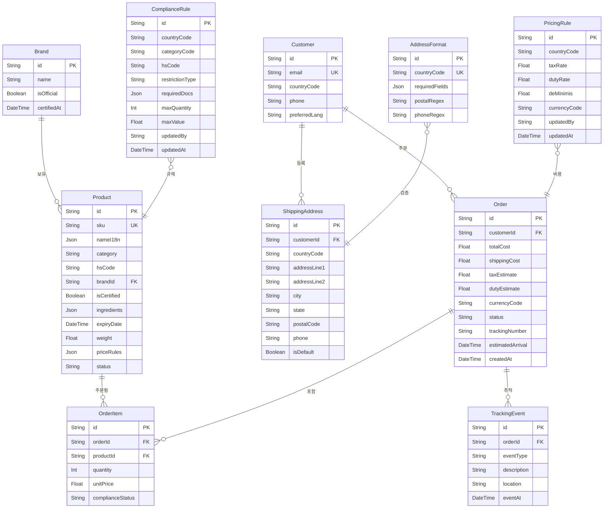
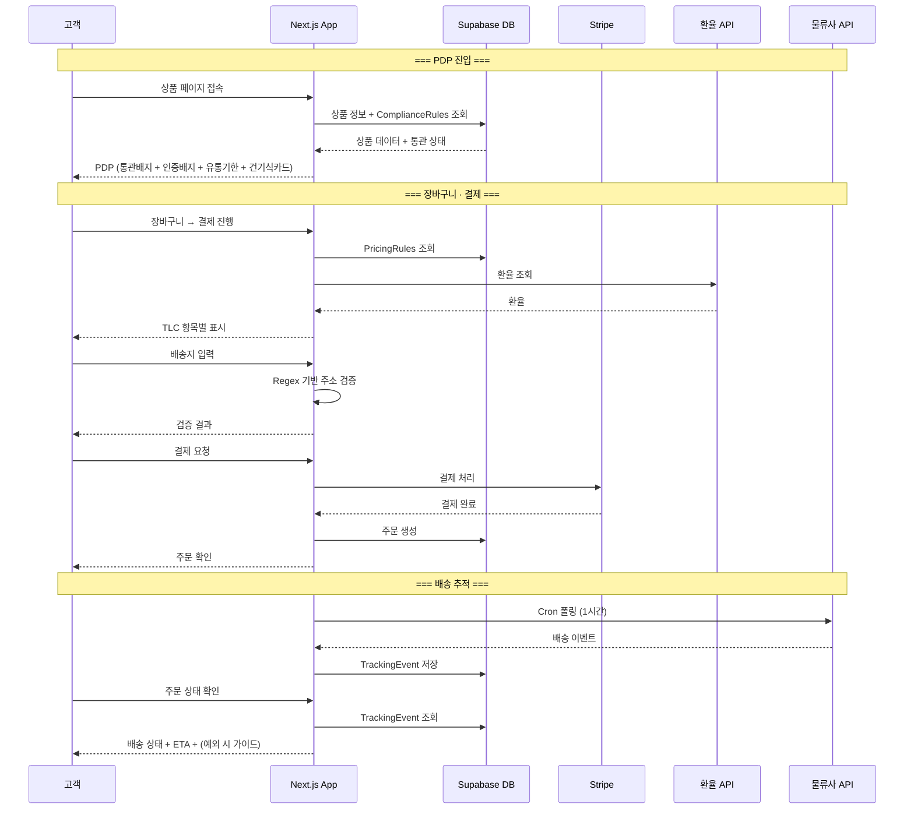
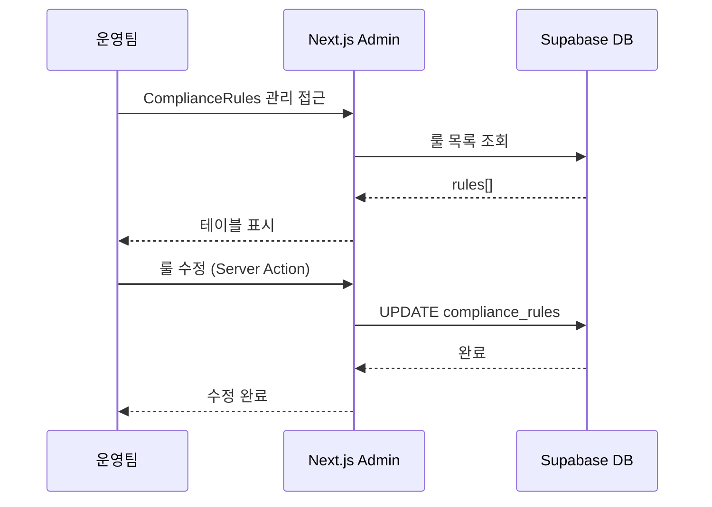

# SRS v2.0 — Vibe Coding Edition (바이브코딩 MVP용 간소화 SRS)

**Document ID:** SRS-002  
**Revision:** 1.0  
**Date:** 2026-05-23  
**Standard:** ISO/IEC/IEEE 29148:2018 (간소화 적용)  
**Source PRD:** PRD v0.4 — 안심 CBT 역직구 플랫폼 (2026-04-25)  
**Status:** Draft — 바이브코딩 MVP용 간소화 버전  
**원본 SRS:** SRS-001 v1.1 (2026-05-02) 기반, 정상 경로 중심 재작성

---

## 1. Introduction

### 1.1 Purpose

본 SRS는 "안심 CBT 역직구 플랫폼" MVP를 **바이브코딩(AI 코드 생성 기반 개발)으로 구현**하기 위해 SRS-001 v1.1을 간소화한 문서이다.

간소화 원칙:
- **정상 경로(Happy Path)만 명세**한다. 외부 API 장애, 캐시 폴백, 재시도 큐 등 장애 내성 시나리오는 Phase 2에서 추가한다.
- **캐시 레이어를 제거**한다. 환율·통관 판정은 매 요청 시 DB/API를 직접 조회한다.
- **비동기 백그라운드 작업을 최소화**한다. Cron Job은 물류 상태 폴링 1개만 유지한다.
- **모니터링은 Vercel 기본 제공 범위**로 한정한다.

### 1.2 Scope

#### In-Scope

| 항목 | 상세 |
|---|---|
| 기능 | F1 총비용 표시, F2 통관 확인, F3 주소 검증, F4 배송 추적, F5 정품 배지, F6 건기식 카드, F7 빠른 재주문 |
| 대상 국가 | 대표 5개국 (Phase 1) |
| 카테고리 | K-Beauty + 건기식 20~30 SKU |
| 언어 | Phase 1: 영어·한국어 |
| 결제 | Stripe 다통화 결제 |

#### Out-of-Scope (Phase 2 이후)

| 항목 | 비고 |
|---|---|
| 외부 API 장애 시 캐시 폴백 | Phase 2 |
| 알림 재시도 큐·에스컬레이션 | Phase 2 |
| Vercel KV 캐시 레이어 | Phase 2 |
| Health Check Cron (외부 API 모니터링) | Phase 2 |
| 비지원국 분기 처리 (AC1-F2) | Phase 2 |
| 룰 미등록 시 자동 티켓 생성 (AC2-F1) | Phase 2 |
| 주소 검증 외부 API 연동 (Google/Loqate) | Phase 2 |
| F8~F14 | Phase 3 |
| B2B2C, 추천, 구독 | Phase 3 |

### 1.3 Definitions

| 약어 | 정의 |
|---|---|
| CBT | Cross-Border Trade |
| TLC | Total Landed Cost — 상품가+배송비+관세+부가세 합산 |
| DDP | Delivered Duty Paid |
| PDP | Product Detail Page |
| HS Code | Harmonized System Code |
| ETA | Estimated Time of Arrival |

### 1.4 Constraints

| ID | 유형 | 내용 |
|---|---|---|
| CON-01 | 기술 스택 | Next.js (App Router) 단일 풀스택. 프론트엔드·백엔드 분리 금지 |
| CON-02 | 서버 로직 | Server Actions 또는 Route Handlers. 별도 백엔드 서버 금지 |
| CON-03 | DB | Prisma + SQLite(로컬) / Supabase PostgreSQL(배포) |
| CON-04 | UI | Tailwind CSS + shadcn/ui |
| CON-05 | 배포 | Vercel. Git Push 자동 배포 |
| CON-06 | 비즈니스 | 통관·세금 로직은 DB 룰 테이블 기반. 하드코딩 금지 |
| CON-07 | 비즈니스 | DDP 우선 정책 |
| CON-08 | 결제 | Stripe 다통화 결제 |
| CON-09 | 보안 | PCI DSS는 Stripe 위임 |

### 1.5 Assumptions

| ID | 내용 |
|---|---|
| ASM-01 | 5개국 세금·관세 데이터를 수동 수집·검증으로 런칭 가능 |
| ASM-02 | 20~30 SKU로 전환율 가설 검증 가능 |
| ASM-03 | 외부 API(환율·물류)는 정상 동작한다고 가정 (장애 처리는 Phase 2) |
| ASM-04 | 물류 파트너가 Tracking API를 제공함 |
| ASM-05 | Stripe가 대상 5개국 다통화 결제를 커버함 |

---

## 2. System Context

### 2.1 External Systems

| ID | 시스템 | 용도 |
|---|---|---|
| EXT-01 | Open Exchange Rates API | 환율 조회 |
| EXT-02 | 물류사 Tracking API | 배송 상태 조회 |
| EXT-03 | Stripe | 결제 처리 |

> **Phase 2에서 추가:** Google/Loqate 주소 검증 API, 이메일/푸시 알림 서비스

### 2.2 Application Structure

| 영역 | 설명 |
|---|---|
| 고객 웹 (Next.js App Router) | PDP, 장바구니, 결제, 주문 추적. SSR + CSR 하이브리드 |
| Admin 웹 (/admin 라우트) | 룰 테이블 CRUD, 상품·브랜드 관리. 같은 Next.js 앱 내 라우트 그룹 |

### 2.3 API Overview

| API | 구현 방식 | 입력 → 출력 | 관련 기능 |
|---|---|---|---|
| TLC 계산 | Route Handler | SKU[], 국가, 배송옵션 → 항목별+합산 비용 | F1 |
| 통관 판정 | Route Handler | SKU, 국가, 수량 → ✅/⚠️/❌ | F2 |
| 주소 검증 | Server Action | 국가, 주소 필드, 전화번호 → 유효/오류 | F3 |
| 배송 상태 조회 | Route Handler | 주문ID → 상태, ETA | F4 |
| 상품 인증 정보 | Route Handler | SKU → 배지 상태, 유통기한 | F5 |
| 건기식 정보 | Route Handler | SKU → 성분·복용법 | F6 |
| 재주문 | Server Action | 고객ID, 주문ID → 복제된 장바구니 | F7 |
| Admin CRUD | Server Action | 룰 데이터 → CRUD 결과 | Admin |

---

## 3. Functional Requirements

### 3.1 F1 — 총비용 표시

| ID | 요구사항 | AC (정상 경로) |
|---|---|---|
| REQ-F1-01 | 결제 페이지에서 상품가·배송비·세금·관세를 항목별 분리 + 합산액 표시 | Given 5개국 중 하나 배송지 설정 → When 결제 페이지 진입 → Then 4개 항목 + 합산액 표시 |
| REQ-F1-02 | 현지 통화 기준 총비용 표시 | Given 통화 선택 → When 총비용 화면 → Then 환율 API 조회 후 현지 통화 표시 |
| REQ-F1-03 | 세금 불확실 시 disclaimer 표시 | Given 세금 불확실 SKU/국가 → When 총비용 표시 → Then 확정/예상 분리 + disclaimer 표시 |
| REQ-F1-04 | 장바구니에서도 TLC 예상 합산액 표시 | Given 장바구니에 상품 존재 + 배송지 설정 → When 장바구니 페이지 → Then TLC 예상액 표시 |
| REQ-F1-05 | Pricing Engine은 PricingRules 테이블에서 세율·관세율 조회 후 TLC 산출 | Given 유효한 국가·HS Code → When TLC 요청 → Then DB 기반 계산 결과 반환 |

> **Phase 2에서 추가:** 환율 API 타임아웃 시 캐시 폴백, 캐시 TTL 초과 시 결제 차단, 비지원국 안내

### 3.2 F2 — 통관 확인

| ID | 요구사항 | AC (정상 경로) |
|---|---|---|
| REQ-F2-01 | PDP에서 통관 상태(✅/⚠️/❌) 표시 | Given 배송 국가 설정 → When PDP 진입 → Then 통관 상태 배지 표시 |
| REQ-F2-02 | ⚠️ 조건부 상태 클릭 시 조건 안내 표시 | Given ⚠️ 상태 → When 상세 클릭 → Then 필요서류·수량·금액 제한 표시 |
| REQ-F2-03 | ❌ 불가 상태 시 장바구니 추가 차단 + 대체 상품 제안 | Given ❌ 상태 → When 장바구니 추가 → Then 차단 + 대체 상품 목록 표시 |
| REQ-F2-04 | Compliance Engine은 ComplianceRules 테이블 기반 판정 | Given 유효한 국가·SKU → When 판정 요청 → Then DB 룰 기반 결과 반환 |
| REQ-F2-05 | 운영팀이 Admin에서 ComplianceRules CRUD 가능 | Given 관리자 로그인 → When CRUD 수행 → Then 즉시 반영 |

> **Phase 2에서 추가:** 룰 미등록 시 ⚠️ + CS 링크 + 자동 티켓, Compliance Engine 장애 시 캐시 폴백

### 3.3 F3 — 주소 검증

| ID | 요구사항 | AC (정상 경로) |
|---|---|---|
| REQ-F3-01 | 주소 입력 시 우편번호·필수필드 실시간 검증 (자체 Regex) | Given 주소 입력 중 → When 필드 값 변경 → Then Regex 기반 검증 결과 즉시 표시 |
| REQ-F3-02 | 전화번호 국가 형식 검증 | Given 전화번호 입력 → When 검증 → Then 유효하지 않으면 경고 + 형식 예시 |
| REQ-F3-03 | 고위험 주소 결제 시도 시 블로킹 경고 | Given 검증 실패 주소 → When 결제 시도 → Then 경고 + 수정 안내 |

> **Phase 2에서 추가:** Google/Loqate 외부 API 2차 검증, 외부 API 장애 시 폴백, 미등록국 분기 처리

### 3.4 F4 — 배송 추적

| ID | 요구사항 | AC (정상 경로) |
|---|---|---|
| REQ-F4-01 | 주문 상태 페이지에서 배송 상태 + ETA 표시 | Given 배송 중 주문 → When 상태 페이지 접근 → Then 현재 상태 + 예상 도착일 표시 |
| REQ-F4-02 | 물류사 이벤트를 표준 상태로 매핑 표시 | Given 물류사 이벤트 수신 → When 처리 → Then 표준 6단계(출고→배송완료)로 매핑 |
| REQ-F4-03 | 4대 예외(통관보류·배송지연·반송·수령불가) 발생 시 행동 가이드 표시 | Given 예외 상태 → When 상태 페이지 접근 → Then 해당 예외별 가이드 텍스트 표시 |

> **Phase 2에서 추가:** 알림 발송(이메일/푸시), 재시도 큐, 에스컬레이션, 48시간 무응답 CS 자동 티켓

### 3.5 F5 — 정품 배지

| ID | 요구사항 | AC (정상 경로) |
|---|---|---|
| REQ-F5-01 | 인증 브랜드 상품에 공식 인증 배지 표시 | Given 인증 브랜드 상품 → When 목록/PDP 진입 → Then 배지 표시 |
| REQ-F5-02 | 정품 보증 정책 페이지 제공 | Given 정책 링크 클릭 → When 페이지 로드 → Then 정책·반품·직배송 프로세스 표시 |
| REQ-F5-03 | PDP에서 유통기한 + 잔여일 표시 | Given PDP → When 유통기한 영역 → Then SKU별 유통기한 + 잔여일 표시 |
| REQ-F5-04 | 유통기한 미등록 시 "확인 중" 플레이스홀더 표시 | Given 미등록 SKU → When PDP → Then "유통기한 정보 확인 중" 표시 |

> **Phase 2에서 추가:** 인증 DB-카탈로그 불일치 감지 + 자동 티켓 생성

### 3.6 F6 — 건기식 설명 카드

| ID | 요구사항 | AC (정상 경로) |
|---|---|---|
| REQ-F6-01 | PDP에서 성분·복용법·주의사항 구조화 카드 표시 | Given 건기식 SKU → When PDP 진입 → Then 카드 형태로 표시 |
| REQ-F6-02 | 사용자 언어 설정에 맞는 언어로 표시 | Given 사용자 언어 en/ko → When 카드 로드 → Then 해당 언어 표시 |
| REQ-F6-03 | 운영팀이 Admin에서 성분·복용법 데이터 입력·수정 가능 | Given 관리자 로그인 → When 데이터 입력 → Then 즉시 반영 |

### 3.7 F7 — 빠른 재주문

| ID | 요구사항 | AC (정상 경로) |
|---|---|---|
| REQ-F7-01 | 주문 내역에서 "재주문" 클릭 시 장바구니에 상품 복제 | Given 주문 내역 → When 재주문 클릭 → Then 동일 상품 장바구니에 추가 |
| REQ-F7-02 | 재주문 시 품절·가격 변동·통관 불가 알림 | Given 재주문 요청 → When 상태 변경 존재 → Then 변경 사항 알림 |

---

## 4. Non-Functional Requirements (간소화)

### 4.1 성능

| ID | 요구사항 | 기준 |
|---|---|---|
| REQ-NF-01 | 페이지 로드 시간 | ≤ 3초 (Vercel Edge Network 기준) |
| REQ-NF-02 | API Route Handler 응답 | ≤ 2초 (정상 경로 기준) |
| REQ-NF-03 | DB 쿼리 응답 | ≤ 500ms |

### 4.2 신뢰성

| ID | 요구사항 | 기준 |
|---|---|---|
| REQ-NF-04 | 월 가용성 | ≥ 99% (Vercel SLA 기반) |
| REQ-NF-05 | 비용 계산 오류율 | ≤ 1% (수동 검증) |

### 4.3 보안

| ID | 요구사항 | 기준 |
|---|---|---|
| REQ-NF-06 | 결제 보안 | PCI DSS (Stripe 위임) |
| REQ-NF-07 | 데이터 전송 | HTTPS (Vercel 기본 제공) |
| REQ-NF-08 | Admin 접근 제어 | 로그인 인증 필수 (NextAuth.js 또는 Supabase Auth) |

### 4.4 비용

| ID | 요구사항 | 기준 |
|---|---|---|
| REQ-NF-09 | 월 인프라 비용 | ≤ $100 (Vercel Pro $20 + Supabase Pro $25 + 도메인 등) |

### 4.5 다국어

| ID | 요구사항 | 기준 |
|---|---|---|
| REQ-NF-10 | Phase 1 지원 언어 | 영어·한국어 |

---

## 5. Data Model (Prisma Schema)

### 5.1 ERD



> **원본 SRS 대비 제거된 테이블:** Notifications (재시도 큐 Phase 2), AuditLogs (변경 이력 Phase 2)
>
> **간소화 사항:** Order.etaInfo(JSONB) → estimatedArrival(DateTime) 단일 필드로 단순화. Order.exceptions(JSONB) 제거 → TrackingEvent.eventType으로 예외 표현.

### 5.2 주요 Enum 값

| Enum | 값 |
|---|---|
| OrderStatus | PENDING, PAID, SHIPPED, CUSTOMS_HOLD, CUSTOMS_CLEARED, IN_DELIVERY, DELIVERED, CANCELLED |
| ComplianceStatus | ALLOWED, CONDITIONAL, PROHIBITED |
| TrackingEventType | SHIPPED, IN_TRANSIT, CUSTOMS_PROCESSING, CUSTOMS_HOLD, CUSTOMS_CLEARED, LOCAL_DELIVERY, DELIVERED, EXCEPTION |
| ProductStatus | ACTIVE, OUT_OF_STOCK, DISCONTINUED |

---

## 6. API Endpoints

| # | Endpoint | Method | 구현 | 설명 |
|---|---|---|---|---|
| 1 | `/api/pricing/calculate` | POST | Route Handler | TLC 계산 |
| 2 | `/api/compliance/check` | GET | Route Handler | 통관 판정 |
| 3 | `validateAddress()` | — | Server Action | 주소 Regex 검증 |
| 4 | `/api/fulfillment/status/[orderId]` | GET | Route Handler | 배송 상태 조회 |
| 5 | `/api/products/[sku]/certification` | GET | Route Handler | 인증·유통기한 |
| 6 | `/api/products/[sku]/supplement-info` | GET | Route Handler | 건기식 정보 |
| 7 | `reorderFromHistory()` | — | Server Action | 재주문 |
| 8 | `processPayment()` | — | Server Action | Stripe 결제 |
| 9 | `/api/exchange-rates` | GET | Route Handler | 환율 조회 (외부 API 프록시) |
| 10 | `/api/admin/compliance-rules` | CRUD | Route Handler | ComplianceRules 관리 |
| 11 | `/api/admin/pricing-rules` | CRUD | Route Handler | PricingRules 관리 |
| 12 | `/api/cron/tracking-poll` | GET | Vercel Cron | 물류 상태 폴링 (1시간 간격) |

---

## 7. Page Structure (Next.js App Router)

```
app/
├── (shop)/                    # 고객 대상 라우트 그룹
│   ├── page.tsx               # 홈 (상품 목록)
│   ├── products/
│   │   └── [sku]/
│   │       └── page.tsx       # PDP (F2 통관배지, F5 인증배지, F6 건기식카드)
│   ├── cart/
│   │   └── page.tsx           # 장바구니 (F1 TLC 예상)
│   ├── checkout/
│   │   └── page.tsx           # 결제 (F1 TLC 확정, F3 주소검증)
│   └── orders/
│       ├── page.tsx           # 주문 내역 (F7 재주문)
│       └── [id]/
│           └── page.tsx       # 주문 상세 (F4 배송추적)
├── (admin)/                   # 운영팀 라우트 그룹
│   ├── admin/
│   │   ├── page.tsx           # Admin 대시보드
│   │   ├── compliance-rules/
│   │   │   └── page.tsx       # ComplianceRules CRUD
│   │   ├── pricing-rules/
│   │   │   └── page.tsx       # PricingRules CRUD
│   │   ├── products/
│   │   │   └── page.tsx       # 상품·브랜드 관리
│   │   └── supplement-info/
│   │       └── page.tsx       # 건기식 데이터 입력
├── api/                       # Route Handlers
│   ├── pricing/calculate/route.ts
│   ├── compliance/check/route.ts
│   ├── fulfillment/status/[orderId]/route.ts
│   ├── products/[sku]/certification/route.ts
│   ├── products/[sku]/supplement-info/route.ts
│   ├── exchange-rates/route.ts
│   ├── admin/compliance-rules/route.ts
│   ├── admin/pricing-rules/route.ts
│   └── cron/tracking-poll/route.ts
├── lib/
│   ├── prisma.ts              # Prisma 클라이언트
│   ├── pricing-engine.ts      # TLC 계산 로직
│   ├── compliance-engine.ts   # 통관 판정 로직
│   ├── address-verifier.ts    # Regex 기반 주소 검증
│   └── actions.ts             # Server Actions 모음
└── prisma/
    └── schema.prisma          # DB 스키마
```

---

## 8. Interaction Flow (정상 경로)

### 8.1 전체 MVP 사용자 여정



### 8.2 Admin 룰 관리



---

## 9. Traceability Matrix (간소화)

| Feature | REQ-FUNC | REQ-NF |
|---|---|---|
| F1 총비용 | REQ-F1-01~05 | REQ-NF-01, 02, 03, 05 |
| F2 통관 | REQ-F2-01~05 | REQ-NF-02, 03 |
| F3 주소 | REQ-F3-01~03 | REQ-NF-02 |
| F4 배송 | REQ-F4-01~03 | REQ-NF-01 |
| F5 정품 | REQ-F5-01~04 | REQ-NF-01 |
| F6 건기식 | REQ-F6-01~03 | REQ-NF-10 |
| F7 재주문 | REQ-F7-01~02 | REQ-NF-02 |

---

## 10. Phase 2 Upgrade Path

바이브코딩 MVP가 안정화된 후, 아래 항목을 순차 추가한다.

| 순서 | 추가 항목 | 관련 원본 SRS 요구사항 |
|---|---|---|
| 1 | Vercel KV 캐시 레이어 (환율·통관 판정) | REQ-FUNC-104, 205 |
| 2 | 환율/세금 API 타임아웃 시 캐시 폴백 | REQ-FUNC-104, REQ-NF-013 |
| 3 | Compliance Engine 장애 시 캐시 폴백 | REQ-FUNC-205 |
| 4 | 비지원국 분기 처리 | REQ-FUNC-105 |
| 5 | Google/Loqate 외부 주소 검증 API 연동 | REQ-FUNC-305 |
| 6 | 알림 발송 (이메일/푸시) + 재시도 큐 | REQ-FUNC-401, 403, 405 |
| 7 | Health Check Cron (외부 API 모니터링) | REQ-NF-033~035 |
| 8 | AuditLogs (변경 이력 추적) | REQ-NF-019, 023 |
| 9 | 룰 미등록 시 자동 티켓 생성 | REQ-FUNC-204 |
| 10 | 인증 DB-카탈로그 불일치 감지 + 자동 티켓 | REQ-FUNC-505 |

---

## 11. 원본 SRS 대비 변경 요약

| 구분 | 원본 SRS v1.1 | 본 문서 (Vibe Coding Edition) | 변경 이유 |
|---|---|---|---|
| 기능 요구사항 수 | 42개 (REQ-FUNC-101~1001) | 25개 (REQ-F1-01~F7-02) | 정상 경로만 유지, 폴백 AC 전량 제거 |
| NFR 수 | 45개 (REQ-NF-001~045) | 10개 (REQ-NF-01~10) | 모니터링·KPI 간소화, Vercel 기본 SLA 의존 |
| 데이터 모델 테이블 | 11개 | 9개 | Notifications, AuditLogs 제거 |
| API 엔드포인트 | 13개 | 12개 | 알림 발송 엔드포인트 제거 |
| Cron Job | 3개 (tracking, retry, health) | 1개 (tracking만) | 재시도 큐·Health Check Phase 2 이동 |
| 캐시 레이어 | Redis (환율·통관·세션) | 없음 | Phase 2로 이동 |
| Class Diagram | Java 스타일 상세 | 제거 (Prisma 스키마로 대체) | 바이브코딩에서는 Prisma 스키마가 Single Source |
| Component Diagram | 8개 서비스 모듈 + API Gateway | 페이지 구조 + lib/ 모듈 | Next.js 단일 앱 구조에 맞게 단순화 |

---

*End of SRS-002 v1.0 — Vibe Coding Edition*
