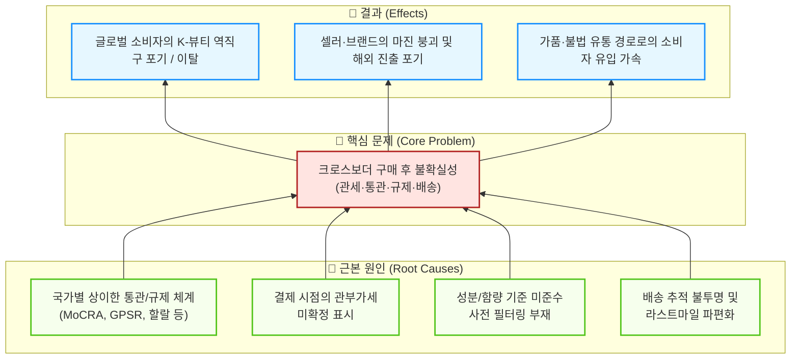

# 문제정의서 초안 ①: 글로벌 소비자의 '구매 후 불확실성' 관점

> **관점 키워드**: 규제·통관·세금 불확실성 / 최종 소비자(B2C) 페인포인트 / 신뢰 실종
> **작성일**: 2026-04-11

---

## 1. 산업과 시장영역 분석

**(K-뷰티·건기식 크로스보더 이커머스 산업 / 역직구 B2C 시장)**에 대한 우리의 분석 결과, 이 영역은

### 1) 기초 리서치 — 시장의 거시적 트렌드 및 기본 양상

시장의 거시적 트렌드 및 기본 양상이 **'고성장·고난이도·저신뢰'** 하다.

- K-뷰티와 건강기능식품의 글로벌 수요는 가파르게 증가하고 있으나, 국가별 상이한 규제(MoCRA, GPSR, 할랄 인증, FDA OTC 등)와 통관 기준의 지속적 상향으로 인해 **판매자와 구매자 모두에게 극심한 불확실성**이 가중되고 있다.
- 알리익스프레스·테무 등 중국 C-커머스 공룡들의 '초저가 무료배송·묻지마 환불' 정책이 소비자의 가격 저항선과 서비스 기대치를 극단적으로 끌어올려, **범용 상품 중개 플랫폼의 마진은 구조적으로 붕괴** 중이다.
- 동시에 틱톡 숍·인스타그램 등 소셜 커머스가 '검색→구매' 여정을 '발견→충동구매'로 대체하며 전통 CBT 플랫폼의 트래픽을 빠르게 흡수하고 있다.

### 2) Porter 5 Forces 분석 — 경쟁 구조

경쟁도가 **극도로 높고** 브랜드 충성도가 **매우 낮으며**, 구매자 교섭력이 **압도적**이다.

| 구조적 요인 | 강도 | 핵심 근거 |
| :--- | :---: | :--- |
| 기존 기업 간 경쟁 | **최상** | 거대 자본의 치킨게임(알리·테무), D2C 옴니채널 점유전, 4PL 물류 단가 경쟁 |
| 신규 진입자 위협 | 높음 | OEM/ODM 인프라로 인디 브랜드 런칭 용이 / 풀필먼트 진입장벽은 존재 |
| 대체재 위협 | 강 | 틱톡 숍 등 소셜 커머스, 현지 유통 직납(B2B), 슈퍼앱 확장 |
| 공급자 교섭력 | 높음 | 대형 포워더·특송사 과점, 메가 브랜드 D2C 가속 |
| **구매자 교섭력** | **최강** | **전환비용 제로(0)**, 극단적 최저가 비교, 로컬 수준 환불 요구 |

- 특히 글로벌 소비자들은 **관부가세 추가 부과, 통관 지연·보류, 성분 규제로 인한 반송** 등 '구매 후 불확실성(Post-Purchase Uncertainty)'에 극도로 민감하며, 이로 인해 결제 전 이탈률이 치명적으로 높다.

### 3) Value Chain 분석 — 핵심 가치 창출 구조

핵심 가치 창출 구조는 **'규제·통관 자동 필터링을 통한 불확실성 사전 차단'**, **'DDP(관세 포함 확정결제) 시스템을 통한 투명한 가격 경험'**, **'에셋 라이트 4PL API 연합을 통한 안정·예측 가능한 배송'** 이다.

- **iHerb**: 장바구니 단계에서 국가별 통관 불가 성분·중량 한도를 자동 차단하여 오배송·반품 비용을 원천적으로 제거하고, 아태 지역 GDC(물류 허브)를 통해 3~5일 내 배송을 실현했다.
- **올리브영 글로벌**: K-뷰티 정품 보증(Fake-Free)과 주요 국가 무료배송 전략으로 초기 진입 장벽과 불확실성을 완화했다.
- **Craver(UMMA)**: 글로벌 특송사 API 탑재와 FDA 등 복잡한 인허가 대행을 통해 바이어(B2B)와 소비자(B2C) 양면의 통관·배송 페인포인트를 제거했다.
- **실리콘투(StyleKorean)**: 자체 글로벌 물류 거점 구축과 현지화 콘텐츠로 라스트마일 배송 기간 단축 및 문화적 이질감을 해소했다.

**그러나**, 이 모든 솔루션은 대규모 자본(Asset-Heavy 창고)이나 이미 구축된 네트워크에 기반하며, **신규 진입 플랫폼이 소비자에게 규제·통관 리스크를 '기술적으로' 사전 해소해주는 표준화된 솔루션은 시장에 부재**하다.

---

## 2. 해결하고자 하는 문제

따라서,

> ### 🎯 문제 진술(Problem Statement)
>
> **[한국 K-뷰티·건기식을 해외에서 구매하려는 글로벌 소비자]** 가  
> **[크로스보더 결제·주문 과정]** 에서 겪는  
> **[예측 불가능한 관부가세 추가 청구, 통관 보류·반송, 성분 규제 미준수로 인한 수령 실패 등 '구매 후 불확실성(Post-Purchase Uncertainty)']** 을 해결하는 것이 중요한 문제이다.

---

### 💡 문제의 심각성과 임팩트 맥락 (방법론 1단계)

| 관점 | 현재 손실 |
| :--- | :--- |
| **사회적** | 정품 K-뷰티·건기식에 대한 글로벌 수요가 가품·불법유통 채널로 우회되어 소비자 안전 위협 및 한국 브랜드 신뢰 훼손 |
| **경제적** | 장바구니 이탈률 상승(통관·세금 불확실성이 결제 전 최대 이탈 사유), 반품·오배송 비용 증가로 판매자 마진 구조적 악화 |
| **환경적** | 통관 반송·재배송으로 인한 불필요한 탄소배출 및 포장 폐기물 발생 |

### 🔍 문제 구조화 (방법론 4단계 — 원인-결과 분석)

### 📌 핵심 이해관계자 (방법론 3단계)

| 이해관계자 | 니즈 | 페인포인트 |
| :--- | :--- | :--- |
| **글로벌 최종 소비자** | 정품 K-뷰티·건기식을 확정된 가격에 안전하게 수령 | 추가 관세 청구, 통관 보류, 성분 부적합 반송 |
| **K-뷰티 인디 브랜드(셀러)** | 해외 D2C 판로 확보, 규제 리스크 최소화 | 국가별 규제 학습 비용, 통관 실패 시 반품 부담 |
| **물류·풀필먼트 파트너** | 안정적 물동량, IT 연동 효율화 | 파편화된 통관 절차, API 비표준화 |

---

### 🚀 솔루션 방향성 (가설)

위 문제를 해결하기 위해, **소비자 결제 단계에서 관부가세·통관 가능 여부·배송 예정일을 100% 확정(DDP)해주는 '불확실성 제로(Uncertainty-Free)' 엔진**을 핵심 가치로 하는 SaaS 기반 에셋 라이트 크로스보더 이커머스 플랫폼을 구축한다.
