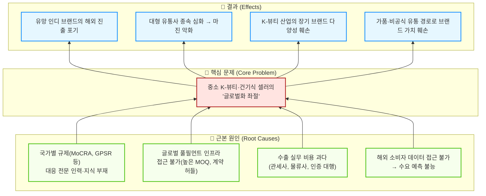

# 문제정의서 초안 ②: K-뷰티·건기식 셀러의 '해외 진출 장벽' 관점

> **관점 키워드**: 중소 브랜드/인디 셀러의 글로벌화 좌절 / B2B SaaS / 공급자 역량 격차
> **작성일**: 2026-04-11

---

## 1. 산업과 시장영역 분석

**(K-뷰티·건기식 크로스보더 유통산업 / B2B 수출·풀필먼트 시장)**에 대한 우리의 분석 결과, 이 영역은

### 1) 기초 리서치 — 시장의 거시적 트렌드 및 기본 양상

시장의 거시적 트렌드 및 기본 양상이 **'공급자(셀러) 역량의 양극화와 글로벌 규제의 급격한 강화'** 이다.

- 한국은 세계 최고 수준의 OEM/ODM 인프라(코스맥스, 한국콜마, 노바렉스 등)를 보유하고 있어 자본력과 기획력만 있으면 누구나 인디 뷰티·건기식 브랜드를 런칭할 수 있는 환경이다. **그러나 '만드는 것'은 쉬워졌지만 '해외에 파는 것'은 오히려 더 어려워지고 있다.**
- MoCRA(미국 화장품 규제 현대화법), GPSR(EU 일반제품안전규정), 할랄 인증, 각국 FDA 등 **글로벌 규제가 급격히 강화·복잡화**하고 있으며, 이 규제 대응 역량은 대형 브랜드와 중소 인디 브랜드 사이에 극심한 격차를 만들고 있다.
- 메가 브랜드들은 D2C 채널을 통해 글로벌 직접 소비자에게 접근하거나 아마존 등 1티어 플랫폼과만 직거래하여, 중간 CBT 플랫폼에 대한 의존도를 낮추는 추세이다. **결과적으로 중소 인디 브랜드들만 홀로 복잡한 글로벌 유통 퍼즐을 풀어야 하는 상황에 내몰리고 있다.**

### 2) Porter 5 Forces 분석 — 경쟁 구조

경쟁도가 **극히 높고**, 중소 셀러의 교섭력이 **구조적으로 취약하며**, 규제 장벽이 **핵심 진입 허들**로 작용한다.

| 구조적 요인 | 강도 | 중소 셀러 관점의 핵심 임팩트 |
| :--- | :---: | :--- |
| 기존 기업 간 경쟁 | **최상** | 올리브영·실리콘투 등 대형 유통사가 이미 독점적 소싱 교섭력 장악 |
| 신규 진입자 위협 | 높음 | 제조(OEM)는 쉽지만, 글로벌 판매·물류 역량은 전무한 상태로 진입 |
| 대체재 위협 | 중 | C-뷰티(중국), 현지 로컬 브랜드의 성장이 K-뷰티 교체 압력으로 작용 |
| **공급자(물류/규제) 교섭력** | **높음** | **대형 포워더·특송사(DHL, FedEx)에 종속, 통관 대행 비용 과다** |
| 구매자 교섭력 | 높음 | B2B 바이어(해외 디스트리뷰터)가 최저가 운임·커스텀 서비스 강요 |

- 중소 인디 브랜드는 **국가별 성분 인증, 라벨링, 통관 서류, HS Code 매핑** 등 수출 실무를 독자적으로 수행할 역량이 없어, 글로벌 기회를 포착하고도 진출을 포기하거나 비효율적인 하청 구조에 의존하게 된다.

### 3) Value Chain 분석 — 핵심 가치 창출 구조

핵심 가치 창출 구조는 **'글로벌 규제·인허가 대행의 소프트웨어화'**, **'수요 예측 기반 수출 최적 경로 추천'**, **'Freemium→유료 구독형 B2B SaaS 생태계 구축'** 이다.

- **Craver(UMMA)**: K-뷰티 브랜드들이 직접 대응하기 어려운 FDA 인허가를 대행하고, 글로벌 특송사 API를 선제 탑재하여 바이어와 셀러 양측의 통관·배송 페인을 시스템적으로 해결했다. 나아가 유망 인디 브랜드를 인큐베이팅(SKIN1004 등)하여 B2B2C 생태계를 확장하고 있다.
- **실리콘투(StyleKorean)**: B2B 대량 화주 풀필먼트 사업과 B2C 커머스를 결합한 옴니채널 모델로, 셀러에게 '글로벌 판매 인프라 일체'를 제공하며 양방향 네트워크 효과를 이루었다.
- **iHerb**: 자사 PB 및 독점 브랜드 직매입 전략으로 공급자 교섭력을 확보했으나, 이 모델은 소수의 선별된 브랜드에만 기회를 제공하여 롱테일 인디 브랜드는 소외된다.
- **올리브영 글로벌**: 압도적 리테일 데이터와 바잉파워로 검증된 브랜드를 해외로 유통하지만, 자체 채널에 입점하지 못하는 수많은 인디 브랜드는 접근 자체가 불가하다.

**결론적으로**, 현재 시장에서 중소 인디 K-뷰티·건기식 브랜드가 **자본·인력 투입 없이도** 글로벌 규제 대응부터 물류·통관까지 '원클릭'으로 해결할 수 있는 **접근 가능하고 표준화된 SaaS 플랫폼이 부재**하다.

---

## 2. 해결하고자 하는 문제

따라서,

> ### 🎯 문제 진술(Problem Statement)
>
> **[글로벌 시장에 자사 브랜드를 수출하고자 하는 한국의 중소·인디 K-뷰티 및 건기식 셀러]** 가  
> **[해외 판매를 시도하거나 확장하는 과정]** 에서 겪는  
> **[국가별 상이한 규제(MoCRA, GPSR, FDA 등) 대응 역량 부재, 통관·물류 인프라 접근 불가, 과도한 수출 실무 비용으로 인한 '글로벌화 좌절']** 을 해결하는 것이 중요한 문제이다.

---

### 💡 문제의 심각성과 임팩트 맥락 (방법론 1단계)

| 관점 | 현재 손실 |
| :--- | :--- |
| **사회적** | 혁신적인 인디 브랜드들이 대형 유통사에 종속되어 창업 생태계 다양성이 훼손됨 |
| **경제적** | 글로벌 K-뷰티 수출 잠재 시장(연 100조원+)에서 중소 브랜드 참여율 극히 낮음 |
| **산업적** | K-뷰티의 '장기적 브랜드 다양성'이 깨지면 산업 전체의 글로벌 경쟁력 약화 |

### 🔍 문제 구조화 (방법론 4단계 — 원인-결과 분석)

### 📌 핵심 이해관계자 (방법론 3단계)

| 이해관계자 | 니즈 | 페인포인트 |
| :--- | :--- | :--- |
| **중소·인디 K-뷰티 브랜드** | 저비용·저리스크로 글로벌 D2C/B2B 판로 확보 | 국가별 규제 학습 비용, 통관 실패, MOQ 미달 |
| **OEM/ODM 제조사** | 해외 수주 물량 확대, 브랜드 파트너 다변화 | 소규모 인디 브랜드의 해외 판로 부재로 수주 기회 제한 |
| **글로벌 해외 바이어(디스트리뷰터)** | 다양한 K-뷰티 신규 브랜드 소싱팀 | 검증된 중소 브랜드 발견 어려움, 인증·규제 적합성 불확실 |
| **물류·포워더 파트너** | 안정적 물동량 확보, SMB 고객층 확대 | 소량·다품종 중소 물량은 수익성 낮아 기피 |

---

### 🚀 솔루션 방향성 (가설)

위 문제를 해결하기 위해, 중소 인디 K-뷰티·건기식 브랜드가 **'한 번의 상품 등록'만으로** 타겟 국가별 규제 적합성 자동 진단 → 최적 물류 경로 추천 → DDP 결제 세팅 → 현지 마케팅 연동까지 원스톱으로 해결하는 **'크로스보더 수출 자동화 B2B SaaS 플랫폼'**을 구축한다. 나아가 Freemium 모델을 통해 진입 장벽을 낮추고, 유료 구독화로 지속 가능한 수익 모델을 확보한다.
