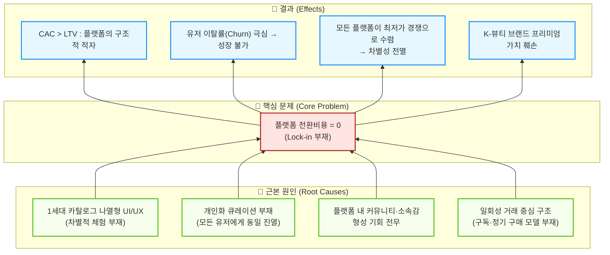

# 문제정의서 초안 ③: 플랫폼의 '전환비용 제로 → 락인 부재' 관점

> **관점 키워드**: 전환비용(Switching Cost) 제로 / 커뮤니티 부재 / CAC 출혈 / 플랫폼 생존
> **작성일**: 2026-04-11

---

## 1. 산업과 시장영역 분석

**(K-뷰티·건기식 크로스보더 이커머스 산업 / 글로벌 역직구 플랫폼 시장)**에 대한 우리의 분석 결과, 이 영역은

### 1) 기초 리서치 — 시장의 거시적 트렌드 및 기본 양상

시장의 거시적 트렌드 및 기본 양상이 **'트래픽은 폭증하지만, 플랫폼 충성도는 소멸'** 이다.

- 전 세계적으로 K-뷰티와 K-컬처에 대한 관심이 폭발적으로 증가하며 크로스보더 직구·역직구 GMV(거래액)는 가파르게 성장 중이지만, **소비자의 특정 플랫폼에 대한 충성도는 역사상 최저 수준**으로 떨어졌다.
- 소비자들은 가격·배송 조건이 더 나은 플랫폼으로 클릭 한 번에 이동하며, 알리·테무·쿠팡 직구 등 초거대 자본 플랫폼들이 '무료배송·묻지마 환불'로 소비자 기대치를 극단적으로 올려놓았다.
- 틱톡 숍·인스타그램 등 소셜 커머스가 '발견형 충동구매' 경험을 제공하며, **전통적 '검색→비교→구매' 모델의 CBT 플랫폼들은 트래픽을 빠르게 빼앗기고 있다.**
- 이 환경에서 신규·중소 플랫폼이 유의미한 트래픽을 확보하려면 **광고비(CAC)의 출혈적 지출**이 불가피하나, 확보한 유저마저 즉시 이탈하는 악순환이 반복된다.

### 2) Porter 5 Forces 분석 — 경쟁 구조

경쟁도가 **살인적으로 높고** 플랫폼 전환비용이 **제로(0)**이며, 대체재(소셜 커머스)의 위협이 **파괴적**이다.

| 구조적 요인 | 강도 | 플랫폼 사업자 관점의 핵심 시사점 |
| :--- | :---: | :--- |
| 기존 기업 간 경쟁 | **최상** | 알리·테무의 자본력 기반 치킨게임, 아마존 FBA의 물류 장악, 품목 동질화(승자독식) |
| 신규 진입자 위협 | 약~중 | 인프라 투자비 때문에 진입은 어렵지만, 진입한 모든 플랫폼이 동일한 '최저가' 게임에 갇힘 |
| **대체재 위협** | **강** | **틱톡 숍·인스타그램이 '앱 내 체류형 충동구매'로 CBT 플랫폼의 존재 이유 자체를 대체** |
| 공급자 교섭력 | 중~상 | 메가 브랜드 D2C 가속으로 중간 플랫폼 의존도 하락 |
| **구매자 교섭력** | **최강** | **전환비용 제로, 극단적 최저가 비교, 무조건적 환불 요구** |

- 결정적으로, 현존하는 대부분의 CBT 플랫폼은 **'상품 카탈로그 나열 + 검색 기능'이라는 1세대 UI/UX**에 머물러 있어, 유저들이 플랫폼에 머물러야 할 이유(체류 시간, 소속감, 콘텐츠)가 전무하다. 이는 **소셜 커머스 대비 구조적 열위**를 의미한다.

### 3) Value Chain 분석 — 핵심 가치 창출 구조

핵심 가치 창출 구조는 **'고관여 K-팬덤 기반 마이크로 쇼퍼블 커뮤니티를 통한 전환비용 창출'**, **'AI 진단 기반 초개인화 구독 모델을 통한 반복 구매 락인'**, **'어필리에이트·인플루언서 바이럴을 통한 자생적 트래픽 획득(CAC 최소화)'** 이다.

- **Craver(UMMA)**: 틱톡 커머스를 적극 융합·활용하는 뷰티 애그리게이터 모델로, 기존 B2B 기반을 넘어 발견형 소셜 커머스 경험을 흡수하고 있다. Freemium 진단 → 구독형 정기배송으로 전환비용을 창출한다.
- **iHerb**: 추천인 코드(어필리에이트 리워드 프로그램)를 통해 충성 사용자가 자발적으로 콘텐츠 마케터가 되도록 바이럴 구조를 설계, CAC를 혁신적으로 낮추고 커뮤니티 기반 락인을 달성했다.
- **실리콘투(StyleKorean)**: 자체 제작 K-미디어 콘텐츠와 유튜브를 통해 팬덤 기반 커뮤니티 라운지를 형성, 유저가 K-뷰티 '소속감'을 느끼며 체류하는 구조를 만들었다.
- **올리브영 글로벌**: 방한 외국인의 오프라인 구매 경험을 글로벌몰 앱으로 연결(O2O 락인)하는 옴니채널 전략으로 자연스러운 재방문을 유도했다.

**그러나**, 이러한 성공 모델들은 각사의 특수한 자산(대규모 오프라인 점포, 수년간 축적된 PB 포트폴리오, 기존 B2B 유통망 등)에 기반하며, **'콘텐츠·커뮤니티·초개인화 진단'을 결합하여 전환비용을 기술적으로 0에서 극대화시키는 표준화된 플랫폼 모델은 시장에 아직 부재**하다.

---

## 2. 해결하고자 하는 문제

따라서,

> ### 🎯 문제 진술(Problem Statement)
>
> **[K-뷰티·건기식에 관심이 있으나 특정 플랫폼에 충성하지 않는 글로벌 소비자(특히 K-컬처 팬덤)]** 가  
> **[다수의 크로스보더 플랫폼을 비교·이동하며 쇼핑하는 과정]** 에서 겪는  
> **['어디서 사든 똑같다'는 차별화 부재, 플랫폼 내 소속감·커뮤니티 경험의 부재, 자신에게 최적화된 제품을 발견하지 못하는 정보 과잉 속 큐레이션 실패]** 를 해결하는 것이 중요한 문제이다.
>
> 이는 동시에 **플랫폼 사업자 관점에서**, 천문학적 마케팅비(CAC) 출혈에도 불구하고 유저가 즉시 이탈하는 **'전환비용 제로(Switching Cost = 0)의 저주'**를 끊고, 지속 가능한 사업 모델을 구축하기 위해 반드시 풀어야 하는 문제이다.

---

### 💡 문제의 심각성과 임팩트 맥락 (방법론 1단계)

| 관점 | 현재 손실 |
| :--- | :--- |
| **소비자** | 수백 개 유사 플랫폼 사이에서 정보 과잉으로 최적 제품 발견 실패, 정품 여부 불안, 재구매 동기 부재 |
| **플랫폼 사업자** | CAC(고객 획득 비용)가 LTV(고객 생애 가치)를 초과하는 구조적 적자 / 유저 이탈률(Churn) 극심 |
| **K-뷰티 생태계** | 플랫폼 간 무한 최저가 경쟁이 브랜드 가치를 훼손, 프리미엄 시장 포지셔닝 붕괴 |

### 🔍 문제 구조화 (방법론 4단계 — 원인-결과 분석)

### 📌 핵심 이해관계자 (방법론 3단계)

| 이해관계자 | 니즈 | 페인포인트 |
| :--- | :--- | :--- |
| **글로벌 K-컬처 팬덤 소비자** | 나만의 피부·건강에 맞는 K-뷰티를 발견하고, 같은 관심사의 커뮤니티에 소속 | 플랫폼 간 차별 없음, 정보 과잉, 큐레이션 실패 |
| **K-뷰티 마이크로 인플루언서** | 팬과 소통하며 수익 창출할 상거래 플랫폼 | 기존 CBT 플랫폼에 크리에이터 도구·연동 부재 |
| **플랫폼 사업자(=당사)** | 낮은 CAC로 충성 고객 확보, 지속 가능 수익 모델 | 광고비 출혈 → 이탈 → 재출혈의 악순환 |
| **K-뷰티 브랜드(셀러)** | 프리미엄 가치를 지켜주는 플랫폼에서의 판매 | 최저가 경쟁 환경에서 브랜드 가치 훼손 |

---

### 🚀 솔루션 방향성 (가설)

위 문제를 해결하기 위해, 3가지 핵심 무기를 융합한 **'차세대 K-뷰티 쇼퍼블 커뮤니티 플랫폼'**을 구축한다:

1. **AI 진단 기반 초개인화 큐레이션**: 무료 AI 피부&건강 문진을 통해 유저별 맞춤 K-뷰티·건기식 추천 → '이 플랫폼만의 가치'를 창출하여 차별화
2. **마이크로 쇼퍼블 커뮤니티 UX**: 카탈로그 대신 숏폼 리뷰·크리에이터 피드 중심 인터페이스로 소속감·체류시간 극대화 → 소셜 커머스 대체재 위협을 역으로 흡수
3. **구독형 정기배송(웰니스 박스) + 어필리에이트 리워드**: 초개인화 진단 결과 기반 매월 맞춤 구성 → 전환비용을 0에서 최대치로 끌어올려 Lock-in 달성, 동시에 충성 유저가 자발적 마케터가 되는 구조로 CAC 혁파
