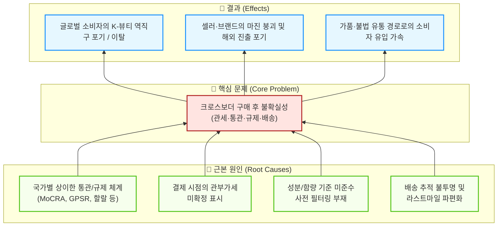
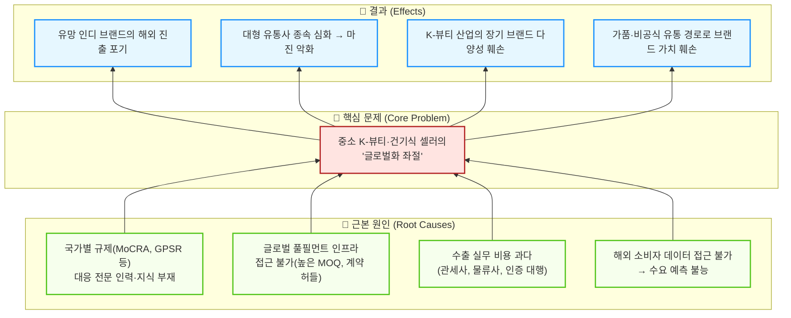
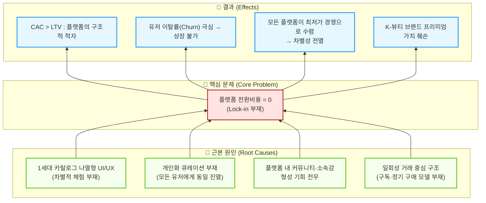

---

# Source File 1

# 문제정의서 초안 ①: 글로벌 소비자의 '구매 후 불확실성' 관점

> **관점 키워드**: 규제·통관·세금 불확실성 / 최종 소비자(B2C) 페인포인트 / 신뢰 실종
> **작성일**: 2026-04-11

---

## 1. 산업과 시장영역 분석

**(K-뷰티·건기식 크로스보더 이커머스 산업 / 역직구 B2C 시장)**에 대한 우리의 분석 결과, 이 영역은

### 1) 기초 리서치 — 시장의 거시적 트렌드 및 기본 양상

시장의 거시적 트렌드 및 기본 양상이 **'고성장·고난이도·저신뢰'** 하다.

- K-뷰티와 건강기능식품의 글로벌 수요는 가파르게 증가하고 있으나, 국가별 상이한 규제(MoCRA, GPSR, 할랄 인증, FDA OTC 등)와 통관 기준의 지속적 상향으로 인해 **판매자와 구매자 모두에게 극심한 불확실성**이 가중되고 있다.
- 알리익스프레스·테무 등 중국 C-커머스 공룡들의 '초저가 무료배송·묻지마 환불' 정책이 소비자의 가격 저항선과 서비스 기대치를 극단적으로 끌어올려, **범용 상품 중개 플랫폼의 마진은 구조적으로 붕괴** 중이다.
- 동시에 틱톡 숍·인스타그램 등 소셜 커머스가 '검색→구매' 여정을 '발견→충동구매'로 대체하며 전통 CBT 플랫폼의 트래픽을 빠르게 흡수하고 있다.

### 2) Porter 5 Forces 분석 — 경쟁 구조

경쟁도가 **극도로 높고** 브랜드 충성도가 **매우 낮으며**, 구매자 교섭력이 **압도적**이다.

| 구조적 요인 | 강도 | 핵심 근거 |
| :--- | :---: | :--- |
| 기존 기업 간 경쟁 | **최상** | 거대 자본의 치킨게임(알리·테무), D2C 옴니채널 점유전, 4PL 물류 단가 경쟁 |
| 신규 진입자 위협 | 높음 | OEM/ODM 인프라로 인디 브랜드 런칭 용이 / 풀필먼트 진입장벽은 존재 |
| 대체재 위협 | 강 | 틱톡 숍 등 소셜 커머스, 현지 유통 직납(B2B), 슈퍼앱 확장 |
| 공급자 교섭력 | 높음 | 대형 포워더·특송사 과점, 메가 브랜드 D2C 가속 |
| **구매자 교섭력** | **최강** | **전환비용 제로(0)**, 극단적 최저가 비교, 로컬 수준 환불 요구 |

- 특히 글로벌 소비자들은 **관부가세 추가 부과, 통관 지연·보류, 성분 규제로 인한 반송** 등 '구매 후 불확실성(Post-Purchase Uncertainty)'에 극도로 민감하며, 이로 인해 결제 전 이탈률이 치명적으로 높다.

### 3) Value Chain 분석 — 핵심 가치 창출 구조

핵심 가치 창출 구조는 **'규제·통관 자동 필터링을 통한 불확실성 사전 차단'**, **'DDP(관세 포함 확정결제) 시스템을 통한 투명한 가격 경험'**, **'에셋 라이트 4PL API 연합을 통한 안정·예측 가능한 배송'** 이다.

- **iHerb**: 장바구니 단계에서 국가별 통관 불가 성분·중량 한도를 자동 차단하여 오배송·반품 비용을 원천적으로 제거하고, 아태 지역 GDC(물류 허브)를 통해 3~5일 내 배송을 실현했다.
- **올리브영 글로벌**: K-뷰티 정품 보증(Fake-Free)과 주요 국가 무료배송 전략으로 초기 진입 장벽과 불확실성을 완화했다.
- **Craver(UMMA)**: 글로벌 특송사 API 탑재와 FDA 등 복잡한 인허가 대행을 통해 바이어(B2B)와 소비자(B2C) 양면의 통관·배송 페인포인트를 제거했다.
- **실리콘투(StyleKorean)**: 자체 글로벌 물류 거점 구축과 현지화 콘텐츠로 라스트마일 배송 기간 단축 및 문화적 이질감을 해소했다.

**그러나**, 이 모든 솔루션은 대규모 자본(Asset-Heavy 창고)이나 이미 구축된 네트워크에 기반하며, **신규 진입 플랫폼이 소비자에게 규제·통관 리스크를 '기술적으로' 사전 해소해주는 표준화된 솔루션은 시장에 부재**하다.

---

## 2. 해결하고자 하는 문제

따라서,

> ### 🎯 문제 진술(Problem Statement)
>
> **[한국 K-뷰티·건기식을 해외에서 구매하려는 글로벌 소비자]** 가  
> **[크로스보더 결제·주문 과정]** 에서 겪는  
> **[예측 불가능한 관부가세 추가 청구, 통관 보류·반송, 성분 규제 미준수로 인한 수령 실패 등 '구매 후 불확실성(Post-Purchase Uncertainty)']** 을 해결하는 것이 중요한 문제이다.

---

### 💡 문제의 심각성과 임팩트 맥락 (방법론 1단계)

| 관점 | 현재 손실 |
| :--- | :--- |
| **사회적** | 정품 K-뷰티·건기식에 대한 글로벌 수요가 가품·불법유통 채널로 우회되어 소비자 안전 위협 및 한국 브랜드 신뢰 훼손 |
| **경제적** | 장바구니 이탈률 상승(통관·세금 불확실성이 결제 전 최대 이탈 사유), 반품·오배송 비용 증가로 판매자 마진 구조적 악화 |
| **환경적** | 통관 반송·재배송으로 인한 불필요한 탄소배출 및 포장 폐기물 발생 |

### 🔍 문제 구조화 (방법론 4단계 — 원인-결과 분석)

### 📌 핵심 이해관계자 (방법론 3단계)

| 이해관계자 | 니즈 | 페인포인트 |
| :--- | :--- | :--- |
| **글로벌 최종 소비자** | 정품 K-뷰티·건기식을 확정된 가격에 안전하게 수령 | 추가 관세 청구, 통관 보류, 성분 부적합 반송 |
| **K-뷰티 인디 브랜드(셀러)** | 해외 D2C 판로 확보, 규제 리스크 최소화 | 국가별 규제 학습 비용, 통관 실패 시 반품 부담 |
| **물류·풀필먼트 파트너** | 안정적 물동량, IT 연동 효율화 | 파편화된 통관 절차, API 비표준화 |

---

### 🚀 솔루션 방향성 (가설)

위 문제를 해결하기 위해, **소비자 결제 단계에서 관부가세·통관 가능 여부·배송 예정일을 100% 확정(DDP)해주는 '불확실성 제로(Uncertainty-Free)' 엔진**을 핵심 가치로 하는 SaaS 기반 에셋 라이트 크로스보더 이커머스 플랫폼을 구축한다.

---

# Source File 2

# 문제정의서 초안 ②: K-뷰티·건기식 셀러의 '해외 진출 장벽' 관점

> **관점 키워드**: 중소 브랜드/인디 셀러의 글로벌화 좌절 / B2B SaaS / 공급자 역량 격차
> **작성일**: 2026-04-11

---

## 1. 산업과 시장영역 분석

**(K-뷰티·건기식 크로스보더 유통산업 / B2B 수출·풀필먼트 시장)**에 대한 우리의 분석 결과, 이 영역은

### 1) 기초 리서치 — 시장의 거시적 트렌드 및 기본 양상

시장의 거시적 트렌드 및 기본 양상이 **'공급자(셀러) 역량의 양극화와 글로벌 규제의 급격한 강화'** 이다.

- 한국은 세계 최고 수준의 OEM/ODM 인프라(코스맥스, 한국콜마, 노바렉스 등)를 보유하고 있어 자본력과 기획력만 있으면 누구나 인디 뷰티·건기식 브랜드를 런칭할 수 있는 환경이다. **그러나 '만드는 것'은 쉬워졌지만 '해외에 파는 것'은 오히려 더 어려워지고 있다.**
- MoCRA(미국 화장품 규제 현대화법), GPSR(EU 일반제품안전규정), 할랄 인증, 각국 FDA 등 **글로벌 규제가 급격히 강화·복잡화**하고 있으며, 이 규제 대응 역량은 대형 브랜드와 중소 인디 브랜드 사이에 극심한 격차를 만들고 있다.
- 메가 브랜드들은 D2C 채널을 통해 글로벌 직접 소비자에게 접근하거나 아마존 등 1티어 플랫폼과만 직거래하여, 중간 CBT 플랫폼에 대한 의존도를 낮추는 추세이다. **결과적으로 중소 인디 브랜드들만 홀로 복잡한 글로벌 유통 퍼즐을 풀어야 하는 상황에 내몰리고 있다.**

### 2) Porter 5 Forces 분석 — 경쟁 구조

경쟁도가 **극히 높고**, 중소 셀러의 교섭력이 **구조적으로 취약하며**, 규제 장벽이 **핵심 진입 허들**로 작용한다.

| 구조적 요인 | 강도 | 중소 셀러 관점의 핵심 임팩트 |
| :--- | :---: | :--- |
| 기존 기업 간 경쟁 | **최상** | 올리브영·실리콘투 등 대형 유통사가 이미 독점적 소싱 교섭력 장악 |
| 신규 진입자 위협 | 높음 | 제조(OEM)는 쉽지만, 글로벌 판매·물류 역량은 전무한 상태로 진입 |
| 대체재 위협 | 중 | C-뷰티(중국), 현지 로컬 브랜드의 성장이 K-뷰티 교체 압력으로 작용 |
| **공급자(물류/규제) 교섭력** | **높음** | **대형 포워더·특송사(DHL, FedEx)에 종속, 통관 대행 비용 과다** |
| 구매자 교섭력 | 높음 | B2B 바이어(해외 디스트리뷰터)가 최저가 운임·커스텀 서비스 강요 |

- 중소 인디 브랜드는 **국가별 성분 인증, 라벨링, 통관 서류, HS Code 매핑** 등 수출 실무를 독자적으로 수행할 역량이 없어, 글로벌 기회를 포착하고도 진출을 포기하거나 비효율적인 하청 구조에 의존하게 된다.

### 3) Value Chain 분석 — 핵심 가치 창출 구조

핵심 가치 창출 구조는 **'글로벌 규제·인허가 대행의 소프트웨어화'**, **'수요 예측 기반 수출 최적 경로 추천'**, **'Freemium→유료 구독형 B2B SaaS 생태계 구축'** 이다.

- **Craver(UMMA)**: K-뷰티 브랜드들이 직접 대응하기 어려운 FDA 인허가를 대행하고, 글로벌 특송사 API를 선제 탑재하여 바이어와 셀러 양측의 통관·배송 페인을 시스템적으로 해결했다. 나아가 유망 인디 브랜드를 인큐베이팅(SKIN1004 등)하여 B2B2C 생태계를 확장하고 있다.
- **실리콘투(StyleKorean)**: B2B 대량 화주 풀필먼트 사업과 B2C 커머스를 결합한 옴니채널 모델로, 셀러에게 '글로벌 판매 인프라 일체'를 제공하며 양방향 네트워크 효과를 이루었다.
- **iHerb**: 자사 PB 및 독점 브랜드 직매입 전략으로 공급자 교섭력을 확보했으나, 이 모델은 소수의 선별된 브랜드에만 기회를 제공하여 롱테일 인디 브랜드는 소외된다.
- **올리브영 글로벌**: 압도적 리테일 데이터와 바잉파워로 검증된 브랜드를 해외로 유통하지만, 자체 채널에 입점하지 못하는 수많은 인디 브랜드는 접근 자체가 불가하다.

**결론적으로**, 현재 시장에서 중소 인디 K-뷰티·건기식 브랜드가 **자본·인력 투입 없이도** 글로벌 규제 대응부터 물류·통관까지 '원클릭'으로 해결할 수 있는 **접근 가능하고 표준화된 SaaS 플랫폼이 부재**하다.

---

## 2. 해결하고자 하는 문제

따라서,

> ### 🎯 문제 진술(Problem Statement)
>
> **[글로벌 시장에 자사 브랜드를 수출하고자 하는 한국의 중소·인디 K-뷰티 및 건기식 셀러]** 가  
> **[해외 판매를 시도하거나 확장하는 과정]** 에서 겪는  
> **[국가별 상이한 규제(MoCRA, GPSR, FDA 등) 대응 역량 부재, 통관·물류 인프라 접근 불가, 과도한 수출 실무 비용으로 인한 '글로벌화 좌절']** 을 해결하는 것이 중요한 문제이다.

---

### 💡 문제의 심각성과 임팩트 맥락 (방법론 1단계)

| 관점 | 현재 손실 |
| :--- | :--- |
| **사회적** | 혁신적인 인디 브랜드들이 대형 유통사에 종속되어 창업 생태계 다양성이 훼손됨 |
| **경제적** | 글로벌 K-뷰티 수출 잠재 시장(연 100조원+)에서 중소 브랜드 참여율 극히 낮음 |
| **산업적** | K-뷰티의 '장기적 브랜드 다양성'이 깨지면 산업 전체의 글로벌 경쟁력 약화 |

### 🔍 문제 구조화 (방법론 4단계 — 원인-결과 분석)

### 📌 핵심 이해관계자 (방법론 3단계)

| 이해관계자 | 니즈 | 페인포인트 |
| :--- | :--- | :--- |
| **중소·인디 K-뷰티 브랜드** | 저비용·저리스크로 글로벌 D2C/B2B 판로 확보 | 국가별 규제 학습 비용, 통관 실패, MOQ 미달 |
| **OEM/ODM 제조사** | 해외 수주 물량 확대, 브랜드 파트너 다변화 | 소규모 인디 브랜드의 해외 판로 부재로 수주 기회 제한 |
| **글로벌 해외 바이어(디스트리뷰터)** | 다양한 K-뷰티 신규 브랜드 소싱팀 | 검증된 중소 브랜드 발견 어려움, 인증·규제 적합성 불확실 |
| **물류·포워더 파트너** | 안정적 물동량 확보, SMB 고객층 확대 | 소량·다품종 중소 물량은 수익성 낮아 기피 |

---

### 🚀 솔루션 방향성 (가설)

위 문제를 해결하기 위해, 중소 인디 K-뷰티·건기식 브랜드가 **'한 번의 상품 등록'만으로** 타겟 국가별 규제 적합성 자동 진단 → 최적 물류 경로 추천 → DDP 결제 세팅 → 현지 마케팅 연동까지 원스톱으로 해결하는 **'크로스보더 수출 자동화 B2B SaaS 플랫폼'**을 구축한다. 나아가 Freemium 모델을 통해 진입 장벽을 낮추고, 유료 구독화로 지속 가능한 수익 모델을 확보한다.

---

# Source File 3

# 문제정의서 초안 ③: 플랫폼의 '전환비용 제로 → 락인 부재' 관점

> **관점 키워드**: 전환비용(Switching Cost) 제로 / 커뮤니티 부재 / CAC 출혈 / 플랫폼 생존
> **작성일**: 2026-04-11

---

## 1. 산업과 시장영역 분석

**(K-뷰티·건기식 크로스보더 이커머스 산업 / 글로벌 역직구 플랫폼 시장)**에 대한 우리의 분석 결과, 이 영역은

### 1) 기초 리서치 — 시장의 거시적 트렌드 및 기본 양상

시장의 거시적 트렌드 및 기본 양상이 **'트래픽은 폭증하지만, 플랫폼 충성도는 소멸'** 이다.

- 전 세계적으로 K-뷰티와 K-컬처에 대한 관심이 폭발적으로 증가하며 크로스보더 직구·역직구 GMV(거래액)는 가파르게 성장 중이지만, **소비자의 특정 플랫폼에 대한 충성도는 역사상 최저 수준**으로 떨어졌다.
- 소비자들은 가격·배송 조건이 더 나은 플랫폼으로 클릭 한 번에 이동하며, 알리·테무·쿠팡 직구 등 초거대 자본 플랫폼들이 '무료배송·묻지마 환불'로 소비자 기대치를 극단적으로 올려놓았다.
- 틱톡 숍·인스타그램 등 소셜 커머스가 '발견형 충동구매' 경험을 제공하며, **전통적 '검색→비교→구매' 모델의 CBT 플랫폼들은 트래픽을 빠르게 빼앗기고 있다.**
- 이 환경에서 신규·중소 플랫폼이 유의미한 트래픽을 확보하려면 **광고비(CAC)의 출혈적 지출**이 불가피하나, 확보한 유저마저 즉시 이탈하는 악순환이 반복된다.

### 2) Porter 5 Forces 분석 — 경쟁 구조

경쟁도가 **살인적으로 높고** 플랫폼 전환비용이 **제로(0)**이며, 대체재(소셜 커머스)의 위협이 **파괴적**이다.

| 구조적 요인 | 강도 | 플랫폼 사업자 관점의 핵심 시사점 |
| :--- | :---: | :--- |
| 기존 기업 간 경쟁 | **최상** | 알리·테무의 자본력 기반 치킨게임, 아마존 FBA의 물류 장악, 품목 동질화(승자독식) |
| 신규 진입자 위협 | 약~중 | 인프라 투자비 때문에 진입은 어렵지만, 진입한 모든 플랫폼이 동일한 '최저가' 게임에 갇힘 |
| **대체재 위협** | **강** | **틱톡 숍·인스타그램이 '앱 내 체류형 충동구매'로 CBT 플랫폼의 존재 이유 자체를 대체** |
| 공급자 교섭력 | 중~상 | 메가 브랜드 D2C 가속으로 중간 플랫폼 의존도 하락 |
| **구매자 교섭력** | **최강** | **전환비용 제로, 극단적 최저가 비교, 무조건적 환불 요구** |

- 결정적으로, 현존하는 대부분의 CBT 플랫폼은 **'상품 카탈로그 나열 + 검색 기능'이라는 1세대 UI/UX**에 머물러 있어, 유저들이 플랫폼에 머물러야 할 이유(체류 시간, 소속감, 콘텐츠)가 전무하다. 이는 **소셜 커머스 대비 구조적 열위**를 의미한다.

### 3) Value Chain 분석 — 핵심 가치 창출 구조

핵심 가치 창출 구조는 **'고관여 K-팬덤 기반 마이크로 쇼퍼블 커뮤니티를 통한 전환비용 창출'**, **'AI 진단 기반 초개인화 구독 모델을 통한 반복 구매 락인'**, **'어필리에이트·인플루언서 바이럴을 통한 자생적 트래픽 획득(CAC 최소화)'** 이다.

- **Craver(UMMA)**: 틱톡 커머스를 적극 융합·활용하는 뷰티 애그리게이터 모델로, 기존 B2B 기반을 넘어 발견형 소셜 커머스 경험을 흡수하고 있다. Freemium 진단 → 구독형 정기배송으로 전환비용을 창출한다.
- **iHerb**: 추천인 코드(어필리에이트 리워드 프로그램)를 통해 충성 사용자가 자발적으로 콘텐츠 마케터가 되도록 바이럴 구조를 설계, CAC를 혁신적으로 낮추고 커뮤니티 기반 락인을 달성했다.
- **실리콘투(StyleKorean)**: 자체 제작 K-미디어 콘텐츠와 유튜브를 통해 팬덤 기반 커뮤니티 라운지를 형성, 유저가 K-뷰티 '소속감'을 느끼며 체류하는 구조를 만들었다.
- **올리브영 글로벌**: 방한 외국인의 오프라인 구매 경험을 글로벌몰 앱으로 연결(O2O 락인)하는 옴니채널 전략으로 자연스러운 재방문을 유도했다.

**그러나**, 이러한 성공 모델들은 각사의 특수한 자산(대규모 오프라인 점포, 수년간 축적된 PB 포트폴리오, 기존 B2B 유통망 등)에 기반하며, **'콘텐츠·커뮤니티·초개인화 진단'을 결합하여 전환비용을 기술적으로 0에서 극대화시키는 표준화된 플랫폼 모델은 시장에 아직 부재**하다.

---

## 2. 해결하고자 하는 문제

따라서,

> ### 🎯 문제 진술(Problem Statement)
>
> **[K-뷰티·건기식에 관심이 있으나 특정 플랫폼에 충성하지 않는 글로벌 소비자(특히 K-컬처 팬덤)]** 가  
> **[다수의 크로스보더 플랫폼을 비교·이동하며 쇼핑하는 과정]** 에서 겪는  
> **['어디서 사든 똑같다'는 차별화 부재, 플랫폼 내 소속감·커뮤니티 경험의 부재, 자신에게 최적화된 제품을 발견하지 못하는 정보 과잉 속 큐레이션 실패]** 를 해결하는 것이 중요한 문제이다.
>
> 이는 동시에 **플랫폼 사업자 관점에서**, 천문학적 마케팅비(CAC) 출혈에도 불구하고 유저가 즉시 이탈하는 **'전환비용 제로(Switching Cost = 0)의 저주'**를 끊고, 지속 가능한 사업 모델을 구축하기 위해 반드시 풀어야 하는 문제이다.

---

### 💡 문제의 심각성과 임팩트 맥락 (방법론 1단계)

| 관점 | 현재 손실 |
| :--- | :--- |
| **소비자** | 수백 개 유사 플랫폼 사이에서 정보 과잉으로 최적 제품 발견 실패, 정품 여부 불안, 재구매 동기 부재 |
| **플랫폼 사업자** | CAC(고객 획득 비용)가 LTV(고객 생애 가치)를 초과하는 구조적 적자 / 유저 이탈률(Churn) 극심 |
| **K-뷰티 생태계** | 플랫폼 간 무한 최저가 경쟁이 브랜드 가치를 훼손, 프리미엄 시장 포지셔닝 붕괴 |

### 🔍 문제 구조화 (방법론 4단계 — 원인-결과 분석)

### 📌 핵심 이해관계자 (방법론 3단계)

| 이해관계자 | 니즈 | 페인포인트 |
| :--- | :--- | :--- |
| **글로벌 K-컬처 팬덤 소비자** | 나만의 피부·건강에 맞는 K-뷰티를 발견하고, 같은 관심사의 커뮤니티에 소속 | 플랫폼 간 차별 없음, 정보 과잉, 큐레이션 실패 |
| **K-뷰티 마이크로 인플루언서** | 팬과 소통하며 수익 창출할 상거래 플랫폼 | 기존 CBT 플랫폼에 크리에이터 도구·연동 부재 |
| **플랫폼 사업자(=당사)** | 낮은 CAC로 충성 고객 확보, 지속 가능 수익 모델 | 광고비 출혈 → 이탈 → 재출혈의 악순환 |
| **K-뷰티 브랜드(셀러)** | 프리미엄 가치를 지켜주는 플랫폼에서의 판매 | 최저가 경쟁 환경에서 브랜드 가치 훼손 |

---

### 🚀 솔루션 방향성 (가설)

위 문제를 해결하기 위해, 3가지 핵심 무기를 융합한 **'차세대 K-뷰티 쇼퍼블 커뮤니티 플랫폼'**을 구축한다:

1. **AI 진단 기반 초개인화 큐레이션**: 무료 AI 피부&건강 문진을 통해 유저별 맞춤 K-뷰티·건기식 추천 → '이 플랫폼만의 가치'를 창출하여 차별화
2. **마이크로 쇼퍼블 커뮤니티 UX**: 카탈로그 대신 숏폼 리뷰·크리에이터 피드 중심 인터페이스로 소속감·체류시간 극대화 → 소셜 커머스 대체재 위협을 역으로 흡수
3. **구독형 정기배송(웰니스 박스) + 어필리에이트 리워드**: 초개인화 진단 결과 기반 매월 맞춤 구성 → 전환비용을 0에서 최대치로 끌어올려 Lock-in 달성, 동시에 충성 유저가 자발적 마케터가 되는 구조로 CAC 혁파
